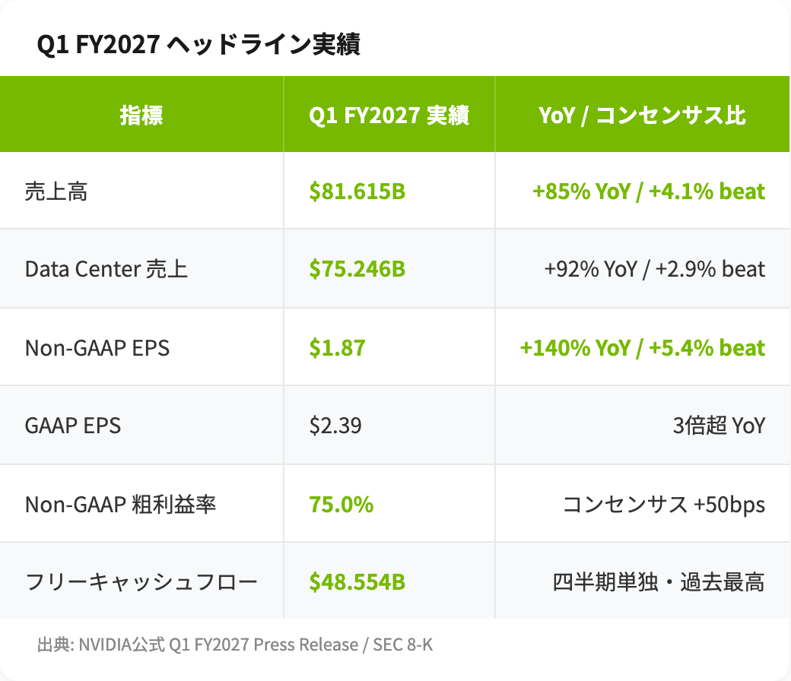
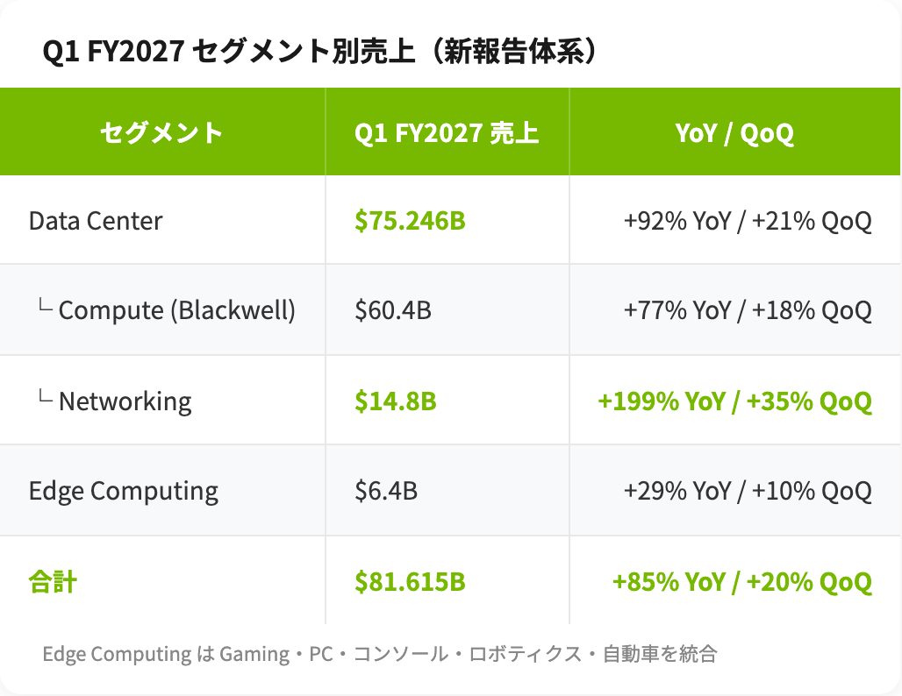
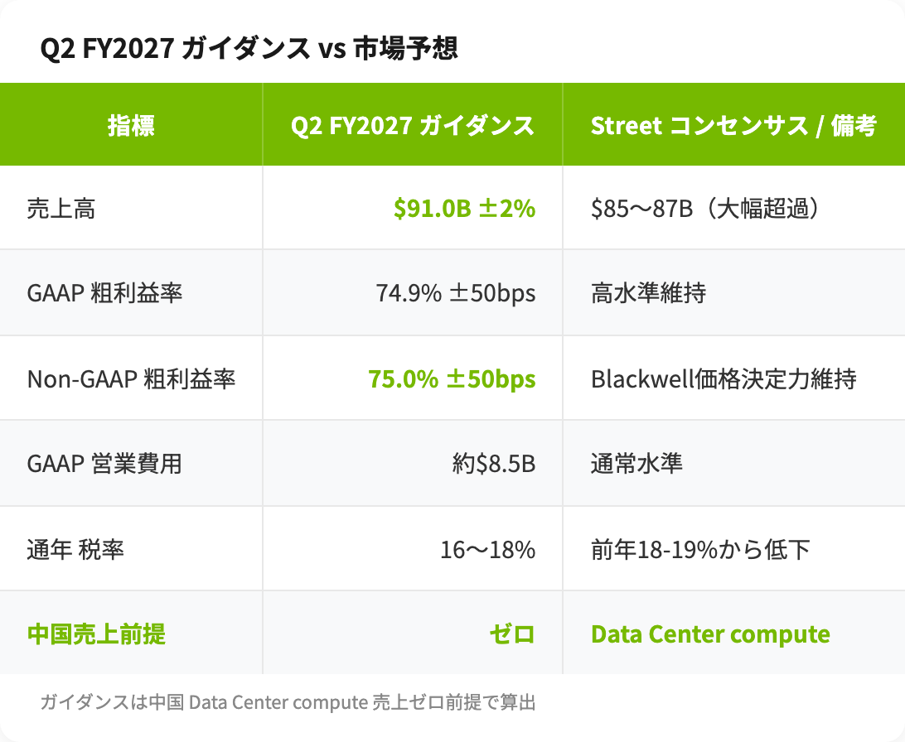
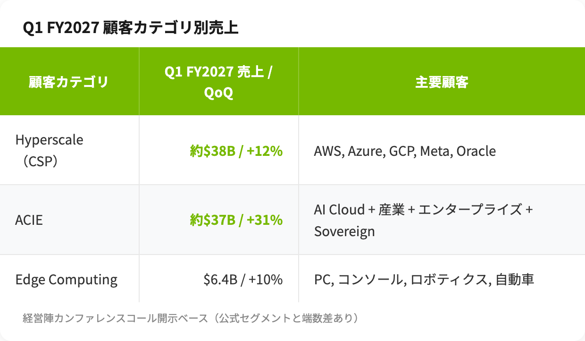

# NVIDIA Q1 FY2027決算レビュー：「完璧な決算」で株価が下がる理由——Blackwellガイダンスと中国ゼロ前提を読み解く

> **免責事項**: 本記事は情報提供を目的としており、投資助言ではありません。投資判断は自己責任で行ってください。記載のデータは執筆時点（2026年5月23日）のものです。

## 概要

NVIDIAは2026年5月20日、FY2027 Q1決算を発表しました。売上$81.6B（+85% YoY）、Non-GAAP EPS $1.87（コンセンサス+5.4% beat）、Q2ガイダンス$91B（市場予想$85〜87Bを大幅超過）と、表面的にはほぼ完璧な内容です。にもかかわらず、決算翌日の株価は **-1.8%、4回連続の下落**。なぜ「優れた決算」が売り材料になっているのか。本記事では数字の裏側、Blackwellガイダンスの読み方、そして「中国データセンター売上ゼロ」を前提とした$91Bガイダンスが意味する構造変化を整理します。

## 1. ヘッドライン実績：トリプルビートでも市場が反応しなかった理由

Q1 FY2027の数字を簡潔にまとめると、売上・EPS・粗利益率・FCFのすべてが市場予想を上回りました。

特筆すべきは**フリーキャッシュフロー$48.5B**という規模です。これは多くのS&P 500企業の通年売上を四半期単独で稼ぎ出しているレベルで、AI投資ブームの「現金製造機」としてのNVIDIAの位置づけを改めて示しました。

それでも株価が下がった理由はシンプルで、**市場の「ささやき値（whisper number）」がガイダンスをすでに上回っていた**からです。アナリストコンセンサスは$85〜87Bでしたが、ヘッジファンドや大手機関投資家の実質的な期待値は$92〜95B レンジに到達していたとされます。NVIDIAは過去3四半期連続、ビートしても株価が翌日に下落しています。「完璧を織り込んだ市場は、優れた決算では満足しない」という構造です。

https://www.cnbc.com/2026/05/20/nvidia-nvda-earnings-report-q1-2027.html

## 2. セグメント構造の地殻変動：Edge Computing統合の意味

Q1 FY2027から、NVIDIAは**報告セグメントを再編**しました。従来のGaming・Professional Visualization・Automotive・OEMを**「Edge Computing」**という単一セグメントに統合し、Data Centerをサブカテゴリ（Compute / Networking）に分割しています。

この再編は単なる開示形式の変更ではありません。**Data Center Networkingの+199%という爆発的成長**を独立した数字として開示したい、という経営陣のメッセージです。Spectrum-X Ethernet、InfiniBand、NVLinkで構成されるNetworking事業は、CFOのColette Kress氏が「全Ethernet競合の合計規模を上回る」と表現したように、もはやチップ単体ではなく「AI factory全体のシステム供給ベンダー」としてのNVIDIAを象徴しています。

一方、Data Center compute本体のQoQ成長率は +18%。前期Q4 FY2026のQoQ +21%から**わずかに減速**しました。これは「Blackwell ramp の踊り場」を示すのか、それとも単に基数効果（base effect）の問題なのか、判断はQ2の数字を待つ必要があります。

https://www.heygotrade.com/en/blog/nvidia-q1-fy27-earnings-preview-may-20-2026/

## 3. 「中国データセンター売上ゼロ前提」のQ2 $91Bガイダンス

Q1決算で最も重要な開示は、Q2 FY2027ガイダンスの**前提**にあります。

注目すべきは、この$91BというガイダンスがCFO Kress氏の言葉どおり「**中国データセンターcompute売上をゼロと仮定**」して算出されている点です。

経緯を整理すると以下のとおりです：

- 2025年4月：米国の新たな輸出ライセンス要件により、H20チップの中国向け売上が実質ゼロ化
- 2026年Q1 FY2026（前年同期）：$4.5Bの在庫評価損を計上
- 2026年Q2 FY2026〜現在：H200ライセンスを米政府が約10社（Alibaba、ByteDance、JD.com、Lenovo等）に承認するも、**実出荷はゼロ**

つまりNVIDIAは、中国市場からの売上を完全に「アップサイドオプション」として外し、それでも$91Bという市場予想を大幅に超えるガイダンスを出せる**非中国市場の需要強度**を示したわけです。

https://www.indmoney.com/blog/us-stocks/nvidia-stock-q1-fy27-earnings-81b-revenue-25x-dividend

これは投資家にとって両刃の剣です。**ベアケース**としては、米中規制が完全凍結し続ければ本来的なAIチップ最大市場の一角を永久に失うリスク、加えてHuawei Ascendなど中国国内勢の自前化が進む構造的脅威があります。一方**ブルケース**として、米中交渉が好転し H200の実出荷が始まれば、ガイダンスは即座に上方修正される余地があります。

## 4. 顧客構成の変化：Hyperscale 50% / ACIE 50%という新しい姿

経営陣はQ1決算カンファレンスコールで、Data Center売上の**顧客構成**を新たな3カテゴリで開示しました。

ハイパースケーラー（CSP）依存度はDataCenterの約50%にまで低下し、残り50%を**ACIE（AI Cloud・Industrial・Enterprise）**が占める構造になりました。とくに**Sovereign AI**（政府発注のAI factory）が今後の成長ドライバーとして強調されており、中東・欧州・日本などで本契約が進んでいます。

これは投資家にとって極めて重要なポイントです。AWS・Microsoft・Google・MetaのFY2026 Capex合計は700B規模に到達していますが、**いつかはROIの検証フェーズが訪れます**。そのとき、ACIE層が需要を引き継げるかが、NVIDIAの長期成長持続性を左右します。Q1のACIE QoQ +31% という伸びは、その引き継ぎが順調に進んでいることを示唆します。

## 5. Blackwell の価格決定力：粗利益率75%維持の意味

非GAAP粗利益率75.0%（ガイダンスも74.9〜75.0%）は、市場の「リトマス試験紙」でした。

アナリストの間では「粗利益率73%割れ＝Blackwellスケール時の価格圧力顕在化」と見られており、Q1の75%維持は**Blackwell（特にGB300）の価格決定力が依然として強い**ことを意味します。これは、AMD MI350系・Broadcom ASIC・Google TPU v7など競合の台頭にもかかわらず、フロンティアモデル開発者にとってNVIDIAスタック（CUDA + Blackwell + NVLink + Spectrum-X）の代替が困難であることを示しています。

Jensen Huang CEOはカンファレンスコールで「Grace Blackwellは最速のトレーニングシステムであり、推論において最低のトークン生成コストを実現する」と発言しました。「最速」と「最低コスト」を同時に主張できるベンダーは現時点でほぼNVIDIAのみです。

https://www.fool.com/earnings/call-transcripts/2026/05/20/nvidia-nvda-q1-2027-earnings-transcript/

## 6. 25倍増配と$80B自社株買い：経営陣の自信

Q1決算と同時に、NVIDIAは2つの大規模な資本還元策を発表しました。

- **配当の25倍引き上げ**：$0.01 → $0.25/株（四半期）
- **新規自社株買い枠$80B承認**（2026年5月18日）
- Q1単体の自社株買い実績：$19.3B

Q1単体のFCF $48.5Bという数字を背景に考えれば、これらは**経営陣がキャッシュフロー継続性に持つ自信**を表しています。とくに$80Bという自社株買い枠は、現時点の時価総額の数%に相当する規模で、EPS押し上げ効果を通じてNon-GAAP EPSをさらに加速させる材料となります。

https://247wallst.com/investing/2026/05/21/nvidia-price-prediction-after-record-earnings-here-is-how-high-the-stock-will-rally/

## 7. プレビュー記事との対比：想定通り、ただしサプライズ3点

本記事の前段となるプレビュー（2026年5月12日公開）では、Blackwell量産フル稼働とCSP Capex 700Bへの依存度を主要論点として提示しました。実績との対比は以下のとおりです：

| 論点 | プレビュー想定 | Q1 FY2027実績 |
|---|---|---|
| 売上ガイダンス比達成 | 達成見込み | $78B ±2% ガイダンスに対し $81.6B（+4.1%超過） |
| Blackwellランプ | フル稼働進行中 | GB300の rampが成長主因と明示 |
| CSP Capex依存度 | Hyperscale 50%超 | Hyperscale 約$38B（Data Centerの約50%）→ **CSP依存度は前年比で低下** |
| 中国Data Center売上 | ゼロ前提シナリオを検証 | **公式にゼロ前提を継続** |
| 粗利益率 | 75%維持か | 74.9〜75.0%で**維持** |

ベースシナリオはほぼそのまま実現しましたが、**プレビュー時点で予測できなかったサプライズ要素**が3点ありました：

1. **Data Center networking +199%の爆発**（Spectrum-X が「全Ethernet競合の合計を上回る」段階に到達）
2. **Vera CPU $200B TAM の初開示**（標準CPU市場への本格参入宣言）
3. **25倍増配 + $80B自社株買い枠** という資本還元の規模感

これらはいずれも「Bull Caseの上方修正材料」として、今後のEPSモデルに織り込まれていくでしょう。

## 8. 次四半期に向けた Watch Points

Q2 FY2027（2026年8月発表予定）に向けて、投資家が注視すべき指標を5つに整理します。

1. **H200の中国実出荷実現可否** — Q2 $91Bガイダンスには含まれず、実現すれば上振れ要因
2. **Networking成長の持続性** — Q1 QoQ +35%の勢いがどこまで続くか
3. **Sovereign AI受注パイプライン** — 中東・欧州・日本の政府系AI factory本契約進捗
4. **ACIE成長率の維持** — Q1 +31% QoQをQ2でも維持できるか
5. **CSP Capex FY2027下期軌道** — AI ROIの実証データ（顧客の収益化進捗）

特に注意すべきは「Whisper number」の動向です。Q2は市場予想がさらに切り上がり、$95〜100Bを織り込む可能性があります。仮にNVIDIAが$95Bという驚異的な実績を出しても、Whisperが$100Bだった場合は再び株価が下落するリスクがあります。

## まとめ：株価が下がっても、ファンダメンタルズは強固

Q1 FY2027決算を投資判断の文脈で整理すると、3つのキーメッセージに集約できます：

1. **ヘッドライン実績は完璧**：売上・EPS・粗利益率・FCFのすべてで市場予想を上回り、Q2ガイダンスも$91Bと$85〜87Bコンセンサスを大幅超過
2. **構造変化が進行中**：CSP依存度の低下、Sovereign AIの台頭、Networking事業の独立成長—NVIDIAは「チップメーカー」から「AI factoryシステム供給ベンダー」へ進化
3. **期待値インフレが最大のリスク**：4回連続の決算翌日下落は、市場が「完璧+α」を要求するフェーズに入ったことを示唆

中長期で見れば、Vera Rubinプラットフォーム、Vera CPU、Spectrum-X Ethernetという3つの新成長エンジンに加え、$80B自社株買い枠によるEPS加速が控えています。短期の株価変動と長期のファンダメンタルズを切り分けて見ることが、現時点でNVDAを評価する際の鍵になります。

---

## 参考データソース

- NVIDIA Q1 FY2027 Press Release（NVIDIA公式 Investor Relations）
- SEC Form 8-K NVDA Q1 FY2027
- NVIDIA Q1 FY2027 Earnings Call Transcript
- CNBC Live Coverage NVDA Q1 FY2027
- The Motley Fool 決算コール書き起こし
- StockTitan 8-K Filing解説
- IndMoney $81.6B Revenue 25x Dividend
- 24/7 Wall St NVDA Price Prediction
- HeyGoTrade NVDA Q1 FY27 Preview

## リスク開示

本記事の情報は2026年5月23日時点のものであり、将来の市場動向や個別銘柄のパフォーマンスを保証するものではありません。NVIDIA株への投資は、データセンター需要の急変動、米中規制動向、競合カスタムシリコンの台頭、AI ROIの未達リスク等、複数のリスク要因を含みます。投資判断は最新の公式開示資料を確認のうえ、自己責任で行ってください。
