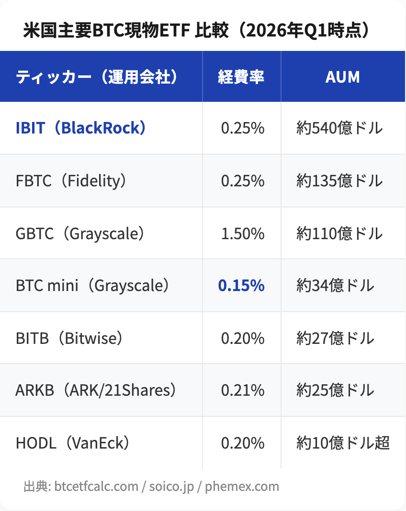
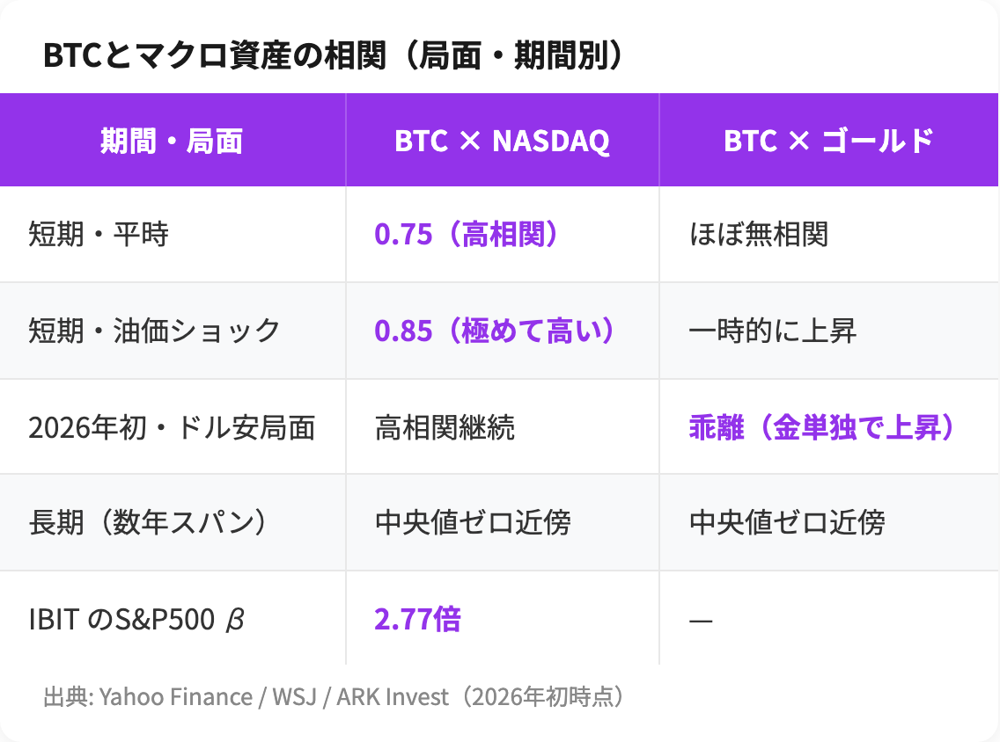

# BTC現物ETFは「株」か「金」か？マクロ相関で見える正体

# はじめに

承認からわずか2年で運用資産残高（AUM）約1,550億ドル規模に成長した、史上最速のETFカテゴリーがあります。それがビットコイン（BTC）現物ETFです。

「BTC現物ETFって結局どんな商品？」「ビットコインは株なの、金なの、それとも独立資産なの？」

本記事では、ETF初心者がまず押さえるべき基礎を整理した上で、2026年時点のマクロ相関データを使って、ビットコインの「正体」を探ります。あわせて日本の税制改正動向にも触れ、いま投資家が考えるべき選択肢を整理します。

# 1. BTC現物ETFとは

## 1.1 ETFの基本

ETF（Exchange Traded Fund：上場投資信託）は、特定の指数や資産に連動する投資信託で、株式と同じく証券取引所で売買できます。BTC現物ETFはその中でも、**実際のビットコインを保有することで価格に連動する**タイプを指します。

ここでよく対比されるのが「先物型ETF」です。先物型は先物契約に投資するため、限月（決済期限）の乗り換え時に**ロールコスト**（次の限月への乗り換えで生じる目減り）が発生し、長期保有時の価格乖離が大きくなりがちです。一方の現物型は運用会社が**カストディ**（資産の保管業務）を通じて実物BTCを保有するため、ビットコインそのものの値動きをよりストレートに追える設計になっています。

## 1.2 米国で承認された経緯

米国では2024年1月10日、SEC（米国証券取引委員会）が11銘柄のBTC現物ETFを同時承認しました。長年現物ETFを否定してきたSECが方針転換した契機は、2023年8月のGrayscale Investments対SEC訴訟（連邦控訴裁判所）でのSEC敗訴判決です。その後Morgan Stanleyが追加され、現在は**12銘柄**が取引されています。

## 1.3 主要銘柄の比較（2026年Q1時点）

米国上場の主要BTC現物ETFを並べると、規模・コスト・カストディ体制で各社に色があります。

市場シェアの観点で目立つのは、BlackRockの **iShares Bitcoin Trust（IBIT）** です。単体で約540億ドルのAUMを抱え、米国BTC現物ETF全体の約45-49%を占めています。

https://btcetfcalc.com/education/best-bitcoin-etf/

# 2. 数字で見る成長スピード

## 2.1 流入額と保有量

BTC現物ETFは、2026年第1四半期（Q1）だけで合計187億ドルのネット流入を記録しました。Q1の米国市場営業日数（約60日）で割ると、**営業日平均で約3億ドル**が流れ込んだ計算になります。

特に2026年1月7日には、単日で6億9,467万ドルのネット流入を記録。これはIBITが3億7,190万ドル、FBTCが1億9,120万ドルを集め、残りはARKB・BITB・BTCなどが分け合った結果です。

https://www.cryptotimes.io/insights/how-etfs-are-driving-bitcoin-in-2026-big-players-shaping-the-trend/

ローンチ以来、米国BTC現物ETFは累計で**71万BTC超**を保有しています。これは**ビットコイン全時価総額（約1.55兆ドル規模）の約6.3%に相当**するとされ、同期間に新規にマイニングされた36.3万BTCの約2倍にあたります。ETFが現物BTCの主要な吸収先になっていることが分かります。

https://phemex.com/ja/blogs/crypto-etfs-explained-2026

## 2.2 IBITの累計流入

IBITはローンチ以来の累計ネット流入額が**632億ドル**（2026年4月時点）に達しています。BlackRockによれば、IBIT保有者の行動は長期保有・バイ＆ホールド型が中心で、市場ストレス時にもフローが安定しているとされます。

https://www.kucoin.com/blog/blackrock-drives-etf

# 3. マクロ資産との相関：BTCは「株」か「金」か

ここからが本題です。ETF経由でBTCがポートフォリオに組み込まれるようになると、避けて通れないのが「BTCはどの資産クラスに属するのか」という問いです。

## 3.1 株式との相関：高ベータtechに連動

2026年1月時点、ビットコインとNASDAQ100の30日相関係数は**0.75**まで上昇しました。油価ショックなどリスクオフ局面では一時**0.85**に達することもあります。

https://finance.yahoo.com/news/bitcoin-divergence-nasdaq-signals-dollar-082201375.html

特に注目されるのが、ソフトウェア株ETF（IGV）との連動です。あるアナリストは「ビットコインはデジタルゴールドというより、高ベータのソフトウェア株のように振る舞っている」と指摘しました。

https://finance.yahoo.com/news/surprising-correlation-between-bitcoin-software-142647495.html

定量的な指標で見ると、IBITのS&P500に対する**ベータ（指数の動きに対する感応度）は2.77倍**（直近基準）と非常に高い数字が報告されています。これは「市場が10%下がるとIBITは理論上およそ27.7%下がる」という意味で、典型的なグロース株ETFよりさらに高い水準です。

https://finance.yahoo.com/news/bitcoin-heads-fourth-annual-loss-150000951.html

## 3.2 ゴールド・ドルとの相関：「デジタルゴールド」説の揺らぎ

「ビットコインはデジタルゴールドだ」という説は、価格が上がる局面では繰り返し語られます。しかし2026年初の市場では、その説が揺らぎました。

- BTCは約8万8千ドルで横ばい
- ドル指数（DXY）は12ヶ月安値圏まで下落
- ゴールドは記録更新

つまり、**ドル安局面でもBTCはゴールドのように上昇しなかった**のです。JPMorganのアナリスト Nikolaos Panigirtzoglou は「年初来でゴールドはBTCを6%ポイント上回るパフォーマンス」と指摘しました。

https://finance.yahoo.com/news/bitcoin-flat-88k-despite-dollar-130525318.html

https://finance.yahoo.com/news/bitcoin-vs-gold-best-buy-071200841.html

一方で、**長期での相関**はまた別の話です。ARK InvestのCathie Woodは、長期データでBTCと伝統的な資産クラス（株式・債券・ゴールド）との相関は**ほぼゼロ**であると指摘しています。短期では株式と動くものの、長期で見るとサイクルが独立しているため、ポートフォリオ分散の文脈で取り上げられる根拠の一つです。

https://finance.yahoo.com/news/cathie-wood-predicts-goldilocks-boom-230104885.html

## 3.3 局面別の相関整理

これらのデータをまとめると、相関は「局面依存」であることが見えてきます。

## 3.4 結論：「正体」の整理

筆者の整理は次の通りです。

- **短期（数週間〜数ヶ月）**: BTCは「高ベータのテック株」として振る舞う
- **中期（数ヶ月〜1年）**: マクロショックの種類によって、テックとゴールドの間を揺れ動く
- **長期（数年）**: 伝統資産との相関は中央値ゼロ近傍に収束し、独立資産的な性質が現れる

つまり「株か金か」ではなく、**期間と局面によって顔が変わるハイブリッド資産**として理解するのが現実的です。

# 4. 日本投資家の視点

## 4.1 アクセス手段の現状

2026年5月時点、日本国内でのBTC現物ETF上場はまだ実現していません。ただし、主要ネット証券（SBI証券・楽天証券・マネックス証券など）では、米国上場のBTC現物ETF（IBIT、FBTC、ARKB等）を米国株式として購入できます。

- 為替手数料: 証券会社・連携サービスにより条件が異なるため、最新の公式情報を確認のうえ判断する必要があります
- 買付手数料: 各社の米国株式取引手数料に準拠
- 税制: 申告分離課税20.315%（株式と同じ）

仮想通貨取引所で現物BTCを購入する場合、利益は雑所得として最大55%（住民税込み）の総合課税となります。**個人の所得水準によっては、申告分離課税20.315%が適用されるETFのほうが税負担を軽減できる場合があり**、最高税率に近い所得水準ほどその差は大きくなる傾向があります。

https://coinpost.jp/stock/bitcoin-etf/

## 4.2 日本の税制改正動向

2025年12月19日、自民党・日本維新の会が公表した「**令和8年度税制改正大綱**」で、暗号資産取引の税制が大きく変わる方向性が示されました。

主なポイントは以下の通りです。

1. 暗号資産取引業者（仮称）が取り扱う暗号資産の譲渡所得を、**雑所得（最大55%）から申告分離課税20%へ**変更
2. 暗号資産ETFについても**投信法施行令を改正して組成可能化**し、申告分離課税の対象に
3. 損失の3年間の繰越控除を認める
4. 施行時期: 金商法改正後（**2028年が有力**と大和総研が推定）

https://www.fsa.go.jp/news/r7/sonota/20251226-2/01.pdf

https://www.dir.co.jp/report/research/law-research/tax/20260206_025575.pdf

なお税率「20%」は所得税15%＋住民税5%の合計で、復興特別所得税等を含めると20.315%相当となる見込みです。NISA成長投資枠でBTC ETFが取り扱えるかどうかも、施行後の証券会社対応次第となります。

## 4.3 ポートフォリオ配分の考え方

BTCは伝統的な株式・債券に比べてボラティリティが極めて高く、**IBITのS&P500対比ベータが2.77倍**という数字は、その高さを端的に物語っています。

機関投資家やアナリストの中には、ボラティリティの高さを理由にポートフォリオ全体に占める比率を限定的にすることを論じる立場もあります（例: 数％〜10％程度を上限とする見解）。最終的な配分は、各個人のリスク許容度・投資期間・既存ポートフォリオとの相関を踏まえて検討する必要があります。

# 5. リスクと注意点

最後に、BTC現物ETFを検討するにあたって押さえるべき主なリスクをまとめます。

1. **価格変動リスク**: BTC自体が高ボラティリティ資産。ドローダウン（高値からの下落幅）50%以上は珍しくない
2. **マクロショック時の脆弱性**: 短期ではNASDAQと一緒に下落しやすい
3. **カストディ集中リスク**: 多くのETFがCoinbaseに保管を委託しており、特定企業への集中度が高い
4. **為替リスク**: 米国ETFを買う場合、円高で円換算リターンが目減りする
5. **税制改正の不確実性**: 日本の改正案は2028年施行が有力だが、内容変更の可能性は残る
6. **規制リスク**: SECや各国規制当局の方針転換が価格に影響する

# まとめ

- BTC現物ETFは2024年1月承認以来、AUM約1,550億ドル規模に成長した最強カテゴリーの一つ
- IBITが市場の45-49%を占める寡占構造
- マクロ相関は局面依存：短期はNASDAQと連動、長期では伝統資産と独立的な性質
- 日本では2028年頃に国内ETF上場の可能性、現在は米国ETFを米国株扱いで購入することが選択肢
- ボラティリティの理解とポートフォリオ全体に占める比率の検討が出発点

「BTCは株か金か」という二項対立ではなく、**期間と局面によって顔が変わるハイブリッド資産**として理解することが、ETF時代のビットコイン投資の出発点になります。

---

いつも読んでいただきありがとうございます！これからも株式投資・資産形成で役立つ記事をお届けします⭐️スキやフォローしていただけると励みになります！！

免責事項: 本記事は一般的な情報提供を目的としており、特定の金融商品の売買を推奨するものではありません。投資には元本割れリスクがあり、過去の実績は将来の運用成果を保証するものではありません。本記事の内容により生じたいかなる損失についても責任を負いかねます。投資に関する最終決定は、ご自身の判断と責任において行ってください。
