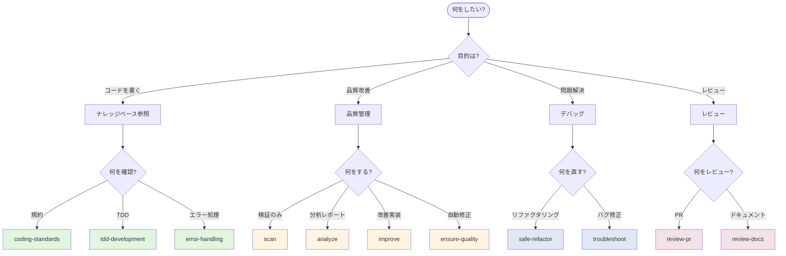
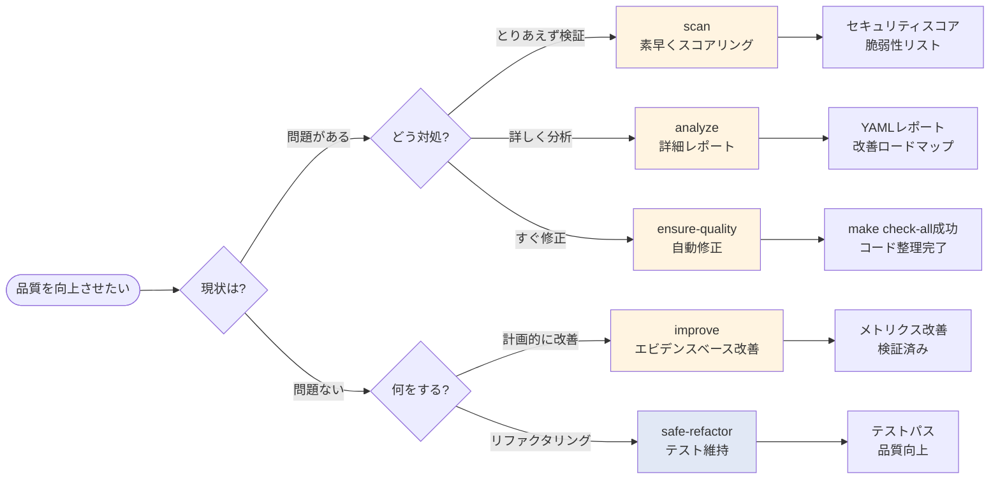
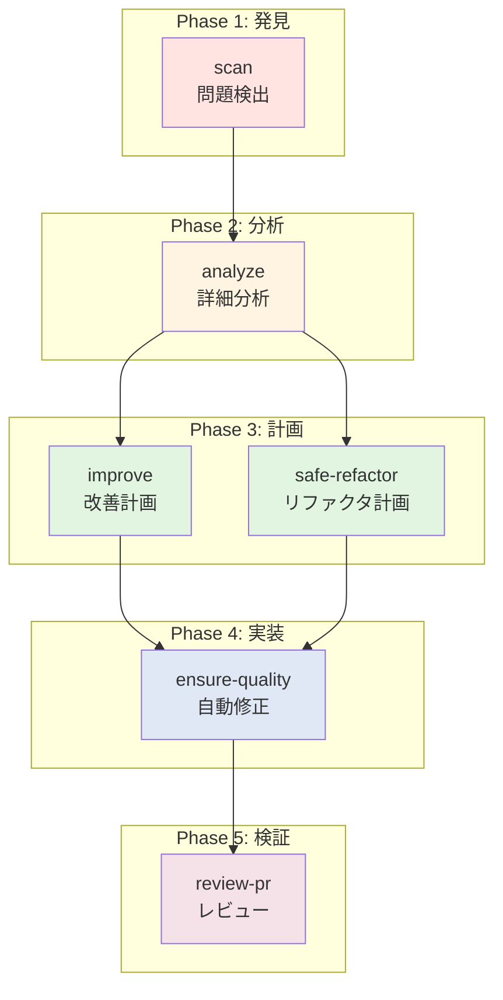
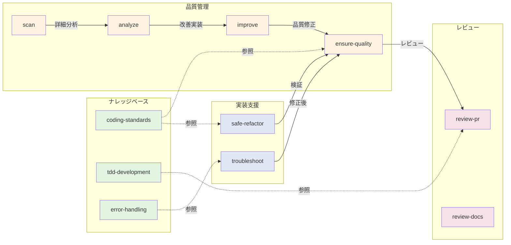
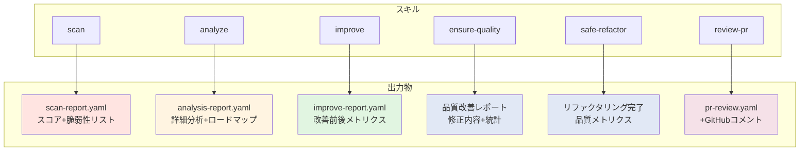

# Python開発スキル選択フローチャート

**生成日**: 2026-01-25

---

## スキル選択フロー

### 1. 目的別フローチャート



---

## 2. 品質管理スキルの使い分け



---

## 3. スキル実行順序（推奨ワークフロー）



---

## 4. スキル依存関係マップ



---

## 5. 状況別スキル選択マトリックス

| 状況 | 推奨スキル | 理由 |
|------|-----------|------|
| **PR作成前** | ensure-quality | 自動修正でmake check-allを通す |
| **週次レビュー** | scan → analyze | 素早くスコアリング→詳細分析 |
| **リファクタリング計画** | analyze → improve | 分析→エビデンスベース改善 |
| **バグ発生** | troubleshoot | 体系的なデバッグ |
| **パフォーマンス問題** | analyze --perf → improve | 詳細分析→最適化実装 |
| **セキュリティ懸念** | scan --security --owasp | OWASP準拠チェック |
| **コードレビュー** | review-pr | 7サブエージェント並列レビュー |
| **レガシーコード改善** | safe-refactor | テストカバレッジ維持 |
| **新機能実装** | tdd-development | TDDサイクル |
| **CI/CD失敗** | ensure-quality | 自動修正 |

---

## 6. スキルの出力物マップ



---

## 7. 緊急度×重要度マトリックス

```
        重要度
         ↑
    高   |  improve          | scan
         |  (計画的改善)      | (セキュリティ検証)
         |                  |
    ─────┼──────────────────┼───────→ 緊急度
         |                  |
    低   |  analyze          | ensure-quality
         |  (詳細分析)        | (自動修正)
         |                  |
```

**使い分け**:
- **緊急 & 重要**: scan（セキュリティ問題を即検出）
- **緊急 & 低重要**: ensure-quality（PR前の自動修正）
- **非緊急 & 重要**: improve（計画的な改善）
- **非緊急 & 低重要**: analyze（詳細な分析レポート）

---

## 8. スキル学習パス

```mermaid
graph LR
    Start([Python開発スタート]) --> Level1

    subgraph "Level 1: 基礎"
        Level1[coding-standards]
        Level1 --> L1A[tdd-development]
        L1A --> L1B[error-handling]
    end

    subgraph "Level 2: 品質管理"
        Level2[ensure-quality]
        Level2 --> L2A[scan]
        L2A --> L2B[analyze]
    end

    subgraph "Level 3: 改善"
        Level3[improve]
        Level3 --> L3A[safe-refactor]
    end

    subgraph "Level 4: デバッグ・レビュー"
        Level4[troubleshoot]
        Level4 --> L4A[review-pr]
    end

    L1B --> Level2
    L2B --> Level3
    L3A --> Level4

    style Level1 fill:#e1f5e1
    style L1A fill:#e1f5e1
    style L1B fill:#e1f5e1
    style Level2 fill:#fff4e1
    style L2A fill:#fff4e1
    style L2B fill:#fff4e1
    style Level3 fill:#e1e8f5
    style L3A fill:#e1e8f5
    style Level4 fill:#f5e1e8
    style L4A fill:#f5e1e8
```



---

## 凡例

### カラーコード

- 🟢 **緑**: ナレッジベース（読み取り専用）
- 🟡 **黄**: 品質管理（分析・検証）
- 🔵 **青**: 実装支援（リファクタリング・デバッグ）
- 🔴 **赤**: レビュー（PR・ドキュメント）

### スキルタイプ

- **ナレッジベース**: 参照のみ、実行なし
- **分析・検証**: レポート生成、スコアリング
- **実装・修正**: コード変更を伴う
- **レビュー**: 第三者視点での評価

---

**フローチャート完了**: 2026-01-25
