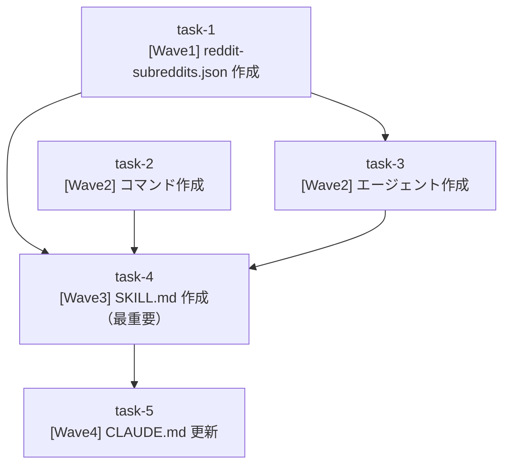

# Reddit 金融トピック収集ワークフロー

**作成日**: 2026-02-23
**ステータス**: 計画中
**タイプ**: workflow
**GitHub Project**: [#58](https://github.com/users/YH-05/projects/58)

## 背景と目的

### 背景

note.com や X での記事作成において「何を書くか」のトピック発見が課題。Reddit の金融・投資コミュニティ（r/stocks, r/investing, r/wallstreetbets 等）には、個人投資家のリアルな議論や注目銘柄の情報が集まっており、記事ネタの宝庫となっている。

### 目的

Reddit MCP を活用して複数の金融系 subreddit からトレンドトピックを自動収集し、情報を整理した上で、既存の `/finance-full` ワークフローに接続して note.com 記事を作成する一気通貫のフローを構築する。

### 成功基準

- [ ] `/reddit-finance-topics` コマンドを実行して subreddit からトピック一覧を取得できる
- [ ] `--deep` オプションで各トピックの深掘り分析と記事化提案が生成される
- [ ] Phase 3 で番号選択後に `/finance-full` が自動起動される
- [ ] `data/config/reddit-subreddits.json` の設定変更で対象 subreddit を容易に変更できる

## リサーチ結果

### 既存パターン

- **コマンド→スキル委譲パターン**: `ai-research-collect.md` をテンプレートとして流用可能
- **3フェーズワークフロー**: `ai-research-workflow/SKILL.md` が同型構造（前処理→並列エージェント→集約）
- **ToolSearch による MCP 動的ロード**: `ToolSearch('reddit')` 後に Reddit MCP ツールが利用可能
- **サブエージェント frontmatter**: `ai-research-article-fetcher.md` から流用可能
- **Reddit MCP 利用パターン**: `agents_sample/research-reddit.md` に実装例あり（get_subreddit_info は API 制限により失敗する場合があることに注意）

### 参考実装

| ファイル | 参考にすべき点 |
|---------|--------------|
| `.claude/commands/ai-research-collect.md` | コマンドの frontmatter・パラメータ解析・スキル委譲の標準実装 |
| `.claude/skills/ai-research-workflow/SKILL.md` | 3フェーズ構成・allowed-tools 定義・`.tmp/` への JSON 出力パターン |
| `.claude/agents/ai-research-article-fetcher.md` | サブエージェント frontmatter 構造（model/tools/permissionMode） |
| `.claude/agents_sample/research-reddit.md` | Reddit MCP ツールの呼び出しパターンと失敗ハンドリング |
| `data/config/finance-news-themes.json` | 設定 JSON の version + グループ別オブジェクト構造 |

### 技術的考慮事項

- Reddit MCP は `.mcp.json` への設定が必要（`command: uvx, args: [mcp-server-reddit]`）
- `get_subreddit_info` は API 制限により失敗する場合があるためスキップ処理が必要
- `--days` フィルタは `time_filter='week'` の近似値として扱う（created_utc による厳密フィルタリングは不要）
- Phase 2 は逐次処理（並列不可）でレート制限リスクを回避

## 実装計画

### アーキテクチャ概要

スラッシュコマンド `/reddit-finance-topics` を起点に、3フェーズで動作するワークフロー。Python CLI スクリプトは一切作成せず、全処理を Claude Code 内 MCP 呼び出しで完結させる。

```
/reddit-finance-topics (コマンド)
  → reddit-finance-topics スキル (オーケストレーター)
      Phase 1: AskUserQuestion でグループ選択 → ToolSearch('reddit') → MCP 収集 → フィルタリング → JSON 保存 → テーブル表示
      Phase 2: reddit-topic-analyzer を逐次起動 (--deep 時のみ)
      Phase 3: AskUserQuestion で番号選択 → Skill: finance-full 自動起動
```

### ファイルマップ

| 操作 | ファイルパス | 説明 |
|------|------------|------|
| 新規作成 | `data/config/reddit-subreddits.json` | subreddit グループ定義・フィルタ閾値・カテゴリマッピング |
| 新規作成 | `.claude/commands/reddit-finance-topics.md` | スラッシュコマンド（パラメータ解析→スキル委譲） |
| 新規作成 | `.claude/agents/reddit-topic-analyzer.md` | Phase 2 深掘りサブエージェント |
| 新規作成 | `.claude/skills/reddit-finance-topics/SKILL.md` | ワークフロー本体（オーケストレーター） |
| 変更 | `CLAUDE.md` | Slash Commands テーブルへの追記 |

### リスク評価

| リスク | 影響度 | 対策 |
|--------|--------|------|
| Reddit MCP が .mcp.json 未設定の場合に全停止 | 高 | スキル冒頭でチェックしエラーメッセージ・設定方法を表示 |
| time_filter パラメータ名が API 仕様と不一致 | 中 | time='week' 近似を明示、失敗時フォールバック（time_filter なしで再試行） |
| 全グループ選択時のコンテキスト増大 | 中 | AskUserQuestion でグループ選択を必須化 |
| スキル→スキルのネスト呼び出し | 低 | allowed-tools に Skill を追加、`0: スキップ` 選択肢も提供 |

## タスク一覧

### Wave 1

- [ ] [Wave1] data/config/reddit-subreddits.json 作成
  - Issue: [#3645](https://github.com/YH-05/finance/issues/3645)
  - ステータス: todo
  - 見積もり: 30分

### Wave 2（Wave 1 完了後）

- [ ] [Wave2] .claude/commands/reddit-finance-topics.md 作成
  - Issue: [#3646](https://github.com/YH-05/finance/issues/3646)
  - ステータス: todo
  - 見積もり: 20分

- [ ] [Wave2] .claude/agents/reddit-topic-analyzer.md 作成
  - Issue: [#3647](https://github.com/YH-05/finance/issues/3647)
  - ステータス: todo
  - 依存: #3645
  - 見積もり: 40分

### Wave 3（Wave 2 完了後）

- [ ] [Wave3] .claude/skills/reddit-finance-topics/SKILL.md 作成
  - Issue: [#3648](https://github.com/YH-05/finance/issues/3648)
  - ステータス: todo
  - 依存: #3645, #3646, #3647
  - 見積もり: 60分

### Wave 4（Wave 3 完了後）

- [ ] [Wave4] CLAUDE.md 更新
  - Issue: [#3649](https://github.com/YH-05/finance/issues/3649)
  - ステータス: todo
  - 依存: #3648
  - 見積もり: 5分

## 依存関係図



---

**最終更新**: 2026-02-23
