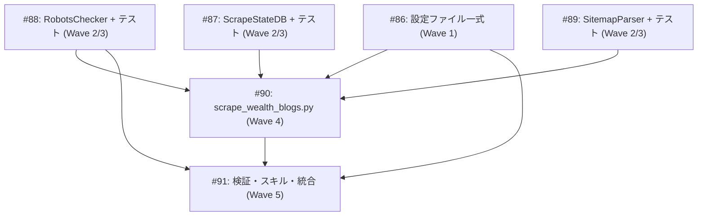

# Wealth Finance Blog RSS収集・スクレイピング実装

**作成日**: 2026-03-13
**ステータス**: 計画中
**タイプ**: package
**GitHub Project**: [#78](https://github.com/users/YH-05/projects/78)

## 背景と目的

### 背景

`data/rss_sources/` から特定した投資・資産形成関連の英語ブログ15サイト（Tier 1: 11, Tier 2: 3, Tier 3: 1）を、既存のRSSインフラ（`src/rss/`）に統合する。RSSフィードは最新10-20件しか返さないため、過去記事の全件取得にはサイトマップベースのバックフィルが必要。

### 目的

2モード動作（incremental: RSS差分取得 / backfill: サイトマップ全件取得）のスクレイピングパイプラインを構築し、テーマ別に整理してMarkdown保存する。

### 成功基準

- [ ] 15サイトのRSSフィードプリセットが `apply_presets()` で登録できる
- [ ] incrementalモードで新着記事を取得・保存できる
- [ ] backfillモードでサイトマップから全記事URLを収集・スクレイピングできる
- [ ] 状態DB（SQLite）で重複取得が排除される
- [ ] robots.txt制約（crawl-delay, ai-train等）が検出・遵守される
- [ ] テーマ別キーワードマッチングでセッションJSONが出力される
- [ ] `make check-all` が通る

## リサーチ結果

### 既存パターン

- **HTTPClient**: async HTTP + exponential backoff（`src/rss/core/http_client.py`）
- **ScrapingPolicy**: UA rotation(7種) + ドメインレート制限（`src/rss/services/company_scrapers/scraping_policy.py`）
- **ArticleExtractor**: trafilatura → lxml fallback 3段階抽出（`src/rss/services/article_extractor.py`）
- **FeedManager.apply_presets()**: JSONプリセットからフィード一括登録（`src/rss/services/feed_manager.py`）
- **session_utils**: filter_by_date, select_top_n, write_session_file（`scripts/session_utils.py`）
- **_get_logger()**: structlog + stdlib fallback の統一ロガー

### 参考実装

| ファイル | 参考にすべき点 |
|---------|--------------|
| `scripts/prepare_ai_research_session.py` | バッチスクレイピングパターン（--days, --categories, --top-n, --dry-run） |
| `scripts/prepare_asset_management_session.py` | テーママッチングパターン、--presets引数追加対象 |
| `data/config/rss-presets-jp.json` | プリセットJSONフォーマット |
| `data/config/asset-management-themes.json` | テーマJSONフォーマット |

### 技術的考慮事項

- `src/rss/config/` ディレクトリは未作成（新規作成が必要）
- Playwright は optional dependency として既に定義済み
- 大規模サイト（44,000+ URL）は全件メモリ保持（≈8.8MB で問題なし）
- crawl-delay が極端に長いサイト（monevator: 240s, marginalrevolution: 600s）はバックフィルに膨大な時間を要する

## 実装計画

### アーキテクチャ概要

既存 `src/rss/` パッケージに統合する2モード動作パイプライン。ScrapingPolicy・ArticleExtractor・HTTPClient・session_utils を最大限再利用。状態DB（SQLite）で重複排除・進捗追跡。

### ファイルマップ

| 操作 | ファイルパス | 説明 |
|------|------------|------|
| 新規作成 | `data/config/rss-presets-wealth.json` | 15サイトRSSフィードプリセット |
| 新規作成 | `data/config/wealth-management-themes.json` | 6テーマ定義 |
| 新規作成 | `src/rss/config/__init__.py` | configパッケージ初期化 |
| 新規作成 | `src/rss/config/wealth_scraping_config.py` | ドメインレート制限・サイトマップURL・バックフィルTier |
| 新規作成 | `data/config/wealth-sitemap-config.json` | 15サイトのサイトマップ設定 |
| 新規作成 | `src/rss/storage/scrape_state_db.py` | SQLite状態DB（WAL、コンテキストマネージャ） |
| 新規作成 | `src/rss/utils/robots_checker.py` | robots.txtチェッカー（ai-directive検出） |
| 新規作成 | `src/rss/utils/sitemap_parser.py` | サイトマップXMLパーサー（インデックス再帰展開） |
| 変更 | `src/rss/utils/__init__.py` | RobotsChecker, SitemapParser エクスポート追加 |
| 新規作成 | `tests/rss/unit/test_wealth_presets.py` | プリセット構造テスト |
| 新規作成 | `tests/rss/unit/storage/test_scrape_state_db.py` | ScrapeStateDB テスト |
| 新規作成 | `tests/rss/unit/utils/test_robots_checker.py` | RobotsChecker テスト |
| 新規作成 | `tests/rss/unit/utils/test_sitemap_parser.py` | SitemapParser テスト |
| 新規作成 | `scripts/scrape_wealth_blogs.py` | メインCLI（2モード対応） |
| 新規作成 | `scripts/validate_rss_presets.py` | プリセット検証スクリプト |
| 新規作成 | `.claude/skills/scrape-finance-blog/SKILL.md` | Claude Codeスキル定義 |
| 変更 | `scripts/prepare_asset_management_session.py` | --presets引数追加 |

### リスク評価

| リスク | 影響度 | 対策 |
|--------|--------|------|
| backfill所要時間（crawl-delay 240-600s） | 高 | --backfill-tier で段階的実行、中断再開可能 |
| Playwright必須（Tier D） | 中 | try import ガード、未インストール時自動スキップ |
| 大規模サイトメモリ | 中 | 1ドメインずつ処理、44K URL ≈ 8.8MB |
| ai-train=no サイト | 低 | --check-robots でオプトイン検出 |

## タスク一覧

### Wave 1（依存なし）

- [ ] 設定ファイル一式の作成
  - Issue: [#86](https://github.com/YH-05/note-finance/issues/86)
  - ステータス: todo
  - 見積もり: 1-1.5h

### Wave 2/3（Wave 1 と並行可能、TDDペア）

- [ ] ScrapeStateDB + テスト
  - Issue: [#87](https://github.com/YH-05/note-finance/issues/87)
  - ステータス: todo
  - 見積もり: 1.5-2h

- [ ] RobotsChecker + テスト
  - Issue: [#88](https://github.com/YH-05/note-finance/issues/88)
  - ステータス: todo
  - 見積もり: 1-1.5h

- [ ] SitemapParser + テスト + utils/__init__.py更新
  - Issue: [#89](https://github.com/YH-05/note-finance/issues/89)
  - ステータス: todo
  - 見積もり: 1.5-2h

### Wave 4（Wave 1-3 完了後）

- [ ] メインCLI scrape_wealth_blogs.py
  - Issue: [#90](https://github.com/YH-05/note-finance/issues/90)
  - ステータス: todo
  - 依存: #86, #87, #88, #89
  - 見積もり: 2-2.5h

### Wave 5（Wave 4 完了後）

- [ ] 検証スクリプト・スキル定義・ワークフロー統合
  - Issue: [#91](https://github.com/YH-05/note-finance/issues/91)
  - ステータス: todo
  - 依存: #86, #88, #90
  - 見積もり: 1-1.5h

## 依存関係図

---

**最終更新**: 2026-03-13
