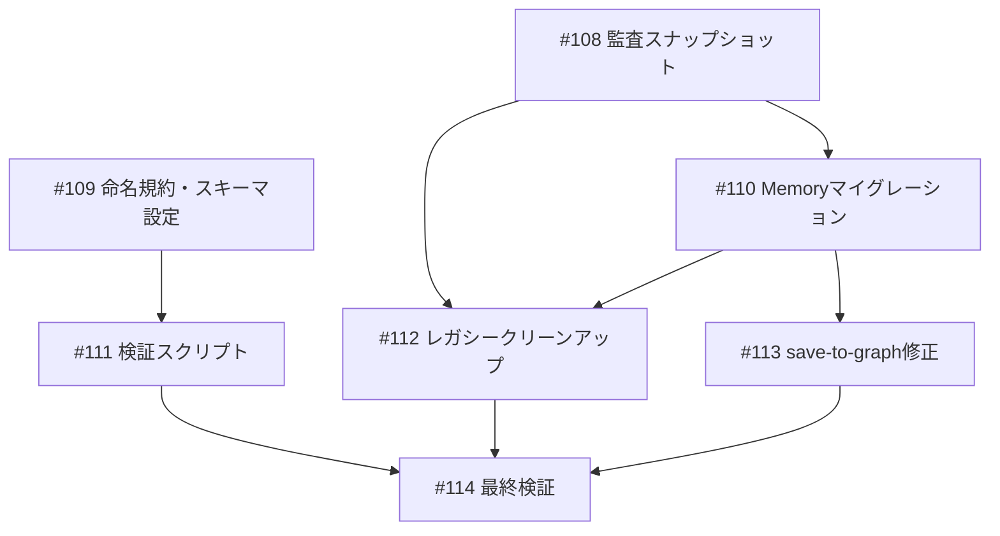

# Neo4j スキーマ PascalCase 統一

**作成日**: 2026-03-15
**ステータス**: 計画中
**タイプ**: from_plan_file
**GitHub Project**: [#80](https://github.com/users/YH-05/projects/80)

## 背景と目的

### 背景

Neo4jデータベースに49個のノードラベルが存在し、3つの異なるデータソースが同一DBに混在している：

| 名前空間 | ラベル例 | 命名規則 | 状態 |
|---------|---------|---------|------|
| KG v2（10ノード） | Source, Claim, Entity | PascalCase | 問題なし |
| Conversation（3ノード） | ConversationSession, Project | PascalCase | 問題なし |
| Memory（16サブラベル） | Memory + decision, project, theme... | snake_case | **要修正** |
| Legacy（26ノード） | Decision(56個), Article, Person... | 混在 | **要クリーンアップ** |

根本原因: `mcp-neo4j-memory` OSSパッケージが `entity.type` の値をそのままラベルとして設定。上流OSSのため直接修正不可だが、呼び出し側でPascalCaseを渡すことで統一可能。

### 目的

全ラベルをPascalCaseに統一し、名前空間を明確に分離する。

### 成功基準

- [ ] 全ラベルがPascalCase（`CALL db.labels() WHERE label =~ '^[a-z].*'` が0件）
- [ ] 名前空間分類でUNKNOWNが空
- [ ] `mcp__memory__note-finance-read_graph` が正常動作
- [ ] `validate_neo4j_schema.py` でUNKNOWN = 0件

## リサーチ結果

### 既存パターン

- **MERGEベース冪等投入**: save-to-graphスキルがMERGEでノード/リレーション投入を実現
- **名前空間分離**: KG v2/Conversation/Memory の3名前空間が同一DBに共存
- **PascalCase統一**: KG v2とConversation名前空間は既にPascalCase準拠

### 参考実装

| ファイル | 説明 |
|---------|------|
| `data/config/knowledge-graph-schema.yaml` | KG v2スキーマSSoT（10ノード・13リレーション） |
| `data/config/neo4j-pdf-constraints.cypher` | UNIQUE制約10個 + インデックス13個 |
| `.claude/skills/save-to-graph/guide.md` | KGデータ投入のCypherテンプレート |
| `scripts/save_conversations_to_neo4j.py` | 会話履歴保存（Neo4j接続パターン参考） |

### 技術的考慮事項

- mcp-neo4j-memory は `e.type` の値をそのままラベルとして設定（line 187）
- Memory ラベル変換後、read_graph がPascalCaseの型名を返すため呼び出し側の互換性確認が必要
- Decision/Project ラベルが Memory サブラベルとレガシーノードで重複

## 実装計画

### アーキテクチャ概要

監査→マイグレーション→クリーンアップ→ドキュメント→検証スクリプト→コード修正の6フェーズ構成。

### ファイルマップ

| 操作 | ファイルパス | 説明 |
|------|------------|------|
| 新規作成 | `data/processed/neo4j_audit_2026-03-15.json` | 監査スナップショット |
| 新規作成 | `.claude/rules/neo4j-namespace-convention.md` | 命名規約ドキュメント |
| 変更 | `data/config/knowledge-graph-schema.yaml` | namespacesセクション追加 |
| 新規作成 | `scripts/validate_neo4j_schema.py` | スキーマ検証スクリプト |
| 変更 | `.claude/skills/save-to-graph/guide.md` | Memoryフィルタ追加 |

### リスク評価

| リスク | 影響度 | 対策 |
|--------|--------|------|
| Memory ラベル変換後の read_graph 互換性 | 中 | マイグレーション後に read_graph で正常読取確認 |
| レガシーノード DETACH DELETE で予期しないリレーション削除 | 中 | 監査でリレーション有無確認、:Archived ソフト削除を優先 |
| Decision/Project ラベルの Memory/レガシー重複 | 低 | `WHERE NOT 'Memory' IN labels(n)` で区別 |

## タスク一覧

### Wave 1（並行開発可能）

- [ ] 監査スナップショット取得
  - Issue: [#108](https://github.com/YH-05/note-finance/issues/108)
  - ステータス: todo
  - 見積もり: 0.5h

- [ ] 命名規約ドキュメント・スキーマ設定
  - Issue: [#109](https://github.com/YH-05/note-finance/issues/109)
  - ステータス: todo
  - 見積もり: 0.5h

### Wave 2（Wave 1 完了後）

- [ ] Memory サブラベルマイグレーション
  - Issue: [#110](https://github.com/YH-05/note-finance/issues/110)
  - ステータス: todo
  - 依存: #108
  - 見積もり: 0.5h

- [ ] スキーマ検証スクリプト作成
  - Issue: [#111](https://github.com/YH-05/note-finance/issues/111)
  - ステータス: todo
  - 依存: #109
  - 見積もり: 0.5h

### Wave 3（Wave 2 完了後）

- [ ] レガシーノード監査・クリーンアップ
  - Issue: [#112](https://github.com/YH-05/note-finance/issues/112)
  - ステータス: todo
  - 依存: #108, #110
  - 見積もり: 0.5h

- [ ] save-to-graph コード修正
  - Issue: [#113](https://github.com/YH-05/note-finance/issues/113)
  - ステータス: todo
  - 依存: #110
  - 見積もり: 0.25h

### Wave 4（Wave 3 完了後）

- [ ] 最終検証
  - Issue: [#114](https://github.com/YH-05/note-finance/issues/114)
  - ステータス: todo
  - 依存: #111, #112, #113
  - 見積もり: 0.25h

## 依存関係図

---

**最終更新**: 2026-03-15
