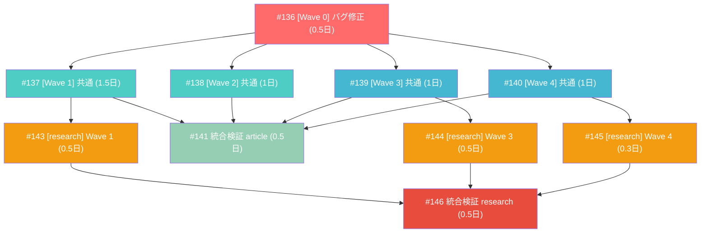

# KG v2.1: AI推論最適化スキーマ設計

**作成日**: 2026-03-17
**ステータス**: 計画中
**タイプ**: schema_extension (from_plan_file)
**GitHub Project**: [#83](https://github.com/users/YH-05/projects/83)
**元プラン (article-neo4j)**: [original-plan.md](./original-plan.md)
**元プラン (research-neo4j)**: [original-plan-research.md](./original-plan-research.md)

## 背景と目的

### 背景

現行 KG v2.0 は Storage-Oriented 設計で、投資スタンスの時系列変化、因果関係、知識ギャップ、時間軸の連鎖がプロパティに閉じ込められており、AI がグラフ走査だけでは発見できない。

### 目的

Selective Reification（選択的実体化）戦略により、推論に必要な情報を選択的にノード/エッジに昇格する。v2.0（10N/15R）→ v2.1（13N/25R）。

### 成功基準

- [ ] 全推論クエリ（SUPERSEDES連鎖/因果チェーン/TREND走査/Question検索）が期待結果を返すこと
- [ ] v2.0 スキーマの既存データが破壊されないこと
- [ ] `make check-all` が全通過すること
- [ ] 非 pdf-extraction マッパーに影響がないこと

## リサーチ結果

### 既存パターン

| パターン | 説明 |
|---------|------|
| `_build_*_nodes()` ヘルパー関数 | scripts/emit_graph_queue.py L665-1060 — 5つのbuilder関数が存在 |
| UUID5 / SHA-256 ID戦略 | id_generator.py — UUID5（source/entity/chunk/period）、SHA-256[:32]（claim/fact/datapoint） |
| `_mapped_result()` 9キーワード引数 | sources/topics/claims/facts/entities/chunks/financial_datapoints/fiscal_periods/relations |
| テスト命名規則 | test_正常系_*/test_異常系_*/test_エッジケース_* |

### 参考実装

| ファイル | 参考にすべき点 |
|---------|-------------|
| `scripts/emit_graph_queue.py` L665-1060 | `_build_*_nodes()` パターン — 新builder関数もこの形式に統一 |
| `src/pdf_pipeline/schemas/extraction.py` L132-195 | `ExtractedClaim` パターン — 新モデルもこの形式に統一 |
| `tests/scripts/test_emit_graph_queue.py` | テストクラス・ヘルパー関数パターン |

### 技術的考慮事項

- Author ノードは v2.0 で定義済み — Wave 1 で実体化（既存 AUTHORED_BY と HOLDS_STANCE を共存）
- content-to-ID マッピングは chunk スコープ内で解決（シンプル・安全）
- as_of_date は ISO 8601 文字列として処理、Neo4j 投入時に date() 変換
- CAUSES の Neo4j CE 対応: from_label/to_label プロパティによるラベル別分岐

## 実装計画

### アーキテクチャ概要

```
PDF → KnowledgeExtractor（LLMプロンプト）
  → ChunkExtractionResult（Pydantic）
  → _process_chunk()（chunk内builder群）
  → map_pdf_extraction()（後処理: SUPERSEDES/NEXT_PERIOD/TREND連鎖生成）
  → _mapped_result()（graph-queue JSON）
  → save-to-graph スキル（Cypher MERGE）
  → article-neo4j（bolt://localhost:7689）/ research-neo4j（bolt://localhost:7688）
```

### スキーマ変更サマリー

| Wave | 新ノード | 新リレーション | 合計 |
|------|---------|--------------|------|
| 0 | — | — | バグ修正のみ |
| 1 | Stance, Author(実体化) | HOLDS_STANCE, ON_ENTITY, BASED_ON, SUPERSEDES | 2N + 4R |
| 2 | — | CAUSES | 1R |
| 3 | — | NEXT_PERIOD, TREND | 2R |
| 4 | Question | ASKS_ABOUT, MOTIVATED_BY, ANSWERED_BY | 1N + 3R |
| **合計** | **3ノード** | **10リレーション** | v2.0→v2.1: 13N/25R |

### リスク評価

| リスク | 影響度 | 対策 |
|--------|--------|------|
| Wave 1-4 並列時の共有関数コンフリクト | 高 | 順次マージ（1→2→3→4） |
| pyright strict の Literal 型エラー | 高 | 既存パターン踏襲 + 各Wave後に make check-all |
| CAUSES の9通りラベル別分岐 | 中 | まず1通りで動作確認 → 残り追加 |

## タスク一覧

### Wave 0（blocking — 全Waveの前提）

- [ ] [Wave 0] Claim フィールド欠落バグ修正 + TestMapPdfExtraction テスト基盤構築
  - Issue: [#136](https://github.com/YH-05/note-finance/issues/136)
  - ステータス: todo
  - 見積もり: 0.5日

### Wave 1-4（Wave 0 完了後、順次マージ推奨）

- [ ] [Wave 1] Stance + SUPERSEDES: 投資スタンスの時系列追跡スキーマ実装
  - Issue: [#137](https://github.com/YH-05/note-finance/issues/137)
  - ステータス: todo
  - 依存: #136
  - 見積もり: 1.5日

- [ ] [Wave 2] CAUSES エッジ: Fact/Claim/FinancialDataPoint 間の因果関係明示化
  - Issue: [#138](https://github.com/YH-05/note-finance/issues/138)
  - ステータス: todo
  - 依存: #136
  - 見積もり: 1日

- [ ] [Wave 3] Temporal Chain: FiscalPeriod / FinancialDataPoint の時系列構造化
  - Issue: [#139](https://github.com/YH-05/note-finance/issues/139)
  - ステータス: todo
  - 依存: #136
  - 見積もり: 1日

- [ ] [Wave 4] Question ノード: 知識ギャップの構造化スキーマ実装
  - Issue: [#140](https://github.com/YH-05/note-finance/issues/140)
  - ステータス: todo
  - 依存: #136
  - 見積もり: 1日

### research-neo4j 固有タスク（各 Wave 共通実装の完了後）

- [ ] [research-neo4j] Wave 1 固有: Author=publisher 実体化 + Claim→Stance 遡及バッチ
  - Issue: [#143](https://github.com/YH-05/note-finance/issues/143)
  - ステータス: todo
  - 依存: #137
  - 見積もり: 0.5日

- [ ] [research-neo4j] Wave 3 固有: Metric.metric_id グルーピング + Temporal Chain 遡及バッチ
  - Issue: [#144](https://github.com/YH-05/note-finance/issues/144)
  - ステータス: todo
  - 依存: #139
  - 見積もり: 0.5日

- [ ] [research-neo4j] Wave 4 固有: consensus_divergence + prediction_test question_type 追加
  - Issue: [#145](https://github.com/YH-05/note-finance/issues/145)
  - ステータス: todo
  - 依存: #140
  - 見積もり: 0.3日

### 統合検証（全Wave完了後）

- [ ] [統合検証] KG v2.1 全Wave統合後の E2E 検証 (article-neo4j)
  - Issue: [#141](https://github.com/YH-05/note-finance/issues/141)
  - ステータス: todo
  - 依存: #137, #138, #139, #140
  - 見積もり: 0.5日

- [ ] [research-neo4j] 統合検証: research-neo4j E2E 検証
  - Issue: [#146](https://github.com/YH-05/note-finance/issues/146)
  - ステータス: todo
  - 依存: #143, #144, #145
  - 見積もり: 0.5日

## 依存関係図



### クリティカルパス

task-1 (#136) → task-2 (#137) → task-7 (#143) → task-10 (#146) = **3日**

### マージ順序（推奨）

`feature/kg-v2.1-wave0` → `wave1` → `wave2` → `wave3` → `wave4`

---

**最終更新**: 2026-03-17
