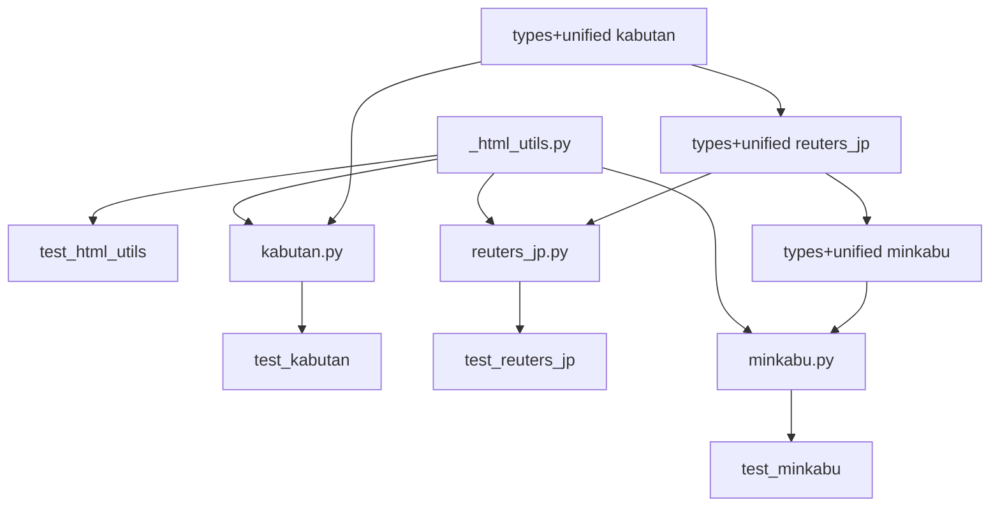

# 日本株ニュース HTMLスクレイパー追加

**作成日**: 2026-03-18
**ステータス**: 計画中
**タイプ**: package
**GitHub Project**: [#84](https://github.com/users/YH-05/projects/84)

## 背景と目的

### 背景

`rss-presets-jp.json` に日本株ニュースソースを追加する際、RSS非提供の3サイト（株探・ロイター日本語版・みんかぶ）をカバーする必要がある。既存の `src/news_scraper/` パッケージには CNBC/NASDAQ のスクレイパーが実装済みで、同じ `collect_news()` インターフェースで拡張可能な設計になっている。

### 目的

- 株探（kabutan.jp）・ロイター日本語版（jp.reuters.com）・みんかぶ（minkabu.jp）のHTMLスクレイパーを実装
- 既存の `SOURCE_REGISTRY` に統合し、`collect_financial_news(sources=['kabutan'])` のように利用可能にする

### 成功基準

- [ ] 3サイト全てで `collect_news()` が `list[Article]` を正しく返す
- [ ] `make check-all` が通る（format, lint, typecheck, test）
- [ ] デフォルト sources `['cnbc', 'nasdaq']` に影響しない

## リサーチ結果

### 既存パターン

- `collect_news(config: ScraperConfig | None = None) -> list[Article]` の統一インターフェース
- `SOURCE_REGISTRY` + 遅延インポートラッパーで新ソース追加時に本体変更不要
- `httpx.Client` + `ThreadPoolExecutor` による並列取得
- `structlog get_logger` + bound context でモジュール別ロギング

### 参考実装

| ファイル | 説明 |
|---------|------|
| `src/news_scraper/nasdaq.py` | httpx.Client + ThreadPoolExecutor パターン |
| `src/news_scraper/cnbc.py` | collect_news() インターフェースの実装例 |
| `src/news_scraper/unified.py:40-57` | SOURCE_REGISTRY + 遅延インポートパターン |
| `src/news_scraper/types.py:32` | SourceName Literal 型定義 |

### 技術的考慮事項

- **株探**: `<time datetime="ISO8601+JST">` 属性があるため年推定ロジック不要。テーブルが広告で2分割される。
- **ロイター**: 完全SSR（httpx + lxml で十分）。`/markets/` と `/business/` で異なるカード構造。`data-testid` セレクタが安定。
- **みんかぶ**: SPA のため sync_playwright 必須。`use_playwright=False` で graceful degradation。
- **非同期化**: 既存コード全面syncのため本プロジェクトではスコープ外。将来の別プロジェクトで対応。

## 実装計画

### アーキテクチャ概要

既存 news_scraper パッケージに3つのHTMLスクレイパーを追加。共通処理を `_html_utils.py` に集約し、各スクレイパーは `collect_news()` インターフェースに従う。`unified.py` の `SOURCE_REGISTRY` に遅延インポート方式で登録。

### ファイルマップ

| 操作 | ファイルパス | 説明 |
|------|------------|------|
| 新規作成 | `src/news_scraper/_html_utils.py` | 共通HTMLパースユーティリティ |
| 新規作成 | `src/news_scraper/kabutan.py` | 株探スクレイパー |
| 新規作成 | `src/news_scraper/reuters_jp.py` | ロイターJPスクレイパー |
| 新規作成 | `src/news_scraper/minkabu.py` | みんかぶスクレイパー |
| 新規作成 | `tests/news_scraper/unit/test_html_utils.py` | ユーティリティテスト |
| 新規作成 | `tests/news_scraper/unit/test_kabutan.py` | 株探テスト |
| 新規作成 | `tests/news_scraper/unit/test_reuters_jp.py` | ロイターJPテスト |
| 新規作成 | `tests/news_scraper/unit/test_minkabu.py` | みんかぶテスト |
| 変更 | `src/news_scraper/types.py` | SourceName に3ソース追加 |
| 変更 | `src/news_scraper/unified.py` | SOURCE_REGISTRY に3エントリ追加 |

### リスク評価

| リスク | 影響度 | 対策 |
|--------|--------|------|
| みんかぶの無限スクロール複雑性 | 高 | max_articles_per_source で上限管理、タイムアウト保護 |
| 株探のHTML構造変更 | 中 | XPathを定数化、0件時に警告ログ |
| ロイター data-testid 変更 | 中 | URLパターンによる二次フィルタリング |
| ロイター IPブロック | 中 | ブラウザ風UA + 2.0s遅延 + graceful degradation |

## タスク一覧

### Wave 1: Foundation + 株探（3-4時間）

- [ ] 共通HTMLユーティリティ (_html_utils.py) の実装
  - Issue: [#148](https://github.com/YH-05/note-finance/issues/148)
  - 見積もり: 1-1.5時間

- [ ] _html_utils.py のユニットテスト実装
  - Issue: [#149](https://github.com/YH-05/note-finance/issues/149)
  - 依存: #148
  - 見積もり: 0.5-1時間

- [ ] SourceName型に 'kabutan' 追加 & unified.py登録
  - Issue: [#150](https://github.com/YH-05/note-finance/issues/150)
  - 依存: #148
  - 見積もり: 0.5時間

- [ ] 株探スクレイパー (kabutan.py) の実装
  - Issue: [#151](https://github.com/YH-05/note-finance/issues/151)
  - 依存: #148, #150
  - 見積もり: 1.5-2時間

- [ ] kabutan.py のユニットテスト実装
  - Issue: [#152](https://github.com/YH-05/note-finance/issues/152)
  - 依存: #151
  - 見積もり: 1-1.5時間

### Wave 2: ロイター日本語版（3-5時間）

- [ ] SourceName型に 'reuters_jp' 追加 & unified.py登録
  - Issue: [#153](https://github.com/YH-05/note-finance/issues/153)
  - 依存: #150
  - 見積もり: 0.5時間

- [ ] ロイター日本語版スクレイパー (reuters_jp.py) の実装
  - Issue: [#154](https://github.com/YH-05/note-finance/issues/154)
  - 依存: #148, #153
  - 見積もり: 2-3時間

- [ ] reuters_jp.py のユニットテスト実装
  - Issue: [#155](https://github.com/YH-05/note-finance/issues/155)
  - 依存: #154
  - 見積もり: 1.5-2時間

### Wave 3: みんかぶ（4-6時間）

- [ ] SourceName型に 'minkabu' 追加 & unified.py登録
  - Issue: [#156](https://github.com/YH-05/note-finance/issues/156)
  - 依存: #153
  - 見積もり: 0.5時間

- [ ] みんかぶスクレイパー (minkabu.py) の実装
  - Issue: [#157](https://github.com/YH-05/note-finance/issues/157)
  - 依存: #148, #156
  - 見積もり: 2.5-3.5時間

- [ ] minkabu.py のユニットテスト実装
  - Issue: [#158](https://github.com/YH-05/note-finance/issues/158)
  - 依存: #157
  - 見積もり: 1-1.5時間

### Wave 4: 将来タスク

- [ ] news_scraper パッケージ全体の非同期化
  - Issue: [#159](https://github.com/YH-05/note-finance/issues/159)
  - 見積もり: 未定（別プロジェクト）

## 依存関係図

---

**最終更新**: 2026-03-18
