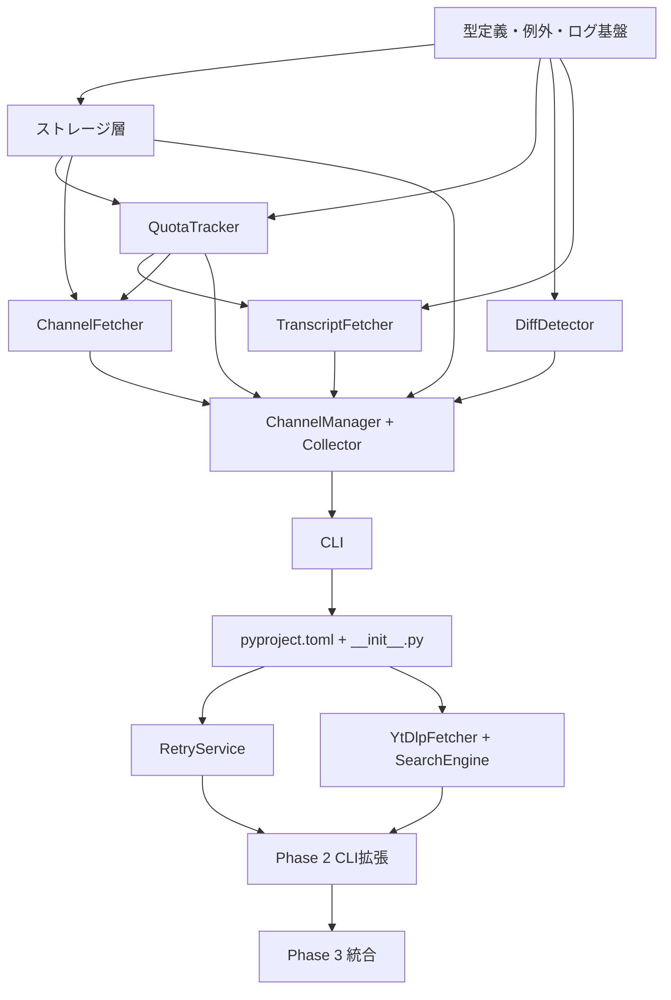

# YouTube Transcript Collector

**作成日**: 2026-03-18
**ステータス**: 計画中
**タイプ**: package
**GitHub Project**: [#85](https://github.com/users/YH-05/projects/85)

## 背景と目的

### 背景

指定した YouTube チャンネルの全動画トランスクリプトを自動収集するシステムを構築する。
YouTube Data API v3 + youtube-transcript-api の2段構成で、ウォッチ対象チャンネルの過去全動画＋新着動画のトランスクリプトを取得・蓄積する。

### 目的

- YouTube チャンネルの動画トランスクリプトを自動収集・蓄積する
- 収集したトランスクリプトを NotebookLM やナレッジグラフと連携して活用する
- CLI ツール（`yt-transcript`）で直感的に操作できる

### 成功基準

- [ ] `yt-transcript channel add <url>` でチャンネル登録ができる
- [ ] `yt-transcript collect --all` で全チャンネルのトランスクリプトを収集できる
- [ ] `make check-all` が全てパスする
- [ ] Phase 3 で NotebookLM・ナレッジグラフ連携が動作する

## リサーチ結果

### 既存パターン

- **4層構造** (core / storage / services / cli) — `src/rss/` と同じアーキテクチャ
- **@dataclass + str(Enum)** — 型定義パターン
- **JSONStorage + LockManager** — filelock 排他制御
- **Click + Rich Table CLI** — CLI 構成
- **data_paths.get_path()** — データルート解決

### 参考実装

| ファイル | 参考にすべき点 |
|---------|---------------|
| `src/rss/types.py` | @dataclass + str(Enum) パターン |
| `src/rss/storage/json_storage.py` | JSONStorage + LockManager 排他制御 |
| `src/rss/core/diff_detector.py` | 差分検出（video_id キーに変更） |
| `src/rss/services/feed_manager.py` | CRUD サービスパターン |
| `src/rss/services/feed_fetcher.py` | 5ステップ収集フロー |
| `src/rss/cli/main.py` | Click + Rich CLI |
| `src/data_paths/paths.py` | get_path('raw/youtube') |

### 技術的考慮事項

- youtube-transcript-api 1.0.x の API 差異を実装前に確認する必要あり
- YouTube API quota (10,000 units/day) の管理が必要
- youtube-transcript-api は非公式ライブラリのため利用不能リスクあり（yt-dlp フォールバックで対策）

## 実装計画

### アーキテクチャ概要

`src/rss/` の4層アーキテクチャを踏襲。Phase 1（MVP）→ Phase 2（拡張）→ Phase 3（統合）の3段階で実装。

### リスク評価

| リスク | 影響度 | 対策 |
|--------|--------|------|
| youtube-transcript-api 1.0.x 破壊的変更 | 高 | 実装前スパイク、0.x 固定の選択肢保持 |
| YouTube API quota 超過 | 高 | QuotaTracker を Phase 1 から実装（9,000 units/day） |
| youtube-transcript-api 利用不能 | 高 | Phase 2 で yt-dlp フォールバック |
| URL 4形式正規化の複雑性 | 中 | 正規表現 + channels.list 正規化 |
| 3階層ストレージのロック管理 | 中 | 同期的順次処理で回避 |

## タスク一覧

### Wave 1（Phase 1 MVP — 順次実装）

- [ ] task-001: 型定義・例外・ログ基盤の実装（2-3h）
  - Issue: [#160](https://github.com/YH-05/note-finance/issues/160)
- [ ] task-002: ストレージ層（LockManager + JSONStorage）（3-4h）
  - Issue: [#161](https://github.com/YH-05/note-finance/issues/161)
  - 依存: #160
- [ ] task-003: QuotaTracker の実装（2h）
  - Issue: [#162](https://github.com/YH-05/note-finance/issues/162)
  - 依存: #160, #161
- [ ] task-004: DiffDetector の実装（1-2h）
  - Issue: [#163](https://github.com/YH-05/note-finance/issues/163)
  - 依存: #160
- [ ] task-005: TranscriptFetcher の実装（2-3h）
  - Issue: [#164](https://github.com/YH-05/note-finance/issues/164)
  - 依存: #160, #162
- [ ] task-006: ChannelFetcher（URL正規化含む）（3-4h）
  - Issue: [#165](https://github.com/YH-05/note-finance/issues/165)
  - 依存: #160, #161, #162
- [ ] task-007: ChannelManager + Collector サービス層（3-4h）
  - Issue: [#166](https://github.com/YH-05/note-finance/issues/166)
  - 依存: #161, #162, #163, #164, #165
- [ ] task-008: CLI（Click + Rich）（2-3h）
  - Issue: [#167](https://github.com/YH-05/note-finance/issues/167)
  - 依存: #166
- [ ] task-009: pyproject.toml + __init__.py（仕上げ）（1h）
  - Issue: [#168](https://github.com/YH-05/note-finance/issues/168)
  - 依存: #167

### Wave 2（Phase 2 拡張）

- [ ] task-010: RetryService（失敗再取得）（2h）
  - Issue: [#169](https://github.com/YH-05/note-finance/issues/169)
  - 依存: #168
- [ ] task-011: YtDlpFetcher + SearchEngine（2-3h）
  - Issue: [#170](https://github.com/YH-05/note-finance/issues/170)
  - 依存: #168
- [ ] task-012: Phase 2 CLI 拡張（1-2h）
  - Issue: [#171](https://github.com/YH-05/note-finance/issues/171)
  - 依存: #169, #170

### Wave 3（Phase 3 統合）

- [ ] task-013: NLM + KG + スケジューラ + CLI（4-5h）
  - Issue: [#172](https://github.com/YH-05/note-finance/issues/172)
  - 依存: #171

## 依存関係図

## 関連ドキュメント

- [議論メモ](./original-plan.md)
- [実装計画](../../plan/2026-03-18_youtube-transcript-collector.md)

---

**最終更新**: 2026-03-18
