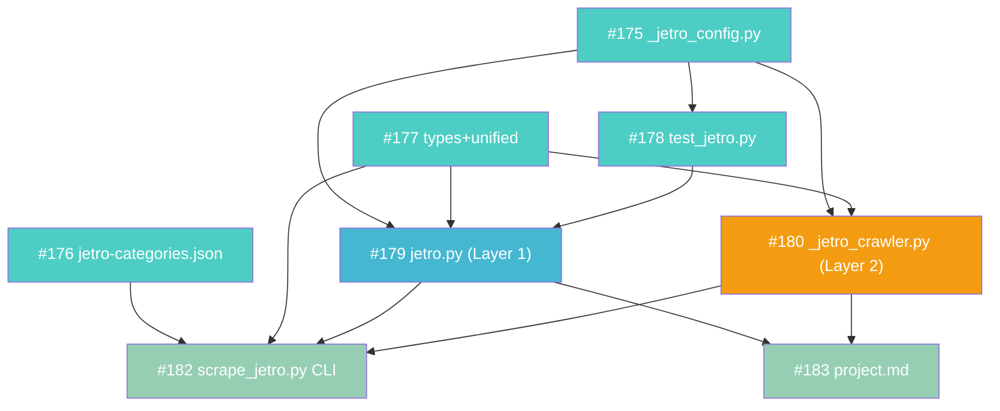

# Project 17: JETRO ビジネス短信スクレイパー

## メタ情報

| 項目 | 値 |
|------|-----|
| GitHub Project | [#86](https://github.com/users/YH-05/projects/86) |
| 作成日 | 2026-03-18 |
| ステータス | 実装中 |
| タイプ | package (news_scraper 拡張) |
| Issues | #175 - #183 (9件) |

## 概要

JETRO（日本貿易振興機構）のビジネス短信・カテゴリページから貿易・ビジネスニュースを自動収集するスクレイパーを `news_scraper` パッケージに追加する。既存の `collect_news()` インターフェースに準拠し、`SOURCE_REGISTRY` 経由で統合。

## 背景

- JETRO はRSS 2.0フィード（ビジネス短信）を提供しているが、カテゴリページ（地域・テーマ・産業別）はAJAX動的ロードのためPlaywrightが必要
- 既存の `news_scraper` パッケージ（CNBC, NASDAQ）と同じ `collect_news()` インターフェースで統合可能
- 日本語日付形式（`2026年03月18日`）とRFC 2822の両方に対応が必要

## アーキテクチャ

### 2層構成

```
                         ┌──────────────────────────┐
                         │   scrape_jetro.py (CLI)  │
                         │  argparse + JSON出力     │
                         └───────────┬──────────────┘
                                     │
                         ┌───────────▼──────────────┐
                         │   collect_news()          │
                         │   (jetro.py)              │
                         │   統一エントリポイント     │
                         └──────┬───────────┬────────┘
                                │           │
                   ┌────────────▼──┐  ┌─────▼──────────────┐
                   │  Layer 1      │  │  Layer 2            │
                   │  RSS取得      │  │  Playwright Crawler │
                   │  + 記事詳細   │  │  カテゴリページ     │
                   │  スクレイピング│  │  DOM抽出            │
                   └───────────────┘  └─────────────────────┘
                   feedparser          async_playwright
                   httpx               lxml
                   trafilatura
```

**Layer 1** (`jetro.py`): RSS 2.0フィードからビジネス短信を取得し、オプションで個別記事ページの本文・タグをスクレイピング。`feedparser` + `httpx` + `trafilatura`（lxml フォールバック）を使用。

**Layer 2** (`_jetro_crawler.py`): AJAXで動的ロードされるカテゴリページ（地域・テーマ・産業別）をPlaywrightでレンダリング後、DOM からエントリを抽出。`networkidle` タイムアウト時は `domcontentloaded` にフォールバック。`asyncio.run()` 同期ラッパーで `collect_news()` から呼び出し可能。

### データフロー

```
RSS Feed (biznews.xml)
  → feedparser.parse()
  → _entry_to_article() / _to_article()
  → list[Article]

Category Pages (biznewstop/asia/cn.html 等)
  → Playwright render → lxml DOM parse
  → _extract_section_entries_from_html()
  → list[CrawledEntry]
  → Article 変換
  → list[Article]

全記事 → deduplicate_by_url() → 最終結果
```

### 統合方式

`unified.py` の `SOURCE_REGISTRY` に遅延インポートラッパー `_collect_jetro()` を登録。`SourceName` Literal型に `"jetro"` を追加。デフォルト `enabled_sources` には含めない（明示指定が必要）。

```python
# types.py
type SourceName = Literal["cnbc", "jetro", "nasdaq"]

# unified.py
SOURCE_REGISTRY = {
    "cnbc": _collect_cnbc,
    "jetro": _collect_jetro,    # 遅延インポート
    "nasdaq": _collect_nasdaq,
}
```

## ファイルマップ

### 実装ファイル

| 操作 | ファイルパス | 行数 | 説明 |
|------|------------|------|------|
| 新規 | `src/news_scraper/_jetro_config.py` | 242 | 定数・CSSセレクタ・JetroContentMeta |
| 新規 | `src/news_scraper/jetro.py` | 538 | Layer 1: RSS取得・記事詳細スクレイピング |
| 新規 | `src/news_scraper/_jetro_crawler.py` | 586 | Layer 2: Playwright カテゴリページCrawler |
| 新規 | `scripts/scrape_jetro.py` | 503 | CLI スクリプト (argparse) |
| 新規 | `data/config/jetro-categories.json` | 197 | カテゴリマスタ (地域・テーマ・産業) |
| 変更 | `src/news_scraper/types.py` | - | SourceName に `"jetro"` 追加 |
| 変更 | `src/news_scraper/unified.py` | - | SOURCE_REGISTRY に jetro 登録 |

### テストファイル

| ファイルパス | 行数 | 説明 |
|------------|------|------|
| `tests/news_scraper/unit/test_jetro_config.py` | 215 | _jetro_config テスト |
| `tests/news_scraper/unit/test_jetro.py` | 532 | jetro.py テスト（日付パース・RSS・記事詳細） |
| `tests/news_scraper/unit/test_jetro_crawler.py` | 485 | _jetro_crawler テスト（DOM抽出・URL構築） |
| `tests/news_scraper/unit/test_scrape_jetro.py` | 423 | CLI テスト |

### フィクスチャ

| ファイルパス | 説明 |
|------------|------|
| `tests/news_scraper/fixtures/jetro/biznews_rss.xml` | RSS フィードサンプル |
| `tests/news_scraper/fixtures/jetro/article_detail.html` | 記事詳細ページHTML |
| `tests/news_scraper/fixtures/jetro/category_world_cn.html` | カテゴリページHTML（中国） |

## CLI 使用例

### 基本（RSSのみ、Playwright不使用）

```bash
uv run python scripts/scrape_jetro.py --no-playwright --max-articles 5
```

### カテゴリ・地域指定 + 本文取得

```bash
uv run python scripts/scrape_jetro.py \
    --categories world \
    --regions us cn \
    --include-content
```

### 全カテゴリ取得

```bash
uv run python scripts/scrape_jetro.py \
    --categories world theme industry \
    --max-articles 100 \
    --request-delay 2.0
```

### 古いデータの削除

```bash
uv run python scripts/scrape_jetro.py --cleanup-days 30
```

### CLI オプション一覧

| オプション | デフォルト | 説明 |
|-----------|-----------|------|
| `--categories` | なし | world / theme / industry |
| `--regions` | なし | 国コードフィルタ (cn, us, vn 等) |
| `--include-content` | False | 記事本文を取得 |
| `--no-playwright` | False | RSS のみモード |
| `--max-articles` | 100 | 最大取得件数 |
| `--request-delay` | 2.0 | リクエスト間隔(秒) |
| `--output-dir` | NAS/ローカル自動判定 | 出力先ディレクトリ |
| `--cleanup-days` | なし | 指定日数より古いデータを削除 |
| `--log-level` | INFO | ログレベル |

### 出力形式

```
{output_dir}/{YYYY-MM-DD}/news_{HHMMSS}.json
```

## Python API 使用例

### Layer 1: RSS + 記事詳細

```python
from news_scraper.jetro import collect_news
from news_scraper.types import ScraperConfig

# RSS のみ（高速）
articles = collect_news()

# 本文付き取得
config = ScraperConfig(include_content=True, max_articles_per_source=20)
articles = collect_news(config=config)
```

### Layer 2: Playwright カテゴリページ

```python
from news_scraper._jetro_crawler import JetroCategoryCrawler

crawler = JetroCategoryCrawler(timeout_ms=60000)
entries = crawler.crawl_all(
    categories=["world"],
    regions={"asia": ["cn", "kr"]},
)
```

### 統合API経由

```python
from news_scraper.unified import collect_financial_news
from news_scraper.types import ScraperConfig

config = ScraperConfig(max_articles_per_source=10)
df = collect_financial_news(sources=["jetro"], config=config)
print(f"取得件数: {len(df)}")
```

## Wave 構成

### Wave 1: 基盤・型定義 (並列可)

| Issue | タイトル | サイズ | 依存 |
|-------|---------|--------|------|
| [#175](https://github.com/YH-05/note-finance/issues/175) | 定数・設定モジュール `_jetro_config.py` の作成 | S | - |
| [#176](https://github.com/YH-05/note-finance/issues/176) | カテゴリマスタ `jetro-categories.json` の作成 | S | - |
| [#177](https://github.com/YH-05/note-finance/issues/177) | SourceName型拡張・SOURCE_REGISTRY登録 | XS | - |
| [#178](https://github.com/YH-05/note-finance/issues/178) | test_jetro.py テスト骨格・TestParseJetroDate 作成 | S | #175 |

### Wave 2: Layer 1 実装

| Issue | タイトル | サイズ | 依存 |
|-------|---------|--------|------|
| [#179](https://github.com/YH-05/note-finance/issues/179) | jetro.py Layer 1 実装（RSS取得・記事詳細スクレイピング） | L | #175, #177, #178 |

### Wave 3: Layer 2 Crawler 実装

| Issue | タイトル | サイズ | 依存 |
|-------|---------|--------|------|
| [#180](https://github.com/YH-05/note-finance/issues/180) | `_jetro_crawler.py` Layer 2 Crawler 実装（Playwright カテゴリページ） | L | #175, #177 |

### Wave 4: CLI・統合・ドキュメント

| Issue | タイトル | サイズ | 依存 |
|-------|---------|--------|------|
| [#182](https://github.com/YH-05/note-finance/issues/182) | `scrape_jetro.py` CLI スクリプト実装 | M | #176, #177, #179, #180 |
| [#183](https://github.com/YH-05/note-finance/issues/183) | project.md プロジェクトドキュメント作成 | S | #179, #180 |

## 依存関係図



## 設計判断

1. **2層アーキテクチャ**: RSS (Layer 1) と Playwright (Layer 2) を分離し、`--no-playwright` で軽量運用可能に
2. **CSSセレクタのフォールバックリスト**: `dict[str, list[str]]` 形式で複数セレクタを優先順に試行し、ページ構造変更への耐性を確保
3. **asyncio.run() 同期ラッパー**: 既存の同期 `collect_news()` インターフェースを維持しつつ、Playwright の async API を利用
4. **networkidle → domcontentloaded フォールバック**: AJAXタイムアウト時の graceful degradation
5. **trafilatura → lxml フォールバック**: 記事本文抽出の二重バックアップ
6. **デフォルト sources に jetro を含めない**: 既存の CNBC/NASDAQ ワークフローに影響なし

## リスク評価

| リスク | 影響度 | 対策 |
|--------|--------|------|
| JETRO HTML構造変更 | 中 | CSSセレクタをフォールバックリスト形式で定義、0件時に警告ログ |
| Playwright タイムアウト | 中 | networkidle → domcontentloaded フォールバック、configurable timeout |
| JETRO IPブロック | 低 | ブラウザ風 User-Agent + request_delay (デフォルト2.0秒) |
| カテゴリマスタの陳腐化 | 低 | jetro-categories.json で一元管理、変更時は1ファイルのみ更新 |

## 関連

- 参考実装: `src/news_scraper/cnbc.py`, `src/news_scraper/nasdaq.py`
- 既存パッケージ: `src/news_scraper/`
- カテゴリマスタ: `data/config/jetro-categories.json`
- CLI参考: `scripts/scrape_finance_news.py`

---

**最終更新**: 2026-03-18
