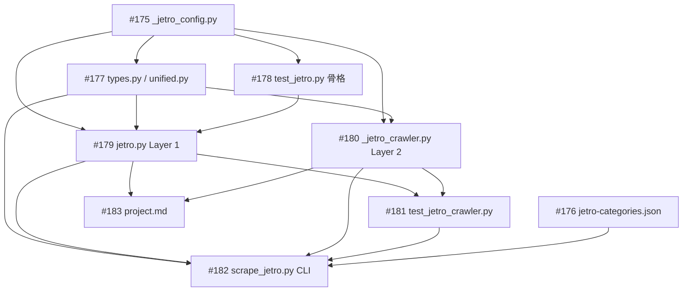

# JETRO海外ビジネス情報スクレイパー

**作成日**: 2026-03-18
**ステータス**: 計画中
**タイプ**: package
**GitHub Project**: [#86](https://github.com/users/YH-05/projects/86)

## 背景と目的

### 背景

JETROのHP（https://www.jetro.go.jp/）の「海外ビジネス情報」セクションには「国・地域別に見る」「テーマ別に見る」「産業別に見る」の3つのナビゲーションがあり、ビジネス短信・地域分析レポート・調査レポート・特集・動画レポート等、複数のコンテンツタイプが含まれる。

現状、JETROはRSSフィード（`biznews.xml`）でビジネス短信のみを配信しているが、要約なし・カテゴリタグなし。カテゴリページのコンテンツはAJAX APIで動的ロードされており、単純なHTTPリクエストでは取得できない。

### 目的

3カテゴリの全コンテンツをスクレイピング可能にし、既存の `src/news_scraper/` パッケージに統合する。

### 成功基準

- [ ] `collect_financial_news(sources=['jetro'])` でJETRO記事を取得できる
- [ ] RSS（ビジネス短信）+ カテゴリページ（全コンテンツタイプ）を網羅
- [ ] `make check-all` が成功する
- [ ] CLI (`scrape_jetro.py`) で手動実行できる

## リサーチ結果

### 既存パターン

- `cnbc.py`: feedparser RSS → `_entry_to_article()` → `deduplicate_by_url()` の標準フロー
- `nasdaq.py`: `httpx.Client` + `DEFAULT_HEADERS` + `ThreadPoolExecutor`
- `unified.py`: `SOURCE_REGISTRY` に lazy import ラッパーで登録
- コードベース全体で `async_playwright` のみ使用（sync 使用例なし）

### 参考実装

| ファイル | 参考にすべき点 |
|---------|-------------|
| `src/news_scraper/cnbc.py` | collect_news() パターン、feedparser RSS 解析、日付パース |
| `src/news_scraper/nasdaq.py` | httpx.Client パターン、並行カテゴリ取得 |
| `src/news_scraper/unified.py:54-57` | SOURCE_REGISTRY 登録パターン |
| `src/news_scraper/types.py:32` | SourceName リテラル型定義 |
| `scripts/scrape_finance_news.py` | CLI argparse パターン、NAS/ローカル出力 |
| `tests/news_scraper/unit/test_cnbc.py` | feedparser モック、テスト構造 |

### 技術的考慮事項

- Playwright: `async_playwright` + `asyncio.run()` ラッパーを採用（コードベース整合性維持）
- CSSセレクタ: フォールバックリスト形式で定数化（ページ構造変更耐性）
- レート制限: request_delay=2.0s（政府系サイト）
- 新規依存追加: なし（全て既存依存）

## 実装計画

### アーキテクチャ概要

2層スクレイピング構成で既存 news_scraper パッケージに統合:

```
Layer 1: RSS + 記事詳細ページ (feedparser + httpx)
  └─ ビジネス短信の最新記事（~48件）を高速取得
     + 個別記事ページから本文・著者・タグを抽出

Layer 2: カテゴリページ Crawler (async_playwright + asyncio.run())
  └─ 国・地域 / テーマ / 産業の各ページを描画
     → 全セクション（短信・レポート・特集等）の記事リンクを発見
     → Layer 1 の記事詳細スクレイパーで本文取得
```

### ファイルマップ

| 操作 | ファイルパス | 説明 |
|------|------------|------|
| 新規作成 | `src/news_scraper/_jetro_config.py` | 定数・セレクタ・dataclass（120行） |
| 新規作成 | `data/config/jetro-categories.json` | カテゴリマスタ（80行） |
| 変更 | `src/news_scraper/types.py` | `SourceName` に `"jetro"` 追加 |
| 変更 | `src/news_scraper/unified.py` | `SOURCE_REGISTRY` に `_collect_jetro` 追加 |
| 新規作成 | `src/news_scraper/jetro.py` | メインモジュール（380行） |
| 新規作成 | `src/news_scraper/_jetro_crawler.py` | Playwright Crawler（280行） |
| 新規作成 | `scripts/scrape_jetro.py` | CLI スクリプト（260行） |
| 新規作成 | `tests/news_scraper/unit/test_jetro.py` | ユニットテスト（200行） |
| 新規作成 | `tests/news_scraper/unit/test_jetro_crawler.py` | Crawler テスト（180行） |
| 新規作成 | `tests/news_scraper/fixtures/jetro/` | HTML/XML フィクスチャ |

### リスク評価

| リスク | 影響度 | 対策 |
|--------|--------|------|
| CSSセレクタがページ間で異なる | 高 | フォールバックリスト + DOM調査 |
| asyncio.run() のイベントループ競合 | 中 | 明確なエラーメッセージ |
| networkidle タイムアウト | 中 | domcontentloaded graceful degradation |
| IP制限（政府系サイト） | 中 | request_delay=2.0s |
| trafilatura の低品質抽出 | 低 | lxml fallback |

## タスク一覧

### Wave 1（並行開発可能）

- [ ] 定数・設定モジュール `_jetro_config.py` の作成
  - Issue: [#175](https://github.com/YH-05/note-finance/issues/175)
  - ステータス: todo
  - 見積もり: 1-2時間

- [ ] カテゴリマスタ `jetro-categories.json` の作成
  - Issue: [#176](https://github.com/YH-05/note-finance/issues/176)
  - ステータス: todo
  - 見積もり: 0.5-1時間

- [ ] SourceName型拡張・SOURCE_REGISTRY登録 (types.py / unified.py)
  - Issue: [#177](https://github.com/YH-05/note-finance/issues/177)
  - ステータス: todo
  - 依存: #175
  - 見積もり: 0.5時間

- [ ] test_jetro.py テスト骨格・TestParseJetroDate 作成
  - Issue: [#178](https://github.com/YH-05/note-finance/issues/178)
  - ステータス: todo
  - 依存: #175
  - 見積もり: 1時間

### Wave 2（Wave 1 完了後）

- [ ] jetro.py Layer 1 実装（RSS取得・記事詳細スクレイピング）
  - Issue: [#179](https://github.com/YH-05/note-finance/issues/179)
  - ステータス: todo
  - 依存: #175, #177, #178
  - 見積もり: 3-4時間

### Wave 3（Wave 2 完了後）

- [ ] _jetro_crawler.py Layer 2 Crawler 実装
  - Issue: [#180](https://github.com/YH-05/note-finance/issues/180)
  - ステータス: todo
  - 依存: #175, #177
  - 見積もり: 3-4時間

- [ ] test_jetro_crawler.py Crawler ユニットテスト作成
  - Issue: [#181](https://github.com/YH-05/note-finance/issues/181)
  - ステータス: todo
  - 依存: #179, #180
  - 見積もり: 1.5-2時間

### Wave 4（Wave 3 完了後）

- [ ] scrape_jetro.py CLI スクリプト実装
  - Issue: [#182](https://github.com/YH-05/note-finance/issues/182)
  - ステータス: todo
  - 依存: #176, #177, #179, #180, #181
  - 見積もり: 2-3時間

- [ ] project.md プロジェクトドキュメント作成
  - Issue: [#183](https://github.com/YH-05/note-finance/issues/183)
  - ステータス: todo
  - 依存: #179, #180
  - 見積もり: 0.5時間

## 依存関係図



---

**最終更新**: 2026-03-18
