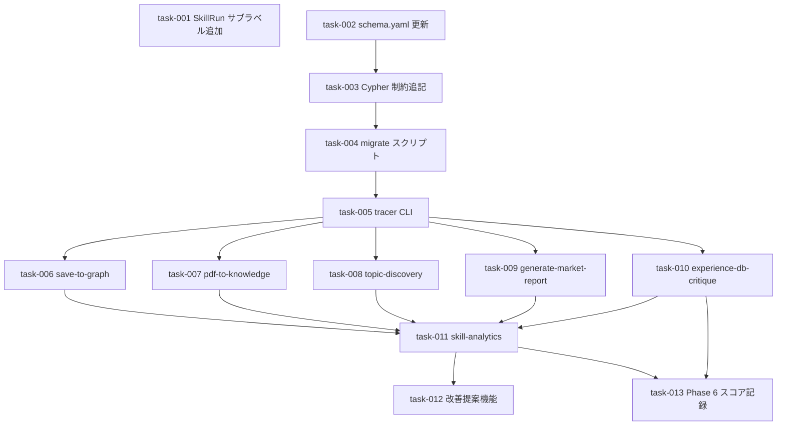

# cognee スキル改善パターン適用（SkillRun Observability）

**作成日**: 2026-03-18
**ステータス**: 計画中
**タイプ**: workflow
**GitHub Project**: [#87](https://github.com/users/YH-05/projects/87)

## 背景と目的

### 背景

cognee (v0.5.4) の自動スキル改善ループ（Observe → Inspect → Amend → Evaluate）を、本プロジェクトの Claude Code スキルシステム（57スキル + 64エージェント）に適用する。cognee SDK は使わず、パターンを抽出して独自実装する。

現在スキル実行のトレースが一切なく、フィードバックは手動（`feedback_*.md` 3件のみ）。スキル品質の経年劣化が追跡できない。

### 目的

SkillRun ログ基盤 → 分析スキル → 改善提案機能の3段階で、スキル実行の可観測性を確立する。

### 成功基準

- [ ] 主要5スキルの実行が `Memory:SkillRun` ノードとして research-neo4j に記録される
- [ ] `skill-analytics` スキルで失敗率・実行時間・エラー分析がレポート出力できる
- [ ] 失敗率 > 15% or フィードバックスコア < 0.6 のスキルに対して改善提案が生成できる

## リサーチ結果

### 既存パターン

- **Neo4j ドライバー接続**: `scripts/validate_neo4j_schema.py` の `GraphDatabase.driver` パターン
- **SHA-256 ID 生成**: `src/pdf_pipeline/services/id_generator.py` の `_sha256_prefix[:32]`
- **CLI 設計**: `scripts/emit_graph_queue.py` の argparse + structlog パターン
- **デュアルラベル**: `Memory:SkillRun` で既存 KG v2 から `WHERE NOT 'Memory' IN labels(n)` で自動除外

### 参考実装

| ファイル | 参考にすべき点 |
|---------|-------------|
| `scripts/validate_neo4j_schema.py` | Neo4j ドライバー接続・argparse パターン |
| `scripts/emit_graph_queue.py` | CLI サブコマンド構成 |
| `src/pdf_pipeline/services/id_generator.py` | SHA-256[:32] ID 生成 |
| `scripts/session_utils.py` | structlog get_logger パターン |
| `scripts/migrate_article_to_research.py` | マイグレーションスクリプト構造 |

### 技術的考慮事項

- research-neo4j は **bolt://localhost:7688**（7687 ではない）
- `data/config/knowledge-graph-schema.yaml` に SkillRun 名前空間を追加しないと `validate_neo4j_schema.py` で UNKNOWN label 検出
- session_id は `os.environ.get('CLAUDE_SESSION_ID', str(uuid.uuid4()))` で取得
- Neo4j 未起動時はグレースフルデグラデーション（警告のみ、合成 ID 返却）

## 実装計画

### アーキテクチャ概要

cognee の Observe→Inspect→Amend→Evaluate ループを3段階で独自実装。全 SkillRun データは `Memory:SkillRun` デュアルラベルで research-neo4j に格納し、既存 KG v2 スキーマとの名前空間分離を維持。

### ファイルマップ

| 操作 | ファイルパス | 説明 |
|------|------------|------|
| modify | `.claude/rules/neo4j-namespace-convention.md` | SkillRun サブラベル追加 |
| modify | `data/config/knowledge-graph-schema.yaml` | SkillRun 名前空間 + version 更新 |
| modify | `docker/research-neo4j/init/01-constraints-indexes.cypher` | 制約/インデックス追加 |
| create | `scripts/migrate_skill_run_schema.py` | マイグレーションスクリプト |
| create | `scripts/skill_run_tracer.py` | SkillRun CLI（start/complete/feedback） |
| modify | 5スキルの SKILL.md | Observability セクション追記 |
| create | `.claude/skills/skill-analytics/SKILL.md` | 分析スキル新設 |
| create | `.claude/skills/skill-analytics/queries.md` | Cypher クエリライブラリ |
| create | `.claude/skills/skill-expert/improvement-template.md` | 改善提案テンプレート |
| modify | `.claude/skills/skill-expert/SKILL.md` | リソーステーブル追記 |
| modify | `.claude/agents/skill-creator.md` | Step 6（改善提案モード）追加 |
| modify | `.claude/skills/experience-db-critique/SKILL.md` | Phase 6 追加 |
| create | `.claude/skills/skill-analytics/evaluation-guide.md` | 評価ループプロトコル |

### リスク評価

| リスク | 影響度 | 対策 |
|--------|--------|------|
| schema.yaml version 更新漏れ → UNKNOWN label | 高 | Wave 1 で yaml + version を同時更新、A-5 で validate PASS 確認 |
| Neo4j 未起動でマイグレーション失敗 | 中 | グレースフルデグラデーション + docker compose up 手順明記 |
| Phase B を A 未完了で開始 → 検証不完全 | 中 | A-5 検証を Phase A 完了条件として必須化 |
| experience-db-critique のスコア記録タイミング | 中 | 統合レポート生成後にのみ呼ぶ順序を明示 |

## タスク一覧

### Wave 1（並行開発可能: task-001/002 は並行、task-003 は task-002 後）

- [ ] neo4j-namespace-convention.md に SkillRun サブラベルを追加
  - Issue: [#184](https://github.com/YH-05/note-finance/issues/184)
  - ステータス: todo
  - 見積もり: 0.5h

- [ ] knowledge-graph-schema.yaml に SkillRun 名前空間を追加
  - Issue: [#185](https://github.com/YH-05/note-finance/issues/185)
  - ステータス: todo
  - 見積もり: 0.5h

- [ ] 01-constraints-indexes.cypher に Skill Observability セクションを追記
  - Issue: [#186](https://github.com/YH-05/note-finance/issues/186)
  - ステータス: todo
  - 依存: #185
  - 見積もり: 0.5h

### Wave 2（task-004 → task-005 の順序依存）

- [ ] migrate_skill_run_schema.py を新規作成
  - Issue: [#187](https://github.com/YH-05/note-finance/issues/187)
  - ステータス: todo
  - 依存: #186
  - 見積もり: 1.5h

- [ ] skill_run_tracer.py を新規作成（start/complete/feedback + A-5検証）
  - Issue: [#188](https://github.com/YH-05/note-finance/issues/188)
  - ステータス: todo
  - 依存: #187
  - 見積もり: 3h

### Wave 3（全5タスク並行可能）

- [ ] save-to-graph SKILL.md に Observability セクションを追記
  - Issue: [#189](https://github.com/YH-05/note-finance/issues/189)
  - ステータス: todo
  - 依存: #188
  - 見積もり: 0.5h

- [ ] pdf-to-knowledge SKILL.md に Observability セクションを挿入
  - Issue: [#190](https://github.com/YH-05/note-finance/issues/190)
  - ステータス: todo
  - 依存: #188
  - 見積もり: 0.5h

- [ ] topic-discovery SKILL.md に Observability セクションを追記
  - Issue: [#191](https://github.com/YH-05/note-finance/issues/191)
  - ステータス: todo
  - 依存: #188
  - 見積もり: 0.5h

- [ ] generate-market-report SKILL.md に Observability セクションを追記
  - Issue: [#192](https://github.com/YH-05/note-finance/issues/192)
  - ステータス: todo
  - 依存: #188
  - 見積もり: 0.5h

- [ ] experience-db-critique SKILL.md に Observability セクションを追記
  - Issue: [#193](https://github.com/YH-05/note-finance/issues/193)
  - ステータス: todo
  - 依存: #188
  - 見積もり: 0.5h

### Wave 4（Wave 3 全完了後）

- [ ] skill-analytics スキルを新規作成（SKILL.md + queries.md + B-4検証）
  - Issue: [#194](https://github.com/YH-05/note-finance/issues/194)
  - ステータス: todo
  - 依存: #189〜#193
  - 見積もり: 3h

### Wave 5（task-012/013 並行可能）

- [ ] 改善提案機能を実装（improvement-template / skill-creator Step6 / evaluation-guide）
  - Issue: [#195](https://github.com/YH-05/note-finance/issues/195)
  - ステータス: todo
  - 依存: #194
  - 見積もり: 3.5h

- [ ] experience-db-critique SKILL.md に Phase 6（フィードバックスコア記録）を追加
  - Issue: [#196](https://github.com/YH-05/note-finance/issues/196)
  - ステータス: todo
  - 依存: #193, #194
  - 見積もり: 1h

## 依存関係図

---

**最終更新**: 2026-03-18
