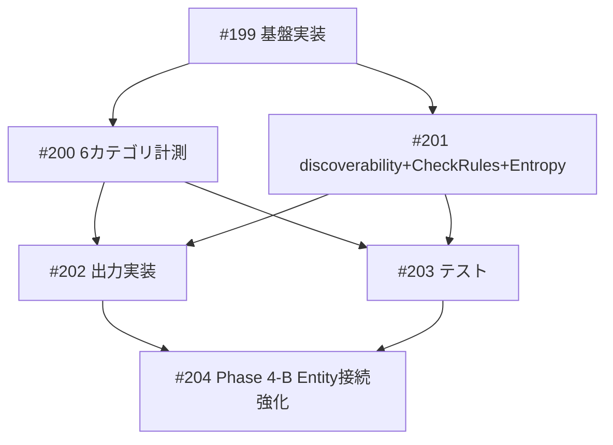

# KG品質ダッシュボード + Entity接続強化（Phase 4-A/4-B）

**作成日**: 2026-03-19
**ステータス**: 計画中
**タイプ**: from_plan_file (package)
**GitHub Project**: [#89](https://github.com/users/YH-05/projects/89)

## 背景と目的

### 背景

research-neo4j（3,425ノード / 6,441リレーション）をAIによる創発的な投資仮説生成・経済見通しの基盤として活用するため、グラフDBの品質を定量的に測定・改善するフレームワークが必要。

Phase 1-3で以下の改善を実施済み:
- Entity間リレーション: 19→888本（47倍）
- Sectorノード化（GICS 11セクター）+ IN_SECTORリレーション
- LLMベースEntity間関係タイプ推論（5種→10種）
- 重複ノード7件解消

### 目的

1. **Phase 4-A**: 7カテゴリの品質指標を定量計測し、改善効果のROIを測定する基盤を構築
2. **Phase 4-B**: Entity孤立ノード97件の接続を強化し、グラフの発見可能性を向上

### 成功基準

- [ ] `scripts/kg_quality_metrics.py` が7カテゴリ+CheckRules+Entropyを計測し、4形式で出力できる
- [ ] テストが全てパスし `make check-all` が成功する
- [ ] Phase 4-Bで孤立Entity数が50%以上削減される

## リサーチ結果

### 既存パターン

| パターン | 参照先 |
|---------|--------|
| Neo4j同期driver接続 (port 7688) | `scripts/classify_authority_level.py` |
| argparse CLI + --dry-run | `scripts/validate_neo4j_schema.py` |
| スキーマYAML読込 | `scripts/validate_neo4j_schema.py: load_namespaces()` |
| MagicMockテスト | `tests/scripts/test_validate_neo4j_schema.py` |
| dataclass構造 | `scripts/save_conversations_to_neo4j.py` |
| MERGE冪等クエリ | `scripts/apply_metric_master.py` |
| 二重フォールバックロギング | `scripts/skill_run_tracer.py` |

### 参考実装

| ファイル | 参考にすべき点 |
|---------|--------------|
| `scripts/validate_neo4j_schema.py` | CLI構造・ロギング・JSON出力の全体テンプレート |
| `scripts/classify_authority_level.py` | Neo4j接続パターン (bolt://localhost:7688) |
| `scripts/apply_metric_master.py` | バッチMERGEクエリパターン |
| `data/config/knowledge-graph-schema.yaml` | 完全性・一貫性チェックのSSoT |
| `tests/scripts/test_validate_neo4j_schema.py` | MagicMock + tmp_path テストパターン |

### 技術的考慮事項

- Neo4j CE（GDSなし）: 連結成分はBFS近似、betweenness centralityはラベル多様性ヒューリスティック
- Richライブラリ: pyproject.tomlに依存登録済みだが既存スクリプトでの使用実績なし
- Memory除外: 全Cypherに `WHERE NOT 'Memory' IN labels(n)` 必須
- Sector/Metricノード: スキーマYAML未定義だがDBに実在 → ハードコード定義で計測対象に含める

## 実装計画

### アーキテクチャ概要

単一スクリプト構成（`scripts/kg_quality_metrics.py`、800-1000行）で7カテゴリ品質指標を計測。Rich Console / JSON / Neo4j / Markdownの4形式で出力。Phase 4-Bは4-A完了後の計測結果を受けて手法を決定する2段階アーキテクチャ。

### ファイルマップ

| 操作 | ファイルパス | 説明 |
|------|------------|------|
| 新規作成 | `scripts/kg_quality_metrics.py` | Phase 4-A メインスクリプト (800-1000行) |
| 新規作成 | `tests/scripts/test_kg_quality_metrics.py` | ユニットテスト |
| 新規作成 | `scripts/strengthen_entity_connections.py` | Phase 4-B Entity接続強化 |
| 新規作成 | `data/processed/kg_quality/` | スナップショット出力先 |

### リスク評価

| リスク | 影響度 | 対策 |
|--------|--------|------|
| Discoverabilityパスサンプリングタイムアウト | 高 | 1ペア5秒上限 + スキップカウント |
| Phase 4-B手法が未確定 | 中 | スクリプト骨格だけ先行作成 |
| BFS近似の連結性計算精度 | 中 | 「近似」である旨をレポートに明記 |

## タスク一覧

### Wave 1（基盤）

- [ ] Phase 4-A 基盤実装（DataClasses + CLI + Neo4j接続）
  - Issue: [#199](https://github.com/YH-05/note-finance/issues/199)
  - ステータス: todo

### Wave 2（計測関数群 — 並行開発可能）

- [ ] 6カテゴリ品質計測関数（structural〜finance_specific）
  - Issue: [#200](https://github.com/YH-05/note-finance/issues/200)
  - ステータス: todo
  - 依存: #199

- [ ] discoverability + CheckRules + EntropyAnalysis
  - Issue: [#201](https://github.com/YH-05/note-finance/issues/201)
  - ステータス: todo
  - 依存: #199

### Wave 3（出力 + テスト — 並行開発可能）

- [ ] 出力実装（Rich + JSON + Neo4j + Markdown + compare）
  - Issue: [#202](https://github.com/YH-05/note-finance/issues/202)
  - ステータス: todo
  - 依存: #200, #201

- [ ] テスト実装（test_kg_quality_metrics.py）
  - Issue: [#203](https://github.com/YH-05/note-finance/issues/203)
  - ステータス: todo
  - 依存: #200, #201

### Wave 4（Phase 4-B — 4-A全体完了後）

- [ ] Entity接続強化（97件の孤立ノード対応）
  - Issue: [#204](https://github.com/YH-05/note-finance/issues/204)
  - ステータス: todo
  - 依存: #202, #203

## 依存関係図

## 主要制約

- Memory除外フィルタ（`WHERE NOT 'Memory' IN labels(n)`）を全Cypherに必須付与
- Neo4j接続: `bolt://localhost:7688`（research-neo4j）
- `NEO4J_PASSWORD` デフォルト `'gomasuke'`
- DataClass: `@dataclass` 使用（Pydantic不使用）
- テスト: MagicMock（実接続なし）
- 全スクリプトに `--dry-run` フラグ

---

**最終更新**: 2026-03-19
