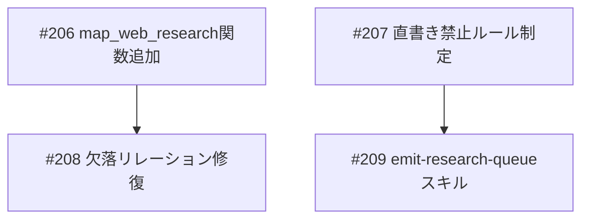

# Neo4j書き込みパイプライン一本化

**作成日**: 2026-03-19
**ステータス**: 計画中
**タイプ**: 混合（コード + ルール + スキル）
**GitHub Project**: [#90](https://github.com/users/YH-05/projects/90)

## 背景と目的

### 背景

research-neo4jのFact 310件を監査した結果、リレーション欠落が深刻（ABOUT 18%欠落、TAGGED 43%欠落、EXTRACTED_FROM 35%欠落）。

**根本原因**: 正式な2段パイプライン（`emit_graph_queue.py` → `save-to-graph`）が存在しリレーションも正しく作成される設計だが、アドホックなCypher直書き（`research-write_neo4j_cypher`を直接呼ぶ）がパイプラインをバイパスし、リレーション付与が漏れている。

| バッチ | 件数 | 経路 | 欠落 |
|--------|------|------|------|
| 3/16 ISATデータ | 80件 | Cypher直書き | ABOUT 45件、TAGGED 80件 |
| 3/18 ASEAN比較 | 108件 | Cypher直書き | EXTRACTED_FROM 73件 |
| 3/19 インドネシア政経 | 35件 | Cypher直書き→事後修正 | 初回全欠落 |

### 目的

アドホック調査データ用の`web-research`コマンドを`emit_graph_queue.py`に追加し、全投入を正式パイプライン経由に統一する。直書き禁止ルールを制定する。既存欠落データの修復、スキル作成、既存リサーチスキルへのKG出力統合も含む。

### 成功基準

- [ ] `web-research` コマンドが `emit_graph_queue.py` に登録され、4種リレーションを正しく生成する
- [ ] 直書き禁止ルールが `.claude/rules/` に制定されている
- [ ] 3バッチ分の欠落リレーションが修復され、品質監査クエリで充足率が改善している
- [ ] `emit-research-queue` スキルが作成され、3リサーチスキルにKG Outputセクションが追加されている

## リサーチ結果

### 既存パターン

- マッパー関数: `map_topic_discovery` (L2890) が直接の参考実装
- `_mapped_result()` (L796): 13キーの標準出力dict
- `_empty_rels()` (L1953): 21種の RELATION_KEYS を空listで初期化
- `_make_source()` (L760): Sourceノード構築ヘルパー
- ID生成: `emit_graph_queue.py`内に `generate_source_id`, `generate_fact_id`, `generate_entity_id`, `generate_topic_id` が定義済み

### 参考実装

| ファイル | 説明 |
|---------|------|
| `scripts/emit_graph_queue.py:L2890` | `map_topic_discovery` — マッパー関数の実装パターン |
| `tests/scripts/test_emit_graph_queue.py:L2534` | `TestMapTopicDiscovery` — テストクラスの構造パターン |
| `.claude/skills/save-to-graph/SKILL.md` | save-to-graph スキル — relations.fact_entity を RELATES_TO として処理 |

### 技術的考慮事項

- `fact_entity` リレーションは `RELATES_TO` として生成（save-to-graph に合わせる。plan file の ABOUT とは異なる）
- `published_at` は YYYY-MM-DD 形式（日付のみ）
- `authority_level` は入力JSONで必須フィールド
- research-neo4j は bolt://localhost:7688 で接続

## 実装計画

### アーキテクチャ概要

`emit_graph_queue.py → save-to-graph` の2段パイプラインを強制し、アドホック直書きによるリレーション欠落を根本解決。web-research コマンドをパイプラインに追加することでアドホック調査データの正式投入経路を確立し、ルールファイル・スキルで運用を支える。

### ファイルマップ

| 操作 | ファイルパス | 説明 |
|------|------------|------|
| 変更 | `scripts/emit_graph_queue.py` | `map_web_research` 追加 + COMMAND_MAPPERS登録 |
| 変更 | `tests/scripts/test_emit_graph_queue.py` | `TestMapWebResearch` 6テストケース |
| 新規作成 | `.claude/rules/neo4j-write-rules.md` | 直書き禁止ルール |
| 変更 | `.claude/rules/README.md` | エントリ追加 |
| 新規作成 | `.claude/skills/emit-research-queue/SKILL.md` | ラッパースキル |
| 変更 | `.claude/skills/investment-research/SKILL.md` | KG Output セクション追加 |
| 変更 | `.claude/skills/macro-economic-research/SKILL.md` | KG Output セクション追加 |
| 変更 | `.claude/skills/equity-stock-research/SKILL.md` | KG Output セクション追加 |

### リスク評価

| リスク | 影響度 | 対策 |
|--------|--------|------|
| RELATES_TO整合確認 | 高 | Phase 1後にサンプル実行で目視確認 |
| authority_level必須化 | 中 | SKILL.mdにサンプルJSON付属 |
| Phase 3 MERGE上書き | 中 | 修復前後でFact件数比較 |

## タスク一覧

### Wave 1（並行開発可能）

- [ ] feat(kg): map_web_research関数追加 + COMMAND_MAPPERSへの登録
  - Issue: [#206](https://github.com/YH-05/note-finance/issues/206)
  - ステータス: todo
  - ラベル: enhancement

- [ ] docs(rules): Neo4j直書き禁止ルール制定
  - Issue: [#207](https://github.com/YH-05/note-finance/issues/207)
  - ステータス: todo
  - ラベル: documentation

### Wave 2（Wave 1 完了後、並行開発可能）

- [ ] chore(kg): 欠落リレーション修復 3バッチ
  - Issue: [#208](https://github.com/YH-05/note-finance/issues/208)
  - ステータス: todo
  - 依存: #206
  - ラベル: enhancement

- [ ] feat(skills): emit-research-queueスキル作成 + 3リサーチスキルKG Output追加
  - Issue: [#209](https://github.com/YH-05/note-finance/issues/209)
  - ステータス: todo
  - 依存: #207
  - ラベル: enhancement

## 依存関係図

---

**最終更新**: 2026-03-19
