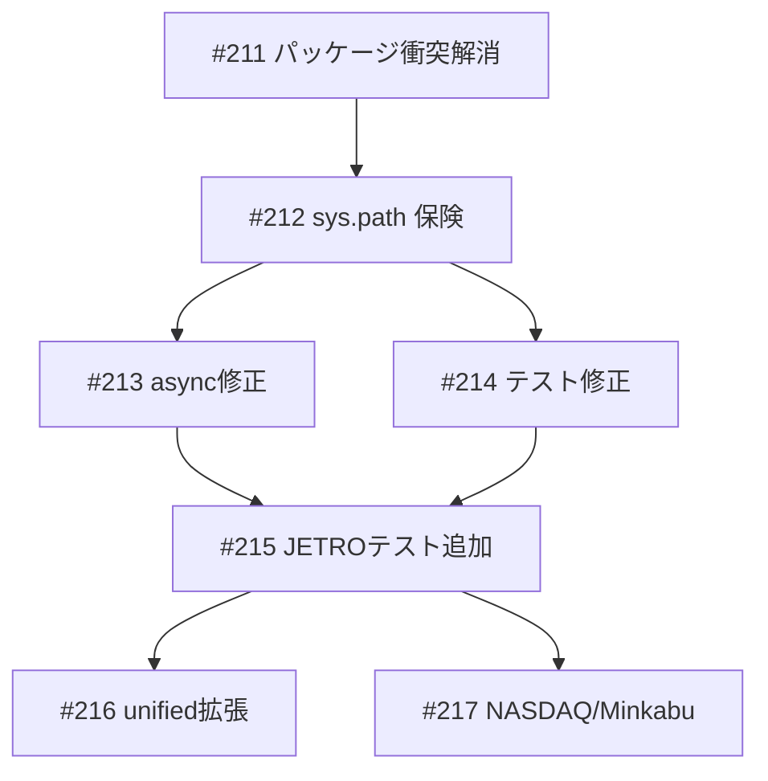

# news_scraper コードベース改善

**作成日**: 2026-03-19
**ステータス**: 計画中
**タイプ**: package
**GitHub Project**: [#91](https://github.com/users/YH-05/projects/91)

## 背景と目的

### 背景

news_scraper を全6ソース（CNBC, NASDAQ, Kabutan, Reuters JP, Minkabu, JETRO）で実行テストした結果、以下の問題が発見された:

1. **パッケージ衝突**: 外部 `finance` 依存が `news_scraper` モジュールを含み、ローカル `src/news_scraper/` をシャドーイング
2. **スクリプト不具合**: `scrape_finance_news.py` が async 関数を同期呼び出し
3. **JETRO 修正未テスト**: セッション中に追加した新機能（カテゴリクロール、アーカイブクロール）にテストなし
4. **統合インターフェースの欠落**: unified.py が JETRO 固有パラメータを渡せない
5. **NASDAQ API 停止**: 全エンドポイントが 404
6. **Minkabu**: Playwright 必須だがデフォルト無効で 0 件

### 目的

news_scraper の全ソース対応を安定化し、テストカバレッジを確保する。

### 成功基準

- [ ] `make check-all` が全 PASSED
- [ ] JETRO 新機能に ~34 件のテストが追加されている
- [ ] `uv run python scripts/scrape_finance_news.py --sources cnbc jetro` が正常動作する
- [ ] パッケージ衝突が解消され、site-packages に news_scraper/ が存在しない

## リサーチ結果

### 既存パターン

- テスト命名: `test_[正常系|異常系|エッジケース]_日本語説明()` 形式
- Playwright モック: `_make_mock_pw_context()` ヘルパーで mock_ctx / page を返す
- HTML フィクスチャ: ファイルベース（`tests/news_scraper/fixtures/`）またはインライン文字列

### 参考実装

| ファイル | 説明 |
|---------|------|
| `tests/news_scraper/unit/test_jetro_crawler.py` | 既存テストパターン（Playwright モック含む） |
| `tests/news_scraper/unit/test_unified.py` | unified.py テストパターン（AsyncMock + patch） |
| `tests/news_scraper/fixtures/jetro/` | HTML/XML フィクスチャ |

### 技術的考慮事項

- `from finance` インポートが **6スクリプト** に存在（プラン記載の3 + 追加発見の3）
- `crawl_archive_pages` テストには `page.locator()` モック追加が必要（`_make_mock_pw_context` に未含有）
- `test_async_unified.py` は古いパターンで重複が多い → テスト追加先は `test_unified.py`

## 実装計画

### アーキテクチャ概要

外部 finance パッケージ衝突の解消（quants への切り替え）を起点に、async/sync 不整合修正・既存テスト修正・新機能テスト追加・unified.py 統合インターフェース拡張・NASDAQ 非推奨化・Minkabu ログ追加を段階的に実施する。

### ファイルマップ

| 操作 | ファイルパス | 説明 |
|------|------------|------|
| 変更 | `pyproject.toml` | finance → quants |
| 変更 | `scripts/validate_neo4j_schema.py` | import 修正 |
| 変更 | `scripts/skill_run_tracer.py` | import 修正 |
| 変更 | `scripts/migrate_skill_run_schema.py` | import 修正 |
| 変更 | `scripts/strengthen_entity_connections.py` | import 修正 |
| 変更 | `scripts/kg_quality_metrics.py` | import 修正 |
| 変更 | `scripts/neo4j_utils.py` | import 修正 |
| 変更 | `scripts/scrape_finance_news.py` | sys.path + async + CLI引数 |
| 変更 | `scripts/scrape_jetro.py` | sys.path |
| 変更 | `tests/news_scraper/unit/test_jetro_crawler.py` | テスト修正+追加 |
| 変更 | `tests/news_scraper/unit/test_jetro.py` | テスト修正+追加 |
| 変更 | `src/news_scraper/types.py` | source_options 追加 |
| 変更 | `src/news_scraper/unified.py` | JETRO passthrough + ログ |
| 変更 | `src/news_scraper/nasdaq.py` | deprecation warning |
| 変更 | `tests/news_scraper/unit/test_unified.py` | テスト追加 |
| 変更 | `tests/news_scraper/unit/test_types.py` | テスト追加 |

### リスク評価

| リスク | 影響度 | 対策 |
|--------|--------|------|
| quants Git URL 不一致で uv sync 失敗 | 高 | Wave 1 で即検出、失敗時は sys.path のみで回避 |
| インポート行番号の変化 | 中 | grep で再スキャンしてから修正 |
| crawl_archive_pages テストの page.locator モック不足 | 中 | page.locator = MagicMock() をインライン追加 |
| _collect_jetro 引数変更で既存テスト破損 | 低 | 同一 Wave で同時更新 |

## タスク一覧

### Wave 1

- [ ] パッケージ衝突解消
  - Issue: [#211](https://github.com/YH-05/note-finance/issues/211)
  - ステータス: todo
  - 複雑度: medium

### Wave 2（Wave 1 完了後）

- [ ] sys.path 保険設定
  - Issue: [#212](https://github.com/YH-05/note-finance/issues/212)
  - ステータス: todo
  - 依存: #211
  - 複雑度: small

### Wave 3（Wave 2 完了後、並列可能）

- [ ] async/sync 不整合修正
  - Issue: [#213](https://github.com/YH-05/note-finance/issues/213)
  - ステータス: todo
  - 依存: #212
  - 複雑度: small

- [ ] 壊れた既存テスト修正
  - Issue: [#214](https://github.com/YH-05/note-finance/issues/214)
  - ステータス: todo
  - 依存: #212
  - 複雑度: small

### Wave 4（Wave 3 完了後）

- [ ] JETRO 新機能テスト追加（~34件）
  - Issue: [#215](https://github.com/YH-05/note-finance/issues/215)
  - ステータス: todo
  - 依存: #213, #214
  - 複雑度: large

### Wave 5（Wave 4 完了後、並列可能）

- [ ] unified.py JETRO パラメータパススルー
  - Issue: [#216](https://github.com/YH-05/note-finance/issues/216)
  - ステータス: todo
  - 依存: #215
  - 複雑度: medium

- [ ] NASDAQ 非推奨化 & Minkabu ログ改善
  - Issue: [#217](https://github.com/YH-05/note-finance/issues/217)
  - ステータス: todo
  - 依存: #215
  - 複雑度: small

## 依存関係図

---

**最終更新**: 2026-03-19
