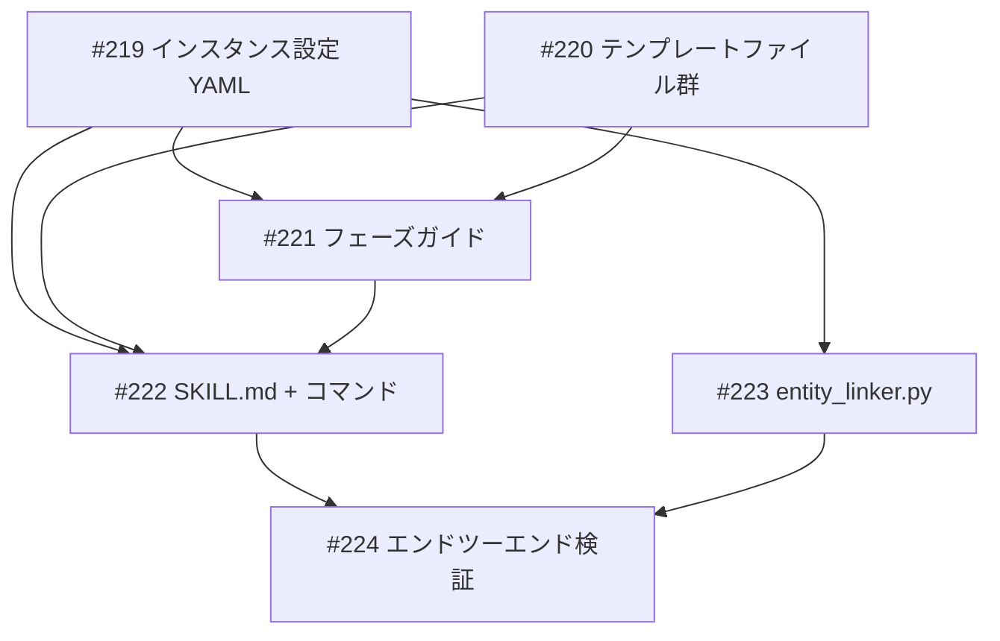

# neo4j-lifecycle スキル開発

**作成日**: 2026-03-23
**ステータス**: 計画中
**タイプ**: skill
**GitHub Project**: [#94](https://github.com/users/YH-05/projects/94)

## 背景と目的

### 背景

creator-neo4j で手動実行した Phase A-E（設計→パイプライン実装→データ移行→品質保証→運用改修）のプロセスを、任意の Neo4j インスタンスに対してドメイン非依存で再現できる汎用スキルが必要。現在は creator-neo4j 固有のスクリプト（entity_linker.py、emit_creator_queue_v2.py 等）がハードコードされており、research-neo4j や note-neo4j での再利用が困難。

### 目的

1つのオーケストレータースキルで全フェーズ（Phase 0-F）を管理し、新規DB構築と既存DB再設計（v1→v2型）の両方に対応する。

### 成功基準

- [ ] `/neo4j-lifecycle --instance creator --mode redesign --dry-run` で Phase 0→A が完走する
- [ ] ontology-template.yaml がドメイン非依存で設計されている
- [ ] entity_linker.py が --instance パラメータで任意のインスタンスに接続できる

## リサーチ結果

### 既存パターン

| パターン | 参照先 | 活用方法 |
|---------|--------|---------|
| マルチフェーズ・オーケストレーター | `.claude/skills/creator-enrichment/SKILL.md` | Phase 0-F の構造テンプレート |
| 対話型設計 | `.claude/skills/project-discuss/SKILL.md` | Phase A/F の AskUserQuestion ループ |
| グラフ投入パイプライン | `.claude/skills/save-to-graph/SKILL.md` | Phase B の MERGE ガイド生成参考 |
| 品質チェック | `.claude/skills/kg-quality-check/SKILL.md` | Phase D の品質検証クエリ参考（独立実装） |

### 参考実装

| ファイル | 参考にすべき点 |
|---------|--------------|
| `.claude/skills/creator-enrichment/SKILL.md` | Phase 0 の ToolSearch + 接続確認パターン |
| `.claude/skills/project-discuss/SKILL.md` | AskUserQuestion ループ + note-neo4j 保存 |
| `scripts/entity_linker.py` | 3層マッチング構造（改修対象） |
| `scripts/emit_graph_queue.py` | graph-queue パイプライン |

### 技術的考慮事項

- ontology-template.yaml はゼロから設計（creator v2 に依存しない）
- entity_linker.py の --instance 対応を含む（後方互換性必須）
- Phase D は kg-quality-check に依存せず独立実装
- registry.yaml の YAML スキーマは実装時に設計

## 実装計画

### アーキテクチャ概要

creator-enrichment のマルチフェーズ・オーケストレーター構造を踏襲し、`--instance` パラメータで接続先を動的切り替え。状態管理は `lifecycle-state.json`（プライマリ）と note-neo4j Discussion/Decision（セカンダリ）の2層構成。

### ファイルマップ

| 操作 | ファイルパス | 説明 |
|------|------------|------|
| 新規作成 | `.claude/skills/neo4j-lifecycle/SKILL.md` | オーケストレーター本体 |
| 新規作成 | `.claude/skills/neo4j-lifecycle/references/phase-{a-f}-*-guide.md` (6件) | フェーズガイド |
| 新規作成 | `.claude/skills/neo4j-lifecycle/references/ontology-template.yaml` | オントロジーテンプレート |
| 新規作成 | `.claude/skills/neo4j-lifecycle/references/extraction-prompt-template.md` | 抽出プロンプトテンプレート |
| 新規作成 | `.claude/skills/neo4j-lifecycle/references/merge-patterns-template.md` | MERGE パターンテンプレート |
| 新規作成 | `.claude/skills/neo4j-lifecycle/references/quality-queries-template.md` | 品質クエリテンプレート |
| 新規作成 | `.claude/commands/neo4j-lifecycle.md` | スラッシュコマンド |
| 新規作成 | `data/config/neo4j-instances/registry.yaml` | インスタンスレジストリ |
| 新規作成 | `data/config/neo4j-instances/creator.yaml` | creator-neo4j 設定 |
| 新規作成 | `data/config/neo4j-instances/research.yaml` | research-neo4j 設定 |
| 新規作成 | `data/config/neo4j-instances/note.yaml` | note-neo4j 設定 |
| 新規作成 | `data/lifecycle-state/.gitkeep` | 状態ディレクトリ |
| 変更 | `scripts/entity_linker.py` | --instance パラメータ追加 |

### リスク評価

| リスク | 影響度 | 対策 |
|--------|--------|------|
| Phase C の不可逆操作 | 高 | --dry-run 必須チェック + AuraDB バックアップ確認 |
| entity_linker.py 後方互換性 | 中 | --instance 未指定時は 7689 フォールバック |
| YAML パスワード平文保存 | 中 | 環境変数参照推奨 + .gitignore 警告 |
| ontology テンプレート汎用性 | 中 | 最小限プレースホルダー + 参考例コメント |

## タスク一覧

### Wave 1（並行開発可能）

- [ ] インスタンス設定 YAML と registry.yaml の作成
  - Issue: [#219](https://github.com/YH-05/note-finance/issues/219)
  - ステータス: todo

- [ ] オントロジー・パイプライン・品質テンプレートファイル群の作成
  - Issue: [#220](https://github.com/YH-05/note-finance/issues/220)
  - ステータス: todo

### Wave 2（Wave 1 完了後）

- [ ] Phase A-F フェーズガイドファイル群の作成
  - Issue: [#221](https://github.com/YH-05/note-finance/issues/221)
  - ステータス: todo
  - 依存: #219, #220

### Wave 3（Wave 2 完了後、並行開発可能）

- [ ] SKILL.md オーケストレーター本体とコマンドファイルの作成
  - Issue: [#222](https://github.com/YH-05/note-finance/issues/222)
  - ステータス: todo
  - 依存: #219, #220, #221

- [ ] entity_linker.py --instance パラメータ追加と Neo4jClient 汎用化
  - Issue: [#223](https://github.com/YH-05/note-finance/issues/223)
  - ステータス: todo
  - 依存: #219

### Wave 4（全完了後）

- [ ] エンドツーエンド検証（creator-neo4j 対象、redesign + dry-run）
  - Issue: [#224](https://github.com/YH-05/note-finance/issues/224)
  - ステータス: todo
  - 依存: #219, #220, #221, #222, #223

## 依存関係図

---

**最終更新**: 2026-03-23
