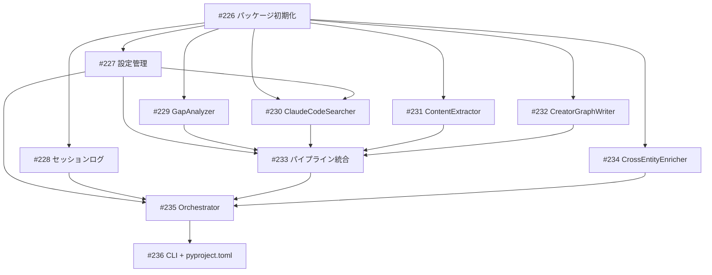

# creator-enrichment Python オーケストレーター

**作成日**: 2026-03-23
**ステータス**: 計画中
**タイプ**: package
**GitHub Project**: [#96](https://github.com/users/YH-05/projects/96)

## 背景と目的

### 背景

creator-enrichment は現在プロンプトベースの Claude Code スキルとして実装されている。1つの会話内で全サイクルを実行するため、コンテキスト膨張・LLMドリフトにより `--until` で指定した終了時刻前に停止してしまう問題がある。

### 目的

Python スクリプトで時間管理とサイクルループを**決定的に**制御し、指定時刻まで絶対に停止しないオーケストレーターを実装する。LLM 依存部分（分類・Entity抽出）のみ Anthropic API を直接呼び出し、検索フェーズは claude_agent_sdk 経由で Claude Code の MCP ツールを使用する。

### 成功基準

- [ ] `uv run python scripts/creator_enrichment_runner.py --until 23:30` で指定時刻まで連続稼働する
- [ ] 1サイクルあたり Phase 1-4 が正常に完了し、Neo4j にノード・リレーションが投入される
- [ ] エラー隔離が機能し、5回連続エラー以外では停止しない
- [ ] `make test` が通る

## リサーチ結果

### 既存パターン

| パターン | 説明 | 適用先 |
|---------|------|--------|
| Neo4jClient + load_instance_config | entity_linker.py の接続管理 | gap_analysis, pipeline |
| resolve_all() in-process import | Entity リンキング | pipeline.py Step 4.0 |
| map_creator_enrichment_v2() | graph-queue JSON 生成 | pipeline.py Step 4.1 |
| Anthropic API バッチ処理 | restructure_claims.py のパターン | extract.py |
| UNWIND MERGE Cypher | guide-v2.md | neo4j_writer.py |
| チェックポイント管理 | .tmp/ への中間保存 | pipeline.py |

### 参考実装

| ファイル | 説明 |
|---------|------|
| `scripts/entity_linker.py` | `resolve_all()`, `Neo4jClient`, `load_instance_config()` を直接 import |
| `scripts/emit_creator_queue_v2.py` | `map_creator_enrichment_v2()` を直接 import（sys.exit 注意） |
| `scripts/restructure_claims.py` | Anthropic API 呼び出し + バッチ処理パターン |
| `.claude/skills/save-to-creator-graph/guide-v2.md` | 10ノード+11リレーション MERGE Cypher |
| `.claude/skills/creator-enrichment/references/` | Q1-Q6 Cypher、Entity抽出プロンプト、ジャンル設定 |

### 技術的考慮事項

- `emit_creator_queue_v2.py` は不正ジャンルで `sys.exit(1)` を呼ぶため、pipeline.py 側で事前バリデーション必須
- 検索フェーズは claude_agent_sdk 経由で MCP ツールを使用（httpx 直接呼び出しではない）
- Fact/Tip/Story に cycle_id プロパティを付与して投入検証に使用
- LLM はすべて claude-haiku-4-5-20251001（コスト優先）

## 実装計画

### アーキテクチャ概要

```
CLI → config.py → orchestrator.py（while ループ）
  → Phase 1: gap_analysis.py（Neo4j Q1-Q6）
  → Phase 2: search.py（claude_agent_sdk → MCP tavily/reddit）
  → Phase 3: extract.py（Anthropic API / Haiku）
  → Phase 4: pipeline.py（resolve_all → emit_queue → neo4j_writer）
  → Phase 4.5: cross_entity.py（3サイクルに1回 / Haiku）
  → session_log.py（.tmp/*.log.md）
```

### ファイルマップ

| 操作 | ファイルパス | 説明 |
|------|------------|------|
| 新規作成 | `src/creator_enrichment/__init__.py` | パッケージ初期化 |
| 新規作成 | `src/creator_enrichment/types.py` | 共有 dataclass/TypedDict（120行） |
| 新規作成 | `src/creator_enrichment/config.py` | CLI引数 + config.json（150行） |
| 新規作成 | `src/creator_enrichment/session_log.py` | セッションログ（100行） |
| 新規作成 | `src/creator_enrichment/phases/gap_analysis.py` | Q1-Q6 Cypher（200行） |
| 新規作成 | `src/creator_enrichment/phases/search.py` | Claude Agent SDK 検索（180行） |
| 新規作成 | `src/creator_enrichment/phases/extract.py` | Entity 抽出（220行） |
| 新規作成 | `src/creator_enrichment/neo4j_writer.py` | MERGE Cypher 移植（350行） |
| 新規作成 | `src/creator_enrichment/phases/pipeline.py` | 統合パイプライン（160行） |
| 新規作成 | `src/creator_enrichment/phases/cross_entity.py` | 共起検出（180行） |
| 新規作成 | `src/creator_enrichment/orchestrator.py` | メインループ（250行） |
| 新規作成 | `scripts/creator_enrichment_runner.py` | CLI（40行） |
| 変更 | `pyproject.toml` | packages + claude_agent_sdk 追加 |

### リスク評価

| リスク | 影響度 | 対策 |
|--------|--------|------|
| claude_agent_sdk パッケージ名・API 不確定 | 高 | uv add で検証。失敗時は httpx フォールバック |
| サブプロセス起動の実行時間・コスト不定 | 高 | 120秒タイムアウト + 検索件数上限 |
| sys.exit(1) 回避の二重バリデーション | 中 | config.py + pipeline.py で二重チェック |
| APOC 依存 | 中 | startup チェック + fulltext-only フォールバック |
| neo4j_writer.py MERGE キー選定ミス | 中 | テストで呼び出し順序を assert + validate() |

## タスク一覧

### Wave 1（並行開発可能）

- [ ] パッケージ初期化・共有型定義
  - Issue: [#226](https://github.com/YH-05/note-finance/issues/226)
  - ステータス: todo
  - 見積もり: 2-3h

- [ ] 設定管理（config.py）
  - Issue: [#227](https://github.com/YH-05/note-finance/issues/227)
  - ステータス: todo
  - 依存: #226
  - 見積もり: 2-3h

- [ ] セッションログ + テスト共通フィクスチャ
  - Issue: [#228](https://github.com/YH-05/note-finance/issues/228)
  - ステータス: todo
  - 依存: #226
  - 見積もり: 2-3h

### Wave 2（Wave 1 完了後）

- [ ] GapAnalyzer（gap_analysis.py）
  - Issue: [#229](https://github.com/YH-05/note-finance/issues/229)
  - 依存: #226
  - 見積もり: 3-4h

- [ ] ClaudeCodeSearcher（search.py）
  - Issue: [#230](https://github.com/YH-05/note-finance/issues/230)
  - 依存: #226, #227
  - 見積もり: 3-4h

- [ ] ContentExtractor（extract.py）
  - Issue: [#231](https://github.com/YH-05/note-finance/issues/231)
  - 依存: #226
  - 見積もり: 3-4h

- [ ] CreatorGraphWriter（neo4j_writer.py）
  - Issue: [#232](https://github.com/YH-05/note-finance/issues/232)
  - 依存: #226
  - 見積もり: 4-6h

### Wave 3（Wave 2 完了後）

- [ ] パイプライン統合（pipeline.py）
  - Issue: [#233](https://github.com/YH-05/note-finance/issues/233)
  - 依存: #229, #230, #231, #232
  - 見積もり: 3-4h

- [ ] CrossEntityEnricher（cross_entity.py）
  - Issue: [#234](https://github.com/YH-05/note-finance/issues/234)
  - 依存: #226
  - 見積もり: 2-3h

### Wave 4（Wave 3 完了後）

- [ ] Orchestrator
  - Issue: [#235](https://github.com/YH-05/note-finance/issues/235)
  - 依存: #233, #234
  - 見積もり: 4-5h

- [ ] CLI + pyproject.toml
  - Issue: [#236](https://github.com/YH-05/note-finance/issues/236)
  - 依存: #235
  - 見積もり: 1-2h

## 依存関係図



---

**最終更新**: 2026-03-23
