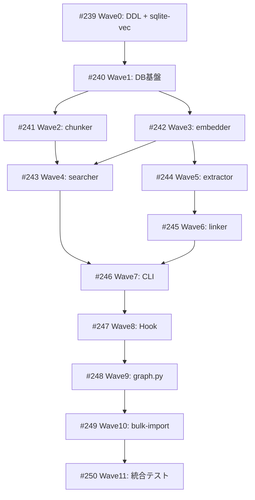

# session-memory（Claude Code 長期記憶システム）

**作成日**: 2026-03-24
**ステータス**: 計画中
**タイプ**: workflow（パッケージ + Hook + CLI）
**GitHub Project**: [#99](https://github.com/users/YH-05/projects/99)

## 背景と目的

### 背景

Claude Code のセッション間で会話コンテキストが失われる課題を解決する。Zenn記事「Claude Codeに長期記憶を持たせたら、壁打ちの質が変わった」の sui-memory アーキテクチャを、本プロジェクトの規約・パターンに適合させて実装する。

現在の記憶システムはファイルベース Markdown（18ファイル、手動管理）。対象は4プロジェクト、1,237セッション（~12,370チャンク）。

### 目的

セッション終了時に自動保存、検索時に過去の議論・判断理由・失敗事例を即座に取得できるようにする。

### 成功基準

- [ ] `make check-all` が全パス
- [ ] `memory-cli bulk-import` で既存セッション取り込み成功
- [ ] `memory-cli search "KG v3.0 設計判断"` で関連する過去の議論がヒット
- [ ] 新セッション終了時に `logs/memory-hook.log` でエラーなし
- [ ] note-neo4j で Session/SessionChunk が正しく投入されている

## リサーチ結果

### 既存パターン

| パターン | 参照元 | 用途 |
|---------|--------|------|
| SQLite コンテキストマネージャ | `src/rss/storage/scrape_state_db.py` | db.py |
| embedding 遅延ロード | `scripts/entity_linker.py:827-839` | embedder.py, linker.py |
| 4層 entity マッチング | `scripts/entity_linker.py` | linker.py |
| _logging.py パターン | `src/rss/_logging.py` | _logging.py |
| Click CLI サブコマンド | `src/rss/cli/main.py` | cli/main.py |
| Neo4j UNWIND バッチ MERGE | `src/creator_enrichment/neo4j_writer.py` | graph.py |

### 技術的考慮事項

- transcript.jsonl の本文パス: `d['message']['content']`（計画の `d['content']` とは異なる）
- note-neo4j: Session/SessionChunk は未存在（新規作成）、既存 Decision ノードへのリンク試行
- sqlite-vec: macOS arm64 互換性を Wave 0 で確認
- Ruri v3-310m: ~600MB、CPU 実行で数時間

## 実装計画

### アーキテクチャ概要

SQLite(FTS5 + sqlite-vec) を高速検索エンジン、note-neo4j(port 7687) をナレッジリンク層として使い分けるハイブリッド構成。SessionEnd Hook が SQLite + Neo4j へ同時投入（フル一貫性）。

### ユーザー決定事項

| 決定 | 選択肢 |
|------|--------|
| Hook×Neo4j | A: Hook で SQLite + Neo4j 同時投入（フル一貫性） |
| Decision 競合 | B: 既存 Decision ノードへの entity_linker リンク試行 |
| テスト構造 | B: tests/unit/test_session_memory/（data_pipeline パターン） |
| DDL 先行 | A: 制約・Index DDL を Phase 1 前に先行実行 |

### リスク評価

| リスク | 影響度 | 対策 |
|--------|--------|------|
| sqlite-vec macOS arm64 互換性 | High | Wave 0 でスモークテスト → FTS5 フォールバック |
| Ruri v3-310m CPU 生成時間 | High | import_log で中断再開、embedding なし時 FTS5 フォールバック |
| Hook 競合（前回未完了時） | Medium | import_log 二重実行防止 + Neo4j 60秒タイムアウト |

## タスク一覧

### Wave 0（事前準備）

- [ ] note-neo4j DDL 先行実行 + sqlite-vec 確認
  - Issue: [#239](https://github.com/YH-05/note-finance/issues/239)
  - ステータス: todo
  - 見積もり: 1h

### Wave 1（DB基盤構築）

- [ ] DB基盤: _logging / types / db + テスト
  - Issue: [#240](https://github.com/YH-05/note-finance/issues/240)
  - ステータス: todo
  - 依存: #239
  - 見積もり: 4h

### Wave 2（チャンカー）

- [ ] chunker.py + ユニット/プロパティテスト
  - Issue: [#241](https://github.com/YH-05/note-finance/issues/241)
  - ステータス: todo
  - 依存: #240
  - 見積もり: 3h

### Wave 3（エンベッダー）

- [ ] embedder.py + pyproject.toml 更新
  - Issue: [#242](https://github.com/YH-05/note-finance/issues/242)
  - ステータス: todo
  - 依存: #240
  - 見積もり: 2h

### Wave 4（検索エンジン）

- [ ] searcher.py + ユニット/プロパティテスト
  - Issue: [#243](https://github.com/YH-05/note-finance/issues/243)
  - ステータス: todo
  - 依存: #241, #242
  - 見積もり: 3h

### Wave 5（構造化抽出）

- [ ] extractor.py + テスト
  - Issue: [#244](https://github.com/YH-05/note-finance/issues/244)
  - ステータス: todo
  - 依存: #242
  - 見積もり: 3h

### Wave 6（リンカー）

- [ ] linker.py（4層照合・既存Decision連携）
  - Issue: [#245](https://github.com/YH-05/note-finance/issues/245)
  - ステータス: todo
  - 依存: #244
  - 見積もり: 3h

### Wave 7（CLI）

- [ ] cli/__init__.py + cli/main.py
  - Issue: [#246](https://github.com/YH-05/note-finance/issues/246)
  - ステータス: todo
  - 依存: #243, #245
  - 見積もり: 2h

### Wave 8（Hook）

- [ ] hook.py + memory_session_end.py + 設定ファイル更新
  - Issue: [#247](https://github.com/YH-05/note-finance/issues/247)
  - ステータス: todo
  - 依存: #246
  - 見積もり: 3h

### Wave 9（Neo4j連携）

- [ ] graph.py（UNWIND バッチ MERGE）
  - Issue: [#248](https://github.com/YH-05/note-finance/issues/248)
  - ステータス: todo
  - 依存: #247
  - 見積もり: 3h

### Wave 10（バルクインポート）

- [ ] バルクインポート実行 + /memory-search コマンド
  - Issue: [#249](https://github.com/YH-05/note-finance/issues/249)
  - ステータス: todo
  - 依存: #248
  - 見積もり: 2h

### Wave 11（統合テスト）

- [ ] 統合テスト + make check-all 全パス確認
  - Issue: [#250](https://github.com/YH-05/note-finance/issues/250)
  - ステータス: todo
  - 依存: #249
  - 見積もり: 2h

## 依存関係図

---

**最終更新**: 2026-03-24
