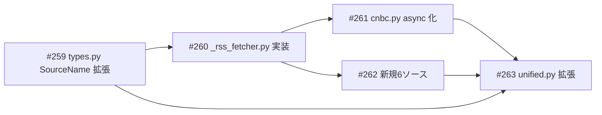

# news_scraper RSS統合 — feeds.json 全26フィードの取り込み

**作成日**: 2026-03-26
**ステータス**: 計画中
**タイプ**: package
**GitHub Project**: [#103](https://github.com/users/YH-05/projects/103)

## 背景と目的

### 背景

`rss_recent_articles.py` は `rss` パッケージ（FeedFetcher + FeedReader）を使い、feeds.json の26フィードをNASに永続保存しながら取得している。一方 `news_scraper` の `cnbc.py` は6フィードのみ対応し、本文取得なし。

### 目的

feeds.json の全26フィードを `news_scraper` に取り込み、`scrape_finance_news.py → NAS → Neo4j` パイプラインの入口として使えるようにする。ストレージはメモリのみ（Article オブジェクト）、本文取得は ArticleExtractor（trafilatura）を使用。

### 成功基準

- [ ] 全26フィードが `scrape_finance_news.py --sources` で指定可能
- [ ] `make check-all` が通る
- [ ] `rss_recent_articles.py` が引き続き独立動作する

## リサーチ結果

### 既存パターン

- **feedparser + ThreadPoolExecutor**: cnbc.py の実装パターンを `_rss_fetcher.py` で async 化して共通化
- **_make_registry_fn + SOURCE_REGISTRY**: unified.py のテスト可能なレジストリパターンを踏襲
- **ArticleExtractor.extract_batch**: rss.services の本文取得APIを `include_content=True` 時に使用
- **cross-package import**: rss パッケージから直接 import（from rss.services import ArticleExtractor）

### RSS 検証結果（実地確認済み）

| フィード | プランの想定 | 実際（検証済み） |
|---------|-------------|----------------|
| Ars Technica | `has_full_content=True` | `content[0].value` は ~1162文字（部分HTML）。全文は ArticleExtractor で取得 |
| ZeroHedge | `entry.content[0].value` | `content` キーなし。`entry.summary` にHTML全文（~3361文字, Drupal CMS） |
| ZeroHedge URL | 未検証 | feedburner URL 正常動作（status=200, 25エントリ） |

### 参考実装

| ファイル | 参考にすべき点 |
|---------|--------------|
| `src/news_scraper/cnbc.py` | ヘルパー関数群の移植元（_parse_cnbc_date 等） |
| `src/rss/services/article_extractor.py` | ArticleExtractor API（extract_batch） |
| `tests/news_scraper/unit/test_cnbc.py` | テストパターン（_make_entry + patch） |
| `data/raw/rss/feeds.json` | 全26フィードの URL 定義 |

## 実装計画

### アーキテクチャ概要

`_rss_fetcher.py` を中核モジュールとして新規作成し、全 RSS ソースの共通フェッチ・パース処理を集約。cnbc.py は `_rss_fetcher` に委譲する形で async 化・21フィード拡張。非CNBC 6ソースは最小構成の薄いモジュールとして追加。

### ファイルマップ

| 操作 | ファイルパス | 説明 |
|------|------------|------|
| 新規作成 | `src/news_scraper/_rss_fetcher.py` | RSS共通ロジック（250-300行） |
| 変更 | `src/news_scraper/types.py` | SourceName に6ソース追加 |
| 変更 | `src/news_scraper/cnbc.py` | async化 + 21フィード拡張（294行→80行） |
| 新規作成 | `src/news_scraper/techcrunch.py` | 最小構成（~40行） |
| 新規作成 | `src/news_scraper/ars_technica.py` | content[0].value使用（~45行） |
| 新規作成 | `src/news_scraper/the_verge.py` | 最小構成（~40行） |
| 新規作成 | `src/news_scraper/hacker_news.py` | 100pt filter（~40行） |
| 新規作成 | `src/news_scraper/federal_reserve.py` | 最小構成（~40行） |
| 新規作成 | `src/news_scraper/zero_hedge.py` | content_is_html=True（~45行） |
| 変更 | `src/news_scraper/unified.py` | SOURCE_REGISTRY 6エントリ追加 |
| 変更 | `scripts/scrape_finance_news.py` | CLI choices 拡張 |
| 新規作成 | `tests/news_scraper/unit/test__rss_fetcher.py` | 共通ロジックテスト |
| 変更 | `tests/news_scraper/unit/test_cnbc.py` | pytest-asyncio 書き直し |
| 新規作成 | `tests/news_scraper/unit/test_new_sources.py` | 6ソーステスト |
| 変更 | `tests/news_scraper/unit/test_async_unified.py` | 新ソーステスト追加 |

### リスク評価

| リスク | 影響度 | 対策 |
|--------|--------|------|
| async化でテストが無音スキップ | 高 | asyncio_mode 確認 + @pytest.mark.asyncio 明示 |
| lxml が依存に含まれない可能性 | 中 | Wave 1 前に確認、html.parser で代替検討 |
| content_field の動的パス評価 | 中 | 2値定数で制限（eval 不使用） |

## タスク一覧

### Wave 1（順序依存: task-1 → task-2）

- [ ] types.py SourceName 拡張（6ソース追加）
  - Issue: [#259](https://github.com/YH-05/note-finance/issues/259)
  - ステータス: todo
  - 見積もり: 0.5h

- [ ] _rss_fetcher.py 実装（RSS共通フェッチャー）とユニットテスト
  - Issue: [#260](https://github.com/YH-05/note-finance/issues/260)
  - ステータス: todo
  - 依存: #259
  - 見積もり: 1.5h

### Wave 2（並行開発可能）

- [ ] cnbc.py async 化（21フィード拡張）と test_cnbc.py 書き直し
  - Issue: [#261](https://github.com/YH-05/note-finance/issues/261)
  - ステータス: todo
  - 依存: #260
  - 見積もり: 1.0h

- [ ] 新規6ソース実装 + test_new_sources.py
  - Issue: [#262](https://github.com/YH-05/note-finance/issues/262)
  - ステータス: todo
  - 依存: #260
  - 見積もり: 1.5h

### Wave 3（Wave 2 完了後）

- [ ] unified.py 拡張 + scrape_finance_news.py CLI 拡張 + test更新
  - Issue: [#263](https://github.com/YH-05/note-finance/issues/263)
  - ステータス: todo
  - 依存: #259, #261, #262
  - 見積もり: 1.0h

## 依存関係図

---

**最終更新**: 2026-03-26
