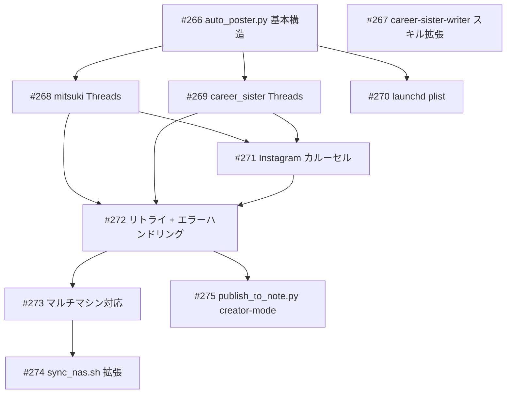

# SNS 自動投稿スクリプト

**作成日**: 2026-03-27
**ステータス**: 計画中
**タイプ**: script
**GitHub Project**: [#104](https://github.com/users/YH-05/projects/104)

## 背景と目的

### 背景

みつき（@mitsuki_fortune）とキャリアお姉さん（@career_sister）の SNS 投稿は現在すべて手動（Claude Code の `/mitsuki-publish`、`/career-sister-publish` コマンド）で行っている。毎日 5+3=8 スロットを手動投稿するのは運用コストが高く、MacBook Pro を常時操作する必要がある。

### 目的

Mac Mini からも launchd で自動投稿できる `scripts/auto_poster.py` を作成し、Threads / Instagram / note.com への投稿を自動化する。

### 成功基準

- [ ] `--dry-run` で全アカウントの対象スロットが正しく表示される
- [ ] mitsuki の Threads 投稿が自動化される（5スロット/日）
- [ ] career_sister の Threads + Instagram 投稿が自動化される（3スロット/日）
- [ ] launchd で定期実行できる
- [ ] マルチマシン（MacBook Pro + Mac Mini）から安全に運用できる
- [ ] note.com 投稿が `--include-note` で自動化される

## リサーチ結果

### 既存パターン

- `ThreadsPoster.for_account()` / `InstagramPoster.post_carousel()` — そのまま import 利用可
- `R2ImageHost.upload_batch()` — carousel 画像アップロード対応済み
- 全依存（tenacity / filelock / boto3 / httpx）が pyproject.toml に存在、追加依存なし
- launchd plist テンプレート（`com.note-finance.scrape-news.plist`）を踏襲可能

### 参考実装

| ファイル | 説明 |
|---------|------|
| `src/creator/poster.py` | ThreadsPoster / InstagramPoster クラス |
| `src/creator/image_hosting.py` | R2ImageHost.upload_batch() |
| `config/launchd/com.note-finance.scrape-news.plist` | launchd plist テンプレート |
| `scripts/sync_nas.sh` | NAS 同期スクリプト |
| `scripts/publish_to_note.py` | note.com 投稿スクリプト |

### 技術的考慮事項

- 2アカウントの meta.json フォーマット・ディレクトリ構造が異なるため DraftReader で差異を吸収
- instagram_caption.md が実際には存在しないため、threads_post.md をフォールバック使用
- publish_to_note.py は articles/ ディレクトリ向け設計のため --creator-mode 追加が必要

## 実装計画

### アーキテクチャ概要

`scripts/auto_poster.py` を中心とした自動投稿パイプライン。既存の ThreadsPoster / InstagramPoster / R2ImageHost をそのまま再利用し、meta.json / posting_state.json で冪等性を担保。マルチマシン対応は NAS 上のロックファイルで制御。

### ファイルマップ

| 操作 | ファイルパス | 説明 |
|------|------------|------|
| 新規作成 | `scripts/auto_poster.py` | 自動投稿スクリプト本体 |
| 新規作成 | `config/launchd/com.note-finance.auto-poster.plist` | launchd 8スロット定期実行 |
| 変更 | `scripts/sync_nas.sh` | creator drafts / posting_state 同期追加 |
| 変更 | `scripts/publish_to_note.py` | --creator-mode フラグ追加 |
| 変更 | `.claude/skills/career-sister-writer/SKILL.md` | instagram_caption.md 生成手順追記 |

### リスク評価

| リスク | 影響度 | 対策 |
|--------|--------|------|
| publish_to_note.py の DraftPublisher が articles/ 前提 | 高 | 事前精読、最悪は別スクリプト切り出し |
| instagram_caption.md 不在時の代用テキスト品質 | 中 | フォールバック実装 + スキル拡張は別タスク |
| NAS 未マウント時のマルチマシン二重投稿 | 中 | 単マシン限定の安全弁として明示 |

## タスク一覧

### Wave 1（並行開発可能）

- [ ] auto_poster.py 基本構造（CLI / Config / SlotMatcher / DraftReader）
  - Issue: [#266](https://github.com/YH-05/note-finance/issues/266)
  - ステータス: todo
- [ ] career-sister-writer スキルに instagram_caption.md 生成手順追記
  - Issue: [#267](https://github.com/YH-05/note-finance/issues/267)
  - ステータス: todo

### Wave 2（Wave 1 完了後、並行可能）

- [ ] mitsuki Threads 投稿 + StateUpdater
  - Issue: [#268](https://github.com/YH-05/note-finance/issues/268)
  - ステータス: todo
  - 依存: #266
- [ ] career_sister Threads 投稿（ディレクトリ差異対応）
  - Issue: [#269](https://github.com/YH-05/note-finance/issues/269)
  - ステータス: todo
  - 依存: #266
- [ ] launchd plist 作成
  - Issue: [#270](https://github.com/YH-05/note-finance/issues/270)
  - ステータス: todo
  - 依存: #266

### Wave 3（Wave 2 完了後）

- [ ] career_sister Instagram カルーセル投稿
  - Issue: [#271](https://github.com/YH-05/note-finance/issues/271)
  - ステータス: todo
  - 依存: #268, #269
- [ ] リトライ + エラーハンドリング（tenacity）
  - Issue: [#272](https://github.com/YH-05/note-finance/issues/272)
  - ステータス: todo
  - 依存: #268, #269, #271

### Wave 4（Wave 3 完了後、一部並行可能）

- [ ] マルチマシン対応（NasLockManager + NasSyncer）
  - Issue: [#273](https://github.com/YH-05/note-finance/issues/273)
  - ステータス: todo
  - 依存: #272
- [ ] sync_nas.sh 拡張
  - Issue: [#274](https://github.com/YH-05/note-finance/issues/274)
  - ステータス: todo
  - 依存: #273
- [ ] publish_to_note.py --creator-mode
  - Issue: [#275](https://github.com/YH-05/note-finance/issues/275)
  - ステータス: todo
  - 依存: #272

## 依存関係図

---

**最終更新**: 2026-03-27
