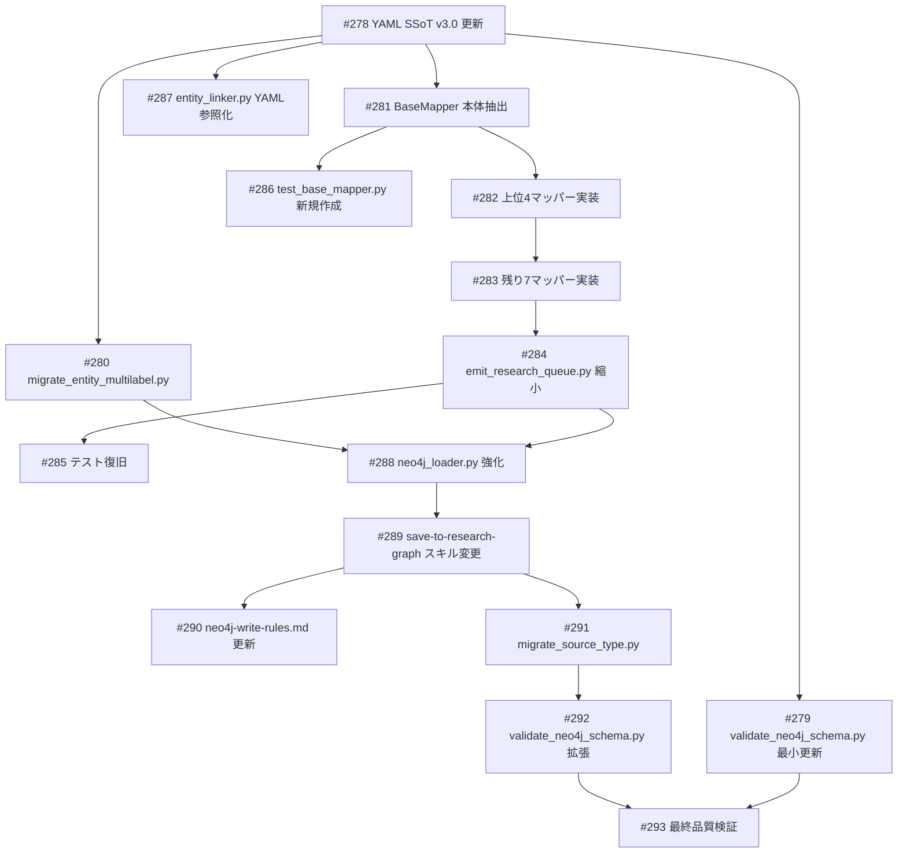

# research-neo4j スキーマ定義とパイプライン再設計

**作成日**: 2026-03-30
**ステータス**: 計画中
**タイプ**: existing_improvement
**GitHub Project**: [#105](https://github.com/users/YH-05/projects/105)

## 背景と目的

### 背景

research-neo4j のスキーマ定義が3箇所に分散し（knowledge-graph-schema.yaml v2.4 / lifecycle-state/research/schema.yaml / emit_research_queue.py 内ハードコード）、投入パイプラインが4,805行に肥大化。v3.0（FIBO準拠）が 2026-03-23 にマージ済みだが Migration 未実行。SSoT統一・パイプライン整理・全体再設計が必要。

### 目的

1. YAML SSoT 統一（knowledge-graph-schema.yaml を v3.0 に更新し唯一の正とする）
2. BaseMapper + プラグインマッパー方式でパイプラインを共通化・分割
3. Entity マルチラベル（30種→14種統合）移行
4. save-to-research-graph スキルを Python CLI オーケストレーターに変更
5. データ品質修正（source_type 正規化、NULL command_source 補完）

### 成功基準

- [ ] knowledge-graph-schema.yaml が v3.0 で、全コンポーネントが YAML 参照
- [ ] emit_research_queue.py が 400行以下に縮小
- [ ] Entity マルチラベル（14種）が全ノードに付与
- [ ] save-to-research-graph が Python CLI のみで動作
- [ ] source_type が 5種以内に正規化
- [ ] /kg-quality-check の品質スコアが維持または改善

## リサーチ結果

### 既存パターン

| パターン | 説明 | 参照元 |
|---------|------|--------|
| `_mapped_result()` | 全マッパーの標準出力dict生成 → BaseMapper.build_result() | `emit_research_queue.py:1395` |
| `_build_*_nodes()` 群 | Entity/Fact/Claim/Chunk ノード生成 → BaseMapper 共通メソッド | `emit_research_queue.py:1715-2593` |
| `_apply_classification_layer()` | v3.0分類ノード後処理 → BaseMapper.postprocess() | `emit_research_queue.py:4316` |
| `ChunkProcessingContext` | dataclass 状態管理 → BaseMapper コンテキスト | `emit_research_queue.py:87` |
| frozenset enum 検証 | `_validate_enum()` → BaseMapper.validate() | `emit_creator_queue_v2.py:158` |

### 参考実装

| ファイル | 参考にすべき点 |
|---------|-------------|
| `scripts/emit_creator_queue_v2.py` | frozenset enum バリデーションパターン |
| `.claude/skills/save-to-creator-graph/SKILL.md` | スキルの対称設計 |
| `tests/scripts/test_entity_linker.py` | config_dir フィクスチャパターン |

### 技術的考慮事項

- APOC `apoc.merge.node` でマルチラベル一発投入（フォールバック: MERGE+SET 2クエリ方式）
- クロスファイルリレーション（TAGGED/ABOUT）は Phase 5 対象外（後回し）
- test_emit_graph_queue.py（294テスト）の import 先が旧名 → 段階的復旧
- ENTITY_TYPE_CONSOLIDATION の二重定義を Phase 1 で YAML 統合

## 実装計画

### アーキテクチャ概要

```
リサーチデータ (.tmp/research-input/)
  → ① emit_research_queue.py [BaseMapper + 11プラグイン + YAML バリデーション]
  → graph-queue JSON (.tmp/graph-queue/)
  → ② entity_linker.py [4段階マッチング]
  → ③ neo4j_loader.py [APOC マルチラベル MERGE + 冪等投入]
  → research-neo4j (bolt://localhost:7688)
```

### ファイルマップ

| 操作 | ファイルパス | 説明 |
|------|------------|------|
| 変更 | `data/config/knowledge-graph-schema.yaml` | v2.4→v3.0 + enum定義統合 |
| 変更 | `scripts/validate_neo4j_schema.py` | v3.0 YAML 対応 |
| 新規作成 | `scripts/migrate_entity_multilabel.py` | マルチラベル移行スクリプト |
| 新規作成 | `scripts/mappers/base.py` | BaseMapper 抽象クラス（600-800行） |
| 新規作成 | `scripts/mappers/__init__.py` | パッケージ初期化 |
| 新規作成 | `scripts/mappers/web_research.py` | web-research マッパー |
| 新規作成 | `scripts/mappers/finance_news.py` | finance-news マッパー |
| 新規作成 | `scripts/mappers/wealth_scrape.py` | wealth-scrape マッパー |
| 新規作成 | `scripts/mappers/pdf_extraction.py` | pdf-extraction マッパー |
| 新規作成 | `scripts/mappers/academic_fetch.py` | academic-fetch マッパー |
| 新規作成 | `scripts/mappers/reddit_topics.py` | reddit-topics マッパー |
| 新規作成 | `scripts/mappers/topic_discovery.py` | topic-discovery マッパー |
| 新規作成 | `scripts/mappers/ai_research.py` | ai-research マッパー |
| 新規作成 | `scripts/mappers/market_report.py` | market-report マッパー |
| 新規作成 | `scripts/mappers/asset_management.py` | asset-management マッパー |
| 新規作成 | `scripts/mappers/finance_full.py` | finance-full マッパー |
| 変更 | `scripts/emit_research_queue.py` | 4,805行→200-400行に縮小 |
| 変更 | `scripts/entity_linker.py` | YAML 参照に変更 |
| 変更 | `src/data_pipeline/neo4j_loader.py` | APOC + 関数分割 |
| 変更 | `.claude/skills/save-to-research-graph/SKILL.md` | Python CLI 化 |
| 変更 | `.claude/rules/neo4j-write-rules.md` | 3段パイプライン |
| 新規作成 | `scripts/migrate_source_type.py` | source_type 正規化 |
| 新規作成 | `tests/scripts/test_base_mapper.py` | BaseMapper テスト |

### リスク評価

| リスク | 影響度 | 対策 |
|--------|--------|------|
| マルチラベル移行での既存データ変更 | High | dry-run → AuraDB バックアップ後実行 |
| 294テスト一括失敗 | High | collect_ignore 維持のまま段階的更新 |
| CLI 後方互換性 | High | argparse API 変更禁止、内部リファクタのみ |
| BaseMapper 抽象化スコープ膨張 | Medium | 上位4マッパー先行→残り7に展開 |
| APOC 依存 | Medium | フォールバック 2クエリ方式も実装 |

## タスク一覧

### Wave 1（YAML SSoT 整備）

- [ ] YAML SSoT v3.0 更新
  - Issue: [#278](https://github.com/YH-05/note-finance/issues/278)
  - ステータス: todo
  - 見積もり: 8-12h

- [ ] validate_neo4j_schema.py 最小更新
  - Issue: [#279](https://github.com/YH-05/note-finance/issues/279)
  - ステータス: todo
  - 依存: #278
  - 見積もり: 2-4h

### Wave 2（Entity マルチラベル移行）

- [ ] migrate_entity_multilabel.py 作成・実行
  - Issue: [#280](https://github.com/YH-05/note-finance/issues/280)
  - ステータス: todo
  - 依存: #278
  - 見積もり: 8-12h

### Wave 3（BaseMapper 抽出 + プラグイン化）

- [ ] BaseMapper 本体の抽出
  - Issue: [#281](https://github.com/YH-05/note-finance/issues/281)
  - ステータス: todo
  - 依存: #278
  - 見積もり: 16-24h

- [ ] 上位4マッパーのプラグイン化
  - Issue: [#282](https://github.com/YH-05/note-finance/issues/282)
  - ステータス: todo
  - 依存: #281
  - 見積もり: 16-20h

- [ ] 残り7マッパーのプラグイン化
  - Issue: [#283](https://github.com/YH-05/note-finance/issues/283)
  - ステータス: todo
  - 依存: #282
  - 見積もり: 8-12h

- [ ] emit_research_queue.py CLI 縮小
  - Issue: [#284](https://github.com/YH-05/note-finance/issues/284)
  - ステータス: todo
  - 依存: #283
  - 見積もり: 6-8h

- [ ] テスト復旧（294テスト再有効化）
  - Issue: [#285](https://github.com/YH-05/note-finance/issues/285)
  - ステータス: todo
  - 依存: #284
  - 見積もり: 6-10h

- [ ] test_base_mapper.py 新規作成
  - Issue: [#286](https://github.com/YH-05/note-finance/issues/286)
  - ステータス: todo
  - 依存: #281
  - 見積もり: 6-8h

- [ ] entity_linker.py YAML 参照化
  - Issue: [#287](https://github.com/YH-05/note-finance/issues/287)
  - ステータス: todo
  - 依存: #278
  - 見積もり: 2-4h

### Wave 4（neo4j_loader.py 強化）

- [ ] neo4j_loader.py 強化
  - Issue: [#288](https://github.com/YH-05/note-finance/issues/288)
  - ステータス: todo
  - 依存: #280, #284
  - 見積もり: 16-24h

### Wave 5（save-to-research-graph スキル変更）

- [ ] save-to-research-graph Python CLI 化
  - Issue: [#289](https://github.com/YH-05/note-finance/issues/289)
  - ステータス: todo
  - 依存: #288
  - 見積もり: 4-6h

- [ ] neo4j-write-rules.md 更新
  - Issue: [#290](https://github.com/YH-05/note-finance/issues/290)
  - ステータス: todo
  - 依存: #289
  - 見積もり: 1-2h

### Wave 6（データ品質修正）

- [ ] source_type 正規化スクリプト
  - Issue: [#291](https://github.com/YH-05/note-finance/issues/291)
  - ステータス: todo
  - 依存: #289
  - 見積もり: 6-10h

### Wave 7（v3.0 完全適用 + 品質検証）

- [ ] validator v3.0 完全対応
  - Issue: [#292](https://github.com/YH-05/note-finance/issues/292)
  - ステータス: todo
  - 依存: #291
  - 見積もり: 6-8h

- [ ] 最終品質検証
  - Issue: [#293](https://github.com/YH-05/note-finance/issues/293)
  - ステータス: todo
  - 依存: #292
  - 見積もり: 4-6h

## 依存関係図



---

**最終更新**: 2026-03-30
