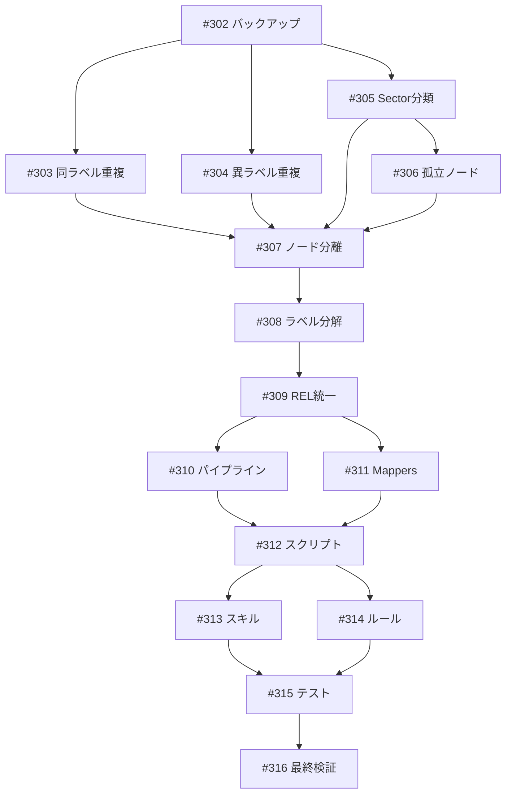

# research-neo4j Entity ノード廃止・ラベル/ノード正規化

**作成日**: 2026-04-02
**ステータス**: 計画中
**タイプ**: general
**GitHub Project**: [#107](https://github.com/users/YH-05/projects/107)
**前身プロジェクト**: [#105](https://github.com/users/YH-05/projects/105)（research-neo4j スキーマ定義とパイプライン再設計 — 16 Issue 全完了）

## 背景と目的

### 背景

research-neo4j の Entity ノード（1,658件）に以下の構造的問題が判明:

1. **Entity ラベルが汎用すぎる** — entity_type プロパティで型を区別するが、ラベルとして意味的クラスを表現していない
2. **プロパティの3層重複** — ticker/sector/country が Entity プロパティ・分類ノード・Entity ノードの3箇所に分散
3. **entity_key 複合キー** — `name::type` 形式の複合キーは Neo4j のアンチパターン
4. **リレーション3種混在** — Fact→Entity が RELATES_TO/ABOUT/MENTIONS に分裂（意味的区別なし）

### 目的

Neo4j 公式ベストプラクティスに準拠したスキーマに再設計する:
- Entity ラベル廃止 → 13個別ファーストクラスラベル
- entity_key 廃止 → NODE KEY 制約
- プロパティ → 独立ノード + リレーション
- RELATES_TO 1本化

### 成功基準

- [ ] Entity ラベルを持つノードが 0 件
- [ ] 13ラベル全てに NODE KEY 制約が設定済み
- [ ] ABOUT/MENTIONS リレーションが 0 件
- [ ] `make check-all` 全チェック通過
- [ ] kg-quality-check 異常なし

## 実装計画

### アーキテクチャ概要

```
Before: Entity(1,658) + entity_type prop + entity_key 複合キー + ABOUT/MENTIONS/RELATES_TO 混在
After:  13個別ラベル + NODE KEY + Ticker/Country/Sector/Industry ノード + RELATES_TO 統一
```

### Neo4j 公式ベストプラクティス（根拠）

| 出典 | 原則 | 今回の適用 |
|------|------|----------|
| David Allen "Graph Modeling: Labels" | ラベルで意味的クラスを表現 | Entity 廃止 → 個別ラベル |
| David Allen "Graph Data Modeling: Keys" | 複合キーを避けよ | entity_key 廃止 → NODE KEY |
| Neo4j Community | ラベルチェック > プロパティフィルタ | entity_type → ラベル |
| Neo4j Cypher Manual | NODE KEY = 存在+一意制約 | ラベルごとに name を NODE KEY |

### リスク評価

| リスク | 影響度 | 対策 |
|--------|--------|------|
| NODE KEY 制約作成時に残存重複 | 高 | Phase 1 完了後に重複 0 件確認 |
| APOC リネームのメモリ不足 | 高 | 1,000件単位バッチ処理 |
| 異ラベル同名 55 組の誤統合 | 高 | 全件人手レビュー |
| パイプライン更新中の新規投入不整合 | 中 | メンテナンスウィンドウ設定 |
| 26ファイルのクエリ更新漏れ | 中 | grep 全件チェック |

## タスク一覧

### Wave 1: 移行前バックアップ

- [ ] [Wave1] 移行前バックアップ・スナップショット取得
  - Issue: [#302](https://github.com/YH-05/note-finance/issues/302)
  - ステータス: todo

### Wave 2: 重複名寄せ・データクレンジング

- [ ] [Wave2] 同ラベル同名重複 19 件の名寄せ
  - Issue: [#303](https://github.com/YH-05/note-finance/issues/303)
  - ステータス: todo
  - 依存: #302

- [ ] [Wave2] 異ラベル同名 55 組の精査・統合判定
  - Issue: [#304](https://github.com/YH-05/note-finance/issues/304)
  - ステータス: todo
  - 依存: #302

- [ ] [Wave2] Entity:Sector 分類確定
  - Issue: [#305](https://github.com/YH-05/note-finance/issues/305)
  - ステータス: todo
  - 依存: #302

- [ ] [Wave2] 孤立ノード処理
  - Issue: [#306](https://github.com/YH-05/note-finance/issues/306)
  - ステータス: todo
  - 依存: #305

### Wave 3: プロパティのノード分離

- [ ] [Wave3] Ticker/Country/Sector/Industry ノード分離
  - Issue: [#307](https://github.com/YH-05/note-finance/issues/307)
  - ステータス: todo
  - 依存: #303, #304, #305, #306

### Wave 4: Entity ラベル分解

- [ ] [Wave4] Entity ラベル分解・entity_key 廃止・NODE KEY 制約
  - Issue: [#308](https://github.com/YH-05/note-finance/issues/308)
  - ステータス: todo
  - 依存: #307

### Wave 5: リレーション統一

- [ ] [Wave5] ABOUT/MENTIONS → RELATES_TO
  - Issue: [#309](https://github.com/YH-05/note-finance/issues/309)
  - ステータス: todo
  - 依存: #308

### Wave 6: パイプライン更新

- [ ] [Wave6] パイプラインコア更新
  - Issue: [#310](https://github.com/YH-05/note-finance/issues/310)
  - ステータス: todo
  - 依存: #309

- [ ] [Wave6] Mappers 更新
  - Issue: [#311](https://github.com/YH-05/note-finance/issues/311)
  - ステータス: todo
  - 依存: #309

### Wave 7: スクリプト更新

- [ ] [Wave7] スクリプト群の Cypher クエリ更新
  - Issue: [#312](https://github.com/YH-05/note-finance/issues/312)
  - ステータス: todo
  - 依存: #310, #311

### Wave 8: スキル・コマンド更新

- [ ] [Wave8] スキルの Cypher クエリ更新
  - Issue: [#313](https://github.com/YH-05/note-finance/issues/313)
  - ステータス: todo
  - 依存: #312

- [ ] [Wave8] コマンド・ルールの Cypher クエリ更新
  - Issue: [#314](https://github.com/YH-05/note-finance/issues/314)
  - ステータス: todo
  - 依存: #312

### Wave 9: テスト・品質検証

- [ ] [Wave9] テスト更新・全品質検証
  - Issue: [#315](https://github.com/YH-05/note-finance/issues/315)
  - ステータス: todo
  - 依存: #313, #314

### Wave 10: 最終検証

- [ ] [Wave10] 最終検証・旧スキーマ削除・ドキュメント更新
  - Issue: [#316](https://github.com/YH-05/note-finance/issues/316)
  - ステータス: todo
  - 依存: #315

## 依存関係図



## 関連リソース

| リソース | パス |
|---------|------|
| 議論メモ | `docs/plan/SideBusiness/2026-04-02_discussion-research-neo4j-entity-redesign.md` |
| 実装計画 | `.tmp/plan-project-20260402-entity-redesign/implementation-plan.json` |
| リサーチ結果 | `.tmp/plan-project-20260402-entity-redesign/research-findings.json` |
| タスク分解 | `.tmp/plan-project-20260402-entity-redesign/task-breakdown.json` |
| note-neo4j | `disc-2026-04-02-research-neo4j-entity-redesign` + Decision 6件 |

---

**最終更新**: 2026-04-02
