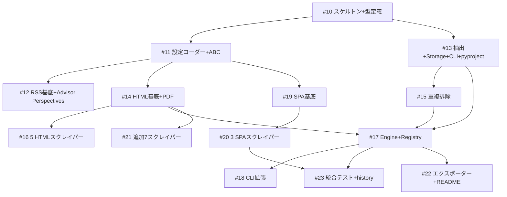

# 投資レポートスクレイパーパッケージ (report_scraper)

**作成日**: 2026-03-05
**ステータス**: 計画中
**タイプ**: package
**GitHub Project**: [#67](https://github.com/users/YH-05/projects/67)

## 背景と目的

### 背景

週次マーケットレポート作成にあたり、主要セルサイド・バイサイドの無料公開レポートを効率的に収集する仕組みが必要。現在は手動でWebサイトを巡回しているが、約25以上のソースがあり自動化の効果が大きい。

### 目的

`src/report_scraper/` として新規独立パッケージを作成し、CLIから週次で手動実行する投資レポート自動収集ツールを構築する。Scrapling ライブラリを活用し、StealthyFetcher（TLS偽装）/ DynamicFetcher（Playwright）で金融機関サイトのWAF対策を強化する。

### 成功基準

- [ ] `report-scraper collect` で全ソースからレポートを自動収集できること
- [ ] RSS / 静的HTML / Playwright(SPA) の3種類の取得方式に対応すること
- [ ] `make check-all` が全パス通ること
- [ ] 重複排除が正しく動作すること

## リサーチ結果

### 既存パターン

- **Lazy Logger**: `src/rss/_logging.py` → そのままコピー
- **ABC Base Scraper + Engine Injection**: `src/rss/services/company_scrapers/base.py` → 適応
- **Registry Pattern**: `src/rss/services/company_scrapers/registry.py` → そのまま適用
- **trafilatura + lxml Fallback**: `src/rss/services/article_extractor.py` → 再利用
- **Click CLI + Rich**: `src/rss/cli/main.py` → 適用
- **Frozen Dataclass**: `src/rss/services/company_scrapers/types.py` → パターン適用
- **Pydantic BaseModel**: `src/news_scraper/types.py` → パターン適用

### 参考実装

| ファイル | 説明 |
|---------|------|
| `src/rss/services/company_scrapers/base.py` | ABC BaseReportScraper の設計参考 |
| `src/rss/services/company_scrapers/engine.py` | ScraperEngine の composition パターン参考 |
| `src/rss/services/company_scrapers/registry.py` | ScraperRegistry の routing パターン参考 |
| `src/rss/services/company_scrapers/types.py` | frozen dataclass + 例外階層の参考 |
| `src/rss/services/article_extractor.py` | trafilatura + lxml 抽出ロジック参考 |
| `src/rss/cli/main.py` | Click CLI + Rich 出力の参考 |
| `src/news_scraper/types.py` | Pydantic BaseModel 設定パターン参考 |

### 技術的考慮事項

- **Scrapling (v0.4.1)**: ベータ版だが、StealthyFetcher（TLS偽装）/ DynamicFetcher（Playwright + Cloudflare対応）が有用。ScrapingPolicy の自前実装が不要に
- 金融機関サイトの WAF（Cloudflare, Akamai）対策が必要 → StealthyFetcher で軽減
- CSS構造変更リスク → Scrapling の適応型要素追跡で自動対応
- パッケージ間依存なし（rss パッケージからコンポーネントをコピーして独立）

## 実装計画

### アーキテクチャ概要

```
BaseReportScraper (ABC)
├── RssReportScraper      → feedparser
├── HtmlReportScraper     → Scrapling StealthyFetcher (TLS偽装 + CSS抽出)
└── SpaReportScraper      → Scrapling DynamicFetcher (Playwright + Cloudflare)

ScraperEngine: fetch → extract → dedup → store (asyncio.Semaphore(5))
ScraperRegistry: source_key → scraper routing
```

データフロー: `YAML Config → ConfigLoader → ScraperRegistry → ScraperEngine → Scrapling Fetchers → ContentExtractor → JsonStore/PdfStore → RunSummary`

### リスク評価

| リスク | 影響度 | 対策 |
|--------|--------|------|
| Scrapling ベータ版のAPI変更 | 中 | バージョン固定 + 薄いラッパーで影響範囲最小化 |
| CSSセレクター変更 | 中 | YAML外出し + 適応型要素追跡 |
| ボット検出/WAF | 中 | StealthyFetcher TLS偽装 + Cloudflare自動対応 |
| Playwright CI複雑化 | 中 | optional dependency + 別CIジョブ |
| メンテナンスコスト | 中 | 高価値ソース優先 + 段階的追加 |

## タスク一覧

### Wave 1（基盤 + RSS）

- [ ] パッケージスケルトンと型定義・例外階層
  - Issue: [#10](https://github.com/YH-05/note-finance/issues/10)
  - ステータス: todo
  - 見積もり: 8-12h

- [ ] YAML設定ローダーとABC基底クラス
  - Issue: [#11](https://github.com/YH-05/note-finance/issues/11)
  - ステータス: todo
  - 依存: #10
  - 見積もり: 8-10h

- [ ] RSS基底クラスとAdvisor Perspectivesスクレイパー
  - Issue: [#12](https://github.com/YH-05/note-finance/issues/12)
  - ステータス: todo
  - 依存: #11
  - 見積もり: 6-8h

- [ ] コンテンツ抽出・JSONストレージ・CLI・pyproject.toml更新
  - Issue: [#13](https://github.com/YH-05/note-finance/issues/13)
  - ステータス: todo
  - 依存: #10
  - 見積もり: 10-14h

### Wave 2（静的HTML + PDF）

- [ ] HTML基底クラス（StealthyFetcher）とPDFダウンローダー
  - Issue: [#14](https://github.com/YH-05/note-finance/issues/14)
  - ステータス: todo
  - 依存: #11
  - 見積もり: 10-14h

- [ ] 重複排除トラッカー
  - Issue: [#15](https://github.com/YH-05/note-finance/issues/15)
  - ステータス: todo
  - 依存: #13
  - 見積もり: 4-6h

- [ ] 5つのHTMLスクレイパー（BlackRock, Schwab, Morgan Stanley, Wells Fargo, Vanguard）
  - Issue: [#16](https://github.com/YH-05/note-finance/issues/16)
  - ステータス: todo
  - 依存: #14
  - 見積もり: 8-12h

- [ ] ScraperEngineとScraperRegistry
  - Issue: [#17](https://github.com/YH-05/note-finance/issues/17)
  - ステータス: todo
  - 依存: #13, #14, #15
  - 見積もり: 10-14h

- [ ] CLI拡張（list, test-source, --tierフィルタ）
  - Issue: [#18](https://github.com/YH-05/note-finance/issues/18)
  - ステータス: todo
  - 依存: #17
  - 見積もり: 4-6h

### Wave 3（Playwright）

- [ ] SPA基底クラスとDynamicFetcher
  - Issue: [#19](https://github.com/YH-05/note-finance/issues/19)
  - ステータス: todo
  - 依存: #11
  - 見積もり: 8-10h

- [ ] 3つのSPAスクレイパー（Goldman Sachs, JP Morgan, PIMCO）
  - Issue: [#20](https://github.com/YH-05/note-finance/issues/20)
  - ステータス: todo
  - 依存: #19
  - 見積もり: 6-10h

- [ ] 統合テストとCLI historyコマンド
  - Issue: [#23](https://github.com/YH-05/note-finance/issues/23)
  - ステータス: todo
  - 依存: #17, #20
  - 見積もり: 6-8h

### Wave 4（追加ソース + 仕上げ）

- [ ] 追加7スクレイパー（State Street, Fidelity等）
  - Issue: [#21](https://github.com/YH-05/note-finance/issues/21)
  - ステータス: todo
  - 依存: #14
  - 見積もり: 8-12h

- [ ] MarkdownサマリーエクスポーターとREADME
  - Issue: [#22](https://github.com/YH-05/note-finance/issues/22)
  - ステータス: todo
  - 依存: #17
  - 見積もり: 4-6h

## 依存関係図



---

**最終更新**: 2026-03-05
