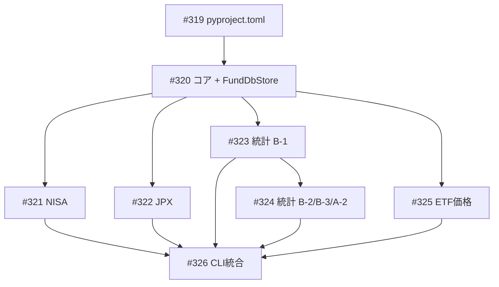

# 投資信託・ETFデータベース (fund_db)

**作成日**: 2026-04-03
**ステータス**: 計画中
**タイプ**: package
**GitHub Project**: [#109](https://github.com/users/YH-05/projects/109)

## 背景と目的

### 背景

株投資ラボ（note.com金融ブログ）の記事執筆用に、日本の投資信託・ETFのデータベースが必要。現在は手動でデータを収集しているが、定期的な更新と分析を効率化するためにパッケージ化する。

### 目的

4つの無料データソース（NISA対象商品リスト、JPX上場銘柄一覧、投資信託協会統計データ、ETF価格）から、マスタデータ・マクロ統計・価格を取得・パース・永続化する `src/fund_db/` パッケージを構築する。

### 成功基準

- [ ] `fund-db sync-all` で全4ソースのデータ取得・パース・JSON保存が完了すること
- [ ] `fund-db status` でデータ鮮度を確認できること
- [ ] `make check-all` が成功すること
- [ ] NISA 投信 2,200件以上、ETF 390件以上のマスタデータが取得できること

## リサーチ結果

### 既存パターン

| パターン | 説明 | 適用 |
|---------|------|------|
| structlog ラッパー | `report_scraper/_logging.py` をコピー流用 | ✅ |
| Pydantic + dataclass | `report_scraper/types.py` のパターンを踏襲 | ✅ |
| JSON永続化 (JsonStore) | 日付パーティション追加で拡張 | ✅ |
| Click CLI グループ | `report_scraper/cli/main.py` + rich.Table | ✅ |
| 例外ヒエラルキー | `report_scraper/exceptions.py` を踏襲 | ✅ |
| data_paths.get_path() | `data/fund_db/` 配下のパス解決 | ✅ |
| httpx ダウンローダー | 同期ダウンロードパターン | ✅ |

### 参考実装

| ファイル | 説明 |
|---------|------|
| `src/report_scraper/_logging.py` | structlog ラッパー（ほぼそのままコピー） |
| `src/report_scraper/storage/json_store.py` | FundDbStore の雛形 |
| `src/report_scraper/cli/main.py` | Click CLI パターン |
| `src/report_scraper/exceptions.py` | 例外ヒエラルキーの参考 |
| `src/data_paths/paths.py` | get_path() API |
| quants: `market/yfinance/fetcher.py` | YFinanceFetcher API（`fetch(FetchOptions)`） |

### 技術的考慮事項

- **YFinanceFetcher API の差異**: プラン記載の `fetch(symbols=...)` ではなく `fetch(FetchOptions(...))` 形式。wrapper 内部で FetchOptions を構築する
- **openpyxl/xlrd は新規追加**: `[project] dependencies` に直接追加
- **統計データURL**: toushin.or.jp の統計ページをスクレイピングしてDLリンクを抽出
- **.tmp/ に全 Excel ファイル確認済み**: NISA×2、JPX×1、統計×4 でパーサーテスト即実行可能
- **NaN 変換**: pandas の isna() チェックで NaN → None に変換してからモデル化

## 実装計画

### アーキテクチャ概要

`src/fund_db/` を単一パッケージとし、4サブパッケージ（nisa/jpx/toushin_stats/etf_prices）で分離。共通基盤（_logging, exceptions, types, config, storage）の上に、各サブパッケージは Downloader → Parser → Models の3層で実装。CLI は Click グループで全サブパッケージのコマンドを束ねる。

データフロー: CLI → Downloader(httpx) → raw_excel保存 → Parser(openpyxl/xlrd) → Pydanticモデル → JSON保存 → `data/fund_db/{category}/{YYYY-MM-DD}/*.json`

### リスク評価

| リスク | 影響度 | 対策 |
|--------|--------|------|
| openpyxl/xlrd 依存追加失敗 | 高 | Wave1 先頭で uv add を実行 |
| toushin.or.jp ページ構造変更 | 中 | `_extract_download_links` を分離 |
| B-2 の31シート構造が複雑 | 中 | B-1完成後に実ファイル確認してから設計 |
| YFinanceFetcher NaN変換 | 中 | Mock テスト + wrap_value ヘルパー |
| .tmp/ ファイル不在（CI） | 中 | `@pytest.mark.skipif` でスキップ |

## タスク一覧

### Wave 1（シリアル）

- [ ] pyproject.toml 更新
  - Issue: [#319](https://github.com/YH-05/note-finance/issues/319)
  - ステータス: todo

- [ ] コアモジュール + FundDbStore + テスト
  - Issue: [#320](https://github.com/YH-05/note-finance/issues/320)
  - ステータス: todo
  - 依存: #319

### Wave 2-5（並行開発可能）

- [ ] NISA サブパッケージ
  - Issue: [#321](https://github.com/YH-05/note-finance/issues/321)
  - ステータス: todo
  - 依存: #320

- [ ] JPX サブパッケージ
  - Issue: [#322](https://github.com/YH-05/note-finance/issues/322)
  - ステータス: todo
  - 依存: #320

- [ ] toushin_stats B-1 先行実装
  - Issue: [#323](https://github.com/YH-05/note-finance/issues/323)
  - ステータス: todo
  - 依存: #320

- [ ] ETF 価格取得
  - Issue: [#325](https://github.com/YH-05/note-finance/issues/325)
  - ステータス: todo
  - 依存: #320

### Wave 4 追加（B-1 完了後）

- [ ] toushin_stats B-2/B-3/A-2 追加
  - Issue: [#324](https://github.com/YH-05/note-finance/issues/324)
  - ステータス: todo
  - 依存: #323

### Wave 6（全完了後）

- [ ] CLI 統合
  - Issue: [#326](https://github.com/YH-05/note-finance/issues/326)
  - ステータス: todo
  - 依存: #321, #322, #323, #324, #325

## 依存関係図

## 関連ドキュメント

- [設計プラン](./original-plan.md)

---

**最終更新**: 2026-04-03
