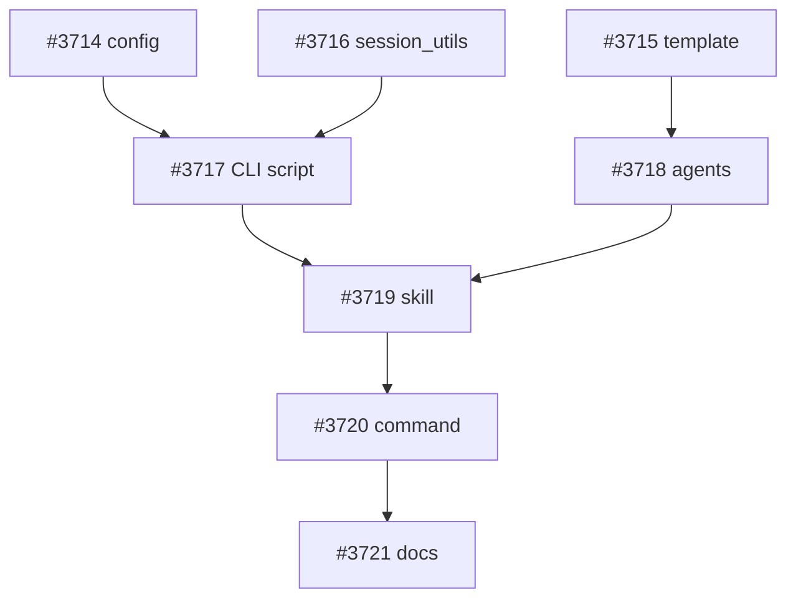

# 資産形成コンテンツ軽量ワークフロー実装

**作成日**: 2026-03-05
**ステータス**: 計画中
**タイプ**: workflow
**GitHub Project**: [#68](https://github.com/users/YH-05/projects/68)

## 背景と目的

### 背景

日本在住の投資初心者向けに資産形成系の記事（note.com + X投稿）を発信したい。既存の `/finance-full`（20-40分）は市場データ取得・SEC開示等の重いリサーチフェーズがあり、教育コンテンツには過剰。運用会社レポートやニュースを収集→キュレーション→初心者向けに噛み砕いた記事を生成する軽量な専用ワークフロー（5-10分）を新設する。

### 目的

- NISA制度、ファンド選び、資産配分、iDeCo、市場基礎知識、資産形成シミュレーションに関する初心者向け記事を効率的に生成
- note.com記事（2000-4000字）+ X投稿（280字以内）を1回のコマンドで生成
- コンプライアンスチェック自動化（既存エージェント再利用）

### 成功基準

- [ ] `/asset-management` が5-10分で完了
- [ ] note記事が2000-4000字の範囲
- [ ] X投稿が280字以内
- [ ] compliance critic が pass
- [ ] `make check-all` パス

## リサーチ結果

### 既存パターン

- `finance-news-workflow`: 3フェーズパイプライン（CLI前処理→並列Issue作成→集約）を採用。5分以内完了
- `prepare_news_session.py`: 980行、共通化可能な6関数 + 6 Pydanticモデルを含む
- `prepare_ai_research_session.py` にも同様の重複関数あり（将来の統合候補）
- `finance-critic-compliance` エージェント: そのまま再利用可能（変更不要）

### 参考実装

| ファイル | 説明 |
|---------|------|
| `scripts/prepare_news_session.py` | session_utils.py 抽出元。filter_by_date, select_top_n 等 |
| `.claude/skills/finance-news-workflow/SKILL.md` | スキル構造のパターン（3フェーズ、パラメータ定義） |
| `data/config/finance-news-themes.json` | テーマ定義のスキーマ参考 |
| `.claude/agents/finance-article-writer.md` | 記事ライターの構造パターン（信頼度別表現、禁止表現） |
| `template/investment_education/` | テンプレート構造の参考（最も近いカテゴリ） |

### 技術的考慮事項

- 日本語RSSフィードURLはランディングページの場合あり → 実装前にcurl検証必須
- `FeedReader` の日本語エンコーディング対応を確認必要
- キーワードマッチングは初版では単純部分文字列マッチ（形態素解析は後回し）

## 実装計画

### アーキテクチャ概要

```
/asset-management "新NISAつみたて投資枠の活用法" --theme nisa
  │
  ├── Phase 1: ソース収集（2-3分）
  │   └── prepare_asset_management_session.py（JP RSS + キーワードマッチ）
  │
  ├── Phase 2: 記事生成（2-4分）
  │   └── asset-management-writer（note記事 + X投稿）
  │
  ├── Phase 3: コンプライアンスチェック（1-2分）
  │   ├── finance-critic-compliance（既存再利用）
  │   └── asset-management-reviser（compliance修正のみ）
  │
  └── Phase 4: 結果報告（<30秒）
```

### ファイルマップ

| 操作 | ファイルパス | 説明 |
|------|------------|------|
| 新規作成 | `data/config/asset-management-themes.json` | 6テーマ定義 + content_rules |
| 新規作成 | `data/config/rss-presets-jp.json` | JP RSSフィード定義 |
| 新規作成 | `template/asset_management/article-meta.json` | メタデータテンプレート |
| 新規作成 | `template/asset_management/02_edit/first_draft.md` | note記事テンプレート |
| 新規作成 | `template/asset_management/02_edit/x_post.md` | X投稿テンプレート |
| 新規作成 | `snippets/nisa-disclaimer.md` | NISA制度変更注記 |
| 新規作成 | `scripts/session_utils.py` | 共通モジュール |
| 新規作成 | `scripts/prepare_asset_management_session.py` | CLI前処理 |
| 新規作成 | `.claude/agents/asset-management-writer.md` | 記事ライター |
| 新規作成 | `.claude/agents/asset-management-reviser.md` | 軽量リバイザー |
| 新規作成 | `.claude/skills/asset-management-workflow/SKILL.md` | スキル定義 |
| 新規作成 | `.claude/skills/asset-management-workflow/guide.md` | 詳細ガイド |
| 新規作成 | `.claude/commands/asset-management.md` | コマンド定義 |
| 変更 | `scripts/prepare_news_session.py` | session_utils import |
| 変更 | `CLAUDE.md` | Slash Commands追加 |
| 変更 | `.claude/commands/new-finance-article.md` | カテゴリ追加 |
| 変更 | `.claude/commands/finance-suggest-topics.md` | カテゴリ追加 |

### リスク評価

| リスク | 影響度 | 対策 |
|--------|--------|------|
| 日本語RSSフィードURLが無効 | 高 | Wave 0でcurl検証。無効なら代替URL探索 |
| session_utils抽出時のリグレッション | 中 | make check-all + 手動テスト。既存テスト未作成のためリスク低 |
| FeedReaderの日本語エンコーディング非対応 | 中 | feedparser直接使用のフォールバック |
| キーワードマッチ精度不足 | 低 | 初版は部分文字列マッチ。後からjanome等追加 |

## タスク一覧

### Wave 0+1（並行開発可能）

- [ ] feat(config): RSSフィードURL検証とJP RSSプリセット・テーマ定義の作成
  - Issue: [#3714](https://github.com/YH-05/finance/issues/3714)
  - ステータス: todo
  - 見積もり: M

- [ ] feat(template): 資産形成カテゴリのテンプレートとNISA免責スニペットの作成
  - Issue: [#3715](https://github.com/YH-05/finance/issues/3715)
  - ステータス: todo
  - 見積もり: S

### Wave 2（Wave 0+1 と並行可能）

- [ ] refactor(scripts): prepare_news_session.py から共通モジュール session_utils.py を抽出
  - Issue: [#3716](https://github.com/YH-05/finance/issues/3716)
  - ステータス: todo
  - 見積もり: M

### Wave 3+4（Wave 1+2 完了後、相互並行可能）

- [ ] feat(scripts): 資産形成セッション前処理スクリプトとテストの作成
  - Issue: [#3717](https://github.com/YH-05/finance/issues/3717)
  - ステータス: todo
  - 依存: #3714, #3716
  - 見積もり: L

- [ ] feat(agents): 資産形成ライターとリバイザーエージェントの定義
  - Issue: [#3718](https://github.com/YH-05/finance/issues/3718)
  - ステータス: todo
  - 依存: #3715
  - 見積もり: M

### Wave 5（Wave 3+4 完了後、逐次）

- [ ] feat(skills): 資産形成ワークフロースキルの作成
  - Issue: [#3719](https://github.com/YH-05/finance/issues/3719)
  - ステータス: todo
  - 依存: #3717, #3718
  - 見積もり: M

- [ ] feat(commands): /asset-management コマンドの作成
  - Issue: [#3720](https://github.com/YH-05/finance/issues/3720)
  - ステータス: todo
  - 依存: #3719
  - 見積もり: S

- [ ] docs: CLAUDE.md と既存コマンドに asset_management カテゴリを追加
  - Issue: [#3721](https://github.com/YH-05/finance/issues/3721)
  - ステータス: todo
  - 依存: #3720
  - 見積もり: S

## 依存関係図



---

**最終更新**: 2026-03-05
