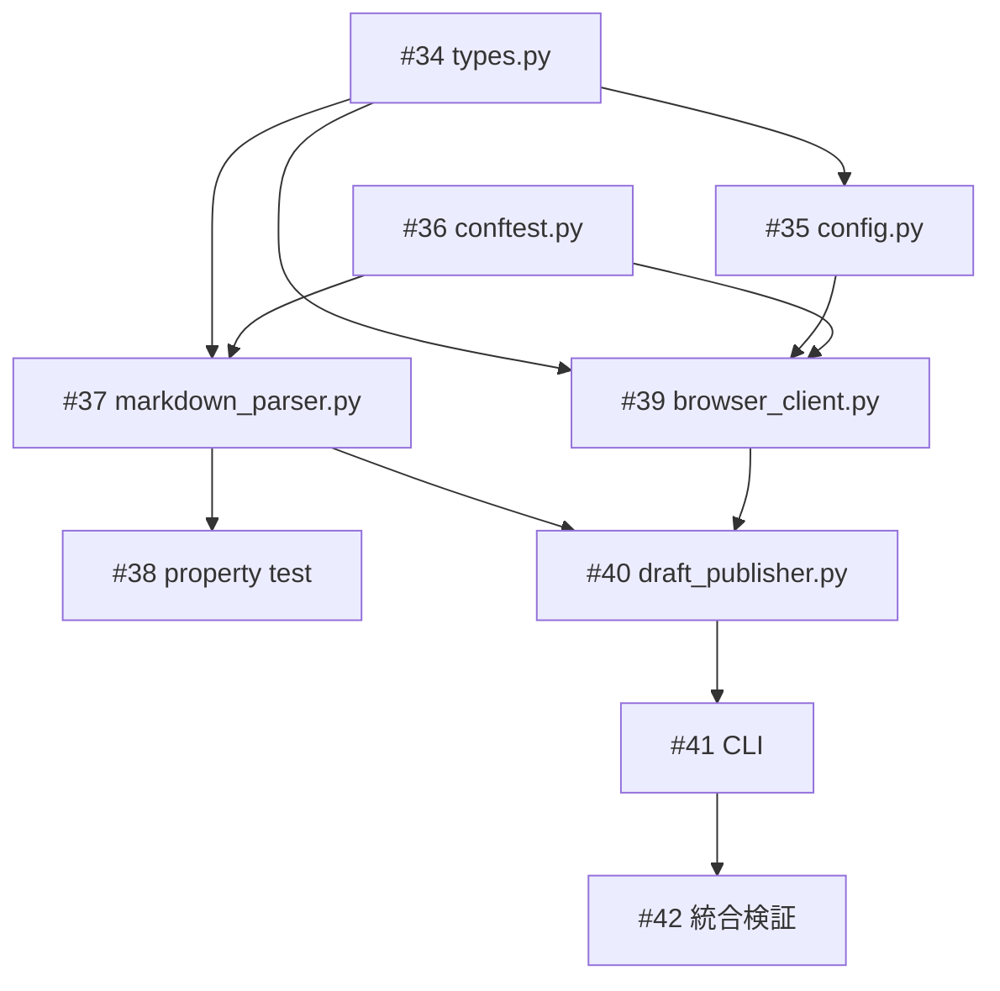

# note.com 下書き投稿スクリプト

**作成日**: 2026-03-06
**ステータス**: 計画中
**タイプ**: package
**GitHub Project**: [#73](https://github.com/users/YH-05/projects/73)

## 背景と目的

### 背景

記事ワークフロー（`/finance-edit`）で生成される `revised_draft.md` を note.com に下書きとして投稿するプロセスは現在手動。Playwright ブラウザ自動化で自動化し、CLI から1コマンドで下書き作成まで完了できるようにする。

### 目的

`scripts/note_publisher/` パッケージとして、Markdown パース → ブラウザ操作 → note.com 下書き投稿の自動化スクリプトを実装する。

### 成功基準

- [ ] `uv run python scripts/publish_to_note.py <article_dir> --dry-run` でパース結果が確認できる
- [ ] `uv run python scripts/publish_to_note.py <article_dir>` で note.com に下書きが作成される
- [ ] `make check-all` が成功する
- [ ] ユニットテスト + プロパティテストが全て通る

## リサーチ結果

### 既存パターン

| パターン | 参照先 |
|---------|--------|
| Playwright async context manager | `src/news/extractors/playwright.py` |
| Playwright モックテスト（AsyncMock） | `tests/news/unit/extractors/test_playwright.py` |
| Scripts CLI（argparse + asyncio.run） | `scripts/generate_table_image.py` |
| Pydantic JSON 永続化 | `scripts/session_utils.py` |
| Pydantic v2 型ヒントスタイル | `src/news/config/models.py` |

### 技術的考慮事項

- **セレクタ戦略**: data-testid ベース（CSS/aria にフォールバック）
- **テーブル PNG 命名**: 出現順連番（table_1.png, table_2.png）
- **テスト範囲**: ユニットテスト + Hypothesis プロパティテスト
- **認証**: 初回 headed ブラウザで手動ログイン → セッション JSON 永続化

## 実装計画

### アーキテクチャ概要

6モジュール構成。Markdown パース（純粋ロジック）とブラウザ操作（副作用）を明確に分離。

```
CLI → DraftPublisher.publish() → markdown_parser.parse_draft() → ArticleDraft
  → NoteBrowserClient: create_new_draft() → set_title() → insert_block() x N
  → upload_image() x N → save_draft() → PublishResult
```

### ファイルマップ

| 操作 | ファイルパス | 説明 |
|------|------------|------|
| 新規作成 | `scripts/note_publisher/__init__.py` | パッケージ初期化 |
| 新規作成 | `scripts/note_publisher/types.py` | Pydantic v2 モデル |
| 新規作成 | `scripts/note_publisher/config.py` | 設定読み込み |
| 新規作成 | `scripts/note_publisher/markdown_parser.py` | Markdown パーサー |
| 新規作成 | `scripts/note_publisher/browser_client.py` | Playwright 操作 |
| 新規作成 | `scripts/note_publisher/draft_publisher.py` | オーケストレーター |
| 新規作成 | `scripts/publish_to_note.py` | CLI エントリポイント |
| 変更 | `.gitignore` | `.note-session.json` 追加 |

### リスク評価

| リスク | 影響度 | 対策 |
|--------|--------|------|
| note.com DOM 構造変更 | 高 | セレクタを定数辞書に集約、3段階フォールバック |
| セッション有効期限不明 | 中 | 毎回ログイン状態検証、自動 headed 切り替え |
| bot 検知 | 中 | typing_delay + ランダム待機 + headed モード |

## タスク一覧

### Wave 1（並行開発可能: #34 と #36）

- [ ] Pydantic v2 型定義モデルの実装（types.py）
  - Issue: [#34](https://github.com/YH-05/note-finance/issues/34)
  - ステータス: todo
  - 見積もり: 1h

- [ ] 設定読み込みモジュールの実装（config.py）
  - Issue: [#35](https://github.com/YH-05/note-finance/issues/35)
  - ステータス: todo
  - 依存: #34
  - 見積もり: 0.5h

- [ ] テスト基盤の構築（conftest.py + __init__.py）
  - Issue: [#36](https://github.com/YH-05/note-finance/issues/36)
  - ステータス: todo
  - 見積もり: 0.5h

### Wave 2（Wave 1 完了後、Wave 3 と並行可能）

- [ ] Markdown パーサーの実装（markdown_parser.py）
  - Issue: [#37](https://github.com/YH-05/note-finance/issues/37)
  - ステータス: todo
  - 依存: #34, #36
  - 見積もり: 2h

- [ ] Markdown パーサーのプロパティベーステスト
  - Issue: [#38](https://github.com/YH-05/note-finance/issues/38)
  - ステータス: todo
  - 依存: #37
  - 見積もり: 1h

### Wave 3（Wave 1 完了後、Wave 2 と並行可能）

- [ ] Playwright ブラウザクライアントの実装（browser_client.py）
  - Issue: [#39](https://github.com/YH-05/note-finance/issues/39)
  - ステータス: todo
  - 依存: #34, #35, #36
  - 見積もり: 2h

### Wave 4（Wave 2 & 3 完了後）

- [ ] オーケストレーターの実装（draft_publisher.py）
  - Issue: [#40](https://github.com/YH-05/note-finance/issues/40)
  - ステータス: todo
  - 依存: #37, #39
  - 見積もり: 1.5h

- [ ] CLI エントリポイントの実装（publish_to_note.py）
  - Issue: [#41](https://github.com/YH-05/note-finance/issues/41)
  - ステータス: todo
  - 依存: #40
  - 見積もり: 0.5h

### Wave 5（Wave 4 完了後）

- [ ] .gitignore 更新・統合検証
  - Issue: [#42](https://github.com/YH-05/note-finance/issues/42)
  - ステータス: todo
  - 依存: #41
  - 見積もり: 0.5h

## 依存関係図



---

**最終更新**: 2026-03-06
