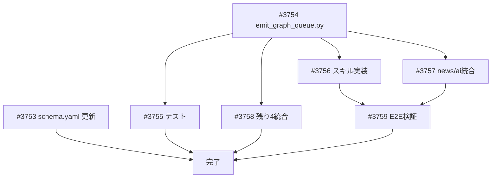

# save-to-graph スキル実装

**作成日**: 2026-03-07
**ステータス**: 計画中
**タイプ**: workflow（スクリプト + スキル + コマンド + 既存統合）
**GitHub Project**: [#74](https://github.com/users/YH-05/projects/74)

## 背景と目的

### 背景

金融コンテンツプロジェクトの各コマンド（`/generate-market-report`, `/finance-news-workflow`, `/ai-research-collect` 等）は、実行時に多数の情報ソースを調査・収集する。しかしこれらのソース情報は使い捨てで、横断的な検索・分析ができない。

### 目的

Neo4j グラフDB にソース情報を蓄積することで：
- 「この主張の根拠となったソースは何か」のトレーサビリティ
- 「このテーマについて過去にどんなソースを参照したか」の検索
- 将来的には主張間の矛盾検出やエビデンスチェーン構築

### 成功基準

- [ ] 6コマンドから graph-queue ファイルが生成される
- [ ] `/save-to-graph` で Neo4j に冪等にデータが投入される
- [ ] 同じデータを2回投入しても重複ノードが作成されない
- [ ] Source → Topic, Source → Claim → Entity のグラフ構造が正しく構築される

## リサーチ結果

### 既存パターン

- スキル構造: `.claude/skills/{name}/SKILL.md` + `guide.md`（フェーズ別処理 + JSON仕様 + エラーハンドリング）
- Python スクリプト: `scripts/prepare_news_session.py` パターン（argparse + 標準ライブラリ）
- Neo4j: docker-compose で 5-community + APOC 有効化済み

### 参考実装

| ファイル | 説明 |
|---------|------|
| `scripts/prepare_news_session.py` | argparse + JSON出力パターン |
| `.claude/skills/finance-news-workflow/SKILL.md` | スキル構造の参考 |
| `.tmp/news-batches/index.json` | 入力データフォーマット |
| `data/config/knowledge-graph-schema.yaml` | グラフスキーマ定義 |

### 技術的考慮事項

- Neo4j 5 Community は複合一意制約が使えない → `topic_key`, `entity_key` 連結キーで対応
- `fetched_at` → `collected_at` リネームはスキーマ定義のみ（既存 Python コードの `fetched_at` は別概念）
- emit_graph_queue.py は標準ライブラリのみ（structlog/Pydantic 不使用）

## 実装計画

### アーキテクチャ概要

```
各コマンド実行
  └→ 末尾ステップで scripts/emit_graph_queue.py を呼び出し
       └→ .tmp/graph-queue/{command}/{queue_id}.json に出力

/save-to-graph（非同期、手動実行）
  └→ .tmp/graph-queue/ 配下の未処理 JSON を検出
       └→ Neo4j MCP (write_neo4j_cypher) で MERGE ベース投入
            └→ 処理済みファイルを削除
```

### ファイルマップ

| 操作 | ファイルパス | 説明 |
|------|------------|------|
| 新規作成 | `scripts/emit_graph_queue.py` | graph-queue 生成スクリプト |
| 新規作成 | `.claude/skills/save-to-graph/SKILL.md` | スキル定義 |
| 新規作成 | `.claude/skills/save-to-graph/guide.md` | 詳細ガイド |
| 新規作成 | `.claude/commands/save-to-graph.md` | スラッシュコマンド |
| 新規作成 | `tests/scripts/test_emit_graph_queue.py` | ユニットテスト |
| 変更 | `data/config/knowledge-graph-schema.yaml` | スキーマ更新 |
| 変更 | `.claude/skills/finance-news-workflow/SKILL.md` | ステップ追加 |
| 変更 | `.claude/skills/ai-research-workflow/SKILL.md` | ステップ追加 |
| 変更 | `.claude/skills/generate-market-report/SKILL.md` | ステップ追加 |
| 変更 | `.claude/skills/asset-management-workflow/SKILL.md` | ステップ追加 |
| 変更 | `.claude/skills/reddit-finance-topics/SKILL.md` | ステップ追加 |
| 変更 | `.claude/commands/finance-full.md` | ステップ追加 |

### リスク評価

| リスク | 影響度 | 対策 |
|--------|--------|------|
| Neo4j 停止中のコマンド実行 | 低 | 非同期分離により影響なし |
| graph-queue フォーマットの仕様変更 | 中 | schema_version で互換性管理 |
| 入力データが存在しないコマンド | 低 | マッピング定義は先行実装、実データ検証は後日 |

## タスク一覧

### Wave 1（並行開発可能）

- [ ] knowledge-graph-schema.yaml の更新
  - Issue: [#3753](https://github.com/YH-05/finance/issues/3753)
  - ステータス: todo
  - 見積もり: S

- [ ] scripts/emit_graph_queue.py の実装
  - Issue: [#3754](https://github.com/YH-05/finance/issues/3754)
  - ステータス: todo
  - 見積もり: L

### Wave 2（Wave 1 完了後）

- [ ] emit_graph_queue.py のユニットテスト
  - Issue: [#3755](https://github.com/YH-05/finance/issues/3755)
  - ステータス: todo
  - 依存: #3754
  - 見積もり: M

- [ ] save-to-graph スキル・コマンドの実装
  - Issue: [#3756](https://github.com/YH-05/finance/issues/3756)
  - ステータス: todo
  - 依存: #3754
  - 見積もり: L

- [ ] finance-news-workflow / ai-research-workflow への統合
  - Issue: [#3757](https://github.com/YH-05/finance/issues/3757)
  - ステータス: todo
  - 依存: #3754
  - 見積もり: S

- [ ] 残り4コマンドへの統合
  - Issue: [#3758](https://github.com/YH-05/finance/issues/3758)
  - ステータス: todo
  - 依存: #3754
  - 見積もり: S

### Wave 3（Wave 2 完了後）

- [ ] E2E 検証・冪等性テスト
  - Issue: [#3759](https://github.com/YH-05/finance/issues/3759)
  - ステータス: todo
  - 依存: #3754, #3756, #3757
  - 見積もり: M

## 依存関係図



---

**最終更新**: 2026-03-07
