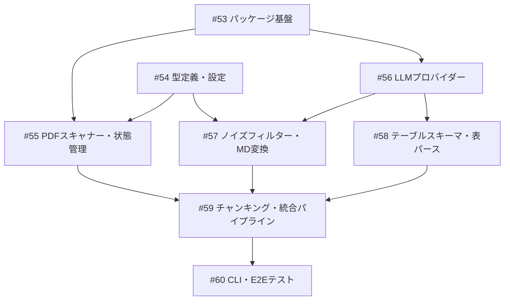

# PDF→ナレッジグラフ パイプライン

**作成日**: 2026-03-11
**ステータス**: 計画中
**タイプ**: package
**GitHub Project**: [#75](https://github.com/users/YH-05/projects/75)

## 背景と目的

### 背景

ナレッジグラフ構築の一環として、セルサイド・中央銀行・コンサル等の調査レポートPDFを構造化し、Neo4jグラフDBに投入するパイプラインが必要。Docling MCP + Gemini CLIでの変換を試みたが、出力の不安定性・ノイズ混入・複雑な表パース不可の課題が発生。2トラック構成（Track A: 本文→MD、Track B: 表→JSON）でLLMProvider Protocol経由の処理を行う。

### 目的

Phase 1（基盤）+ Phase 2-4（PDF→MD変換）を優先実装し、セルサイドレポートPDFからセクション分割Markdown + 構造化テーブルJSONを安定的に出力できるパイプラインを構築する。

### 成功基準

- [ ] サンプルPDF 8本に対してMarkdown + JSON出力が生成できる
- [ ] 数値抽出精度 95%以上（ground_truthベース）
- [ ] ノイズ除去率 100%（免責事項等）
- [ ] 同一PDFの再処理で冪等性が保証される
- [ ] `make check-all` が成功する

## リサーチ結果

### 既存パターン

- **Pydantic BaseModel**: `report_scraper/types.py` のパターン（Field(description=...)）を全面適用。frozen dataclassは使わず全てPydantic
- **structlog logging**: `report_scraper/_logging.py` のget_logger(name, **context)パターンを複製
- **YAML config + Pydantic**: `report_scraper/config/loader.py` のyaml.safe_load→model_validateパターン
- **Click CLI + Rich**: `report_scraper/cli/main.py` のパターン（@click.group() + Rich Console/Table）
- **ID生成**: `scripts/emit_graph_queue.py` のUUID5/SHA-256パターンを移植
- **MERGE書き込み**: `.claude/skills/save-to-graph/guide.md` のMERGE + UNWINDパターンを参考

### 参考実装

| ファイル | 説明 |
|---------|------|
| `src/report_scraper/types.py` | Pydantic BaseModel + frozen dataclass パターン |
| `src/report_scraper/_logging.py` | structlog + get_logger パターン |
| `src/report_scraper/config/loader.py` | YAML + Pydantic バリデーション |
| `src/report_scraper/cli/main.py` | Click CLI + Rich 出力 |
| `src/report_scraper/exceptions.py` | 例外階層パターン |
| `scripts/emit_graph_queue.py` | ID生成（UUID5/SHA-256） |
| `src/report_scraper/storage/pdf_store.py` | PDF保存・パス安全性 |

### 技術的考慮事項

- pymupdf (fitz) はインストール済みだが pyproject.toml 未登録 → optional-dependencies[pdf] で追加
- Docling MCP は optional（なくてもLLMのみで動作する設計）
- 開発中はモック/スタブを使い、実APIは統合テストのみ
- ground_truth.json は段階的に人手で作成

## 実装計画

### アーキテクチャ概要

2トラック構成: Track A（本文→Markdown）+ Track B（表→構造化JSON）。LLMProvider Protocol + ProviderChain でGemini CLI主体/Claude Codeフォールバック。Phase 1-4のオーケストレーターがパイプライン全体を制御。

### ファイルマップ

| 操作 | ファイルパス | 説明 |
|------|------------|------|
| 新規作成 | `src/pdf_pipeline/__init__.py` | パッケージ初期化 |
| 新規作成 | `src/pdf_pipeline/_logging.py` | structlog設定 |
| 新規作成 | `src/pdf_pipeline/exceptions.py` | 例外階層 |
| 新規作成 | `src/pdf_pipeline/types.py` | Pydantic型定義 |
| 新規作成 | `src/pdf_pipeline/config/loader.py` | YAML設定ローダー |
| 新規作成 | `src/pdf_pipeline/core/pdf_scanner.py` | PDFスキャン |
| 新規作成 | `src/pdf_pipeline/core/noise_filter.py` | ノイズ除去 |
| 新規作成 | `src/pdf_pipeline/core/markdown_converter.py` | MD変換 |
| 新規作成 | `src/pdf_pipeline/core/table_detector.py` | 表検出 |
| 新規作成 | `src/pdf_pipeline/core/table_reconstructor.py` | 表再構築 |
| 新規作成 | `src/pdf_pipeline/core/chunker.py` | チャンキング |
| 新規作成 | `src/pdf_pipeline/core/pipeline.py` | オーケストレーター |
| 新規作成 | `src/pdf_pipeline/schemas/tables.py` | 3層テーブルスキーマ |
| 新規作成 | `src/pdf_pipeline/services/llm_provider.py` | LLMProvider Protocol |
| 新規作成 | `src/pdf_pipeline/services/gemini_provider.py` | Gemini CLI |
| 新規作成 | `src/pdf_pipeline/services/claude_provider.py` | Claude Code |
| 新規作成 | `src/pdf_pipeline/services/provider_chain.py` | フォールバック |
| 新規作成 | `src/pdf_pipeline/services/state_manager.py` | 状態管理 |
| 新規作成 | `src/pdf_pipeline/services/id_generator.py` | ID生成 |
| 新規作成 | `src/pdf_pipeline/cli/main.py` | Click CLI |
| 変更 | `pyproject.toml` | パッケージ登録 |
| 新規作成 | `data/config/pdf-pipeline-config.yaml` | 設定ファイル |
| 新規作成 | `data/sample_report/ground_truth.json` | グラウンドトゥルース |

### リスク評価

| リスク | 影響度 | 対策 |
|--------|--------|------|
| LLM出力の不安定性 | 高 | デュアルインプット + Pydanticバリデーション + ProviderChainフォールバック |
| 表パース精度 | 高 | 3層スキーマ（RawTableフォールバック保証）+ 段階的改善 |
| Gemini CLI レート制限 | 中 | is_available()チェック + フォールバック + LLM出力キャッシュ |
| ground_truth未整備 | 中 | スキーマ先行定義 + ダミーデータでテスト構造を先に作成 |
| pymupdf未登録 | 低 | Wave 1でoptional-dependencies[pdf]として追加 |

## タスク一覧

### Wave 1（並行開発可能）

- [ ] パッケージ基盤の作成
  - Issue: [#53](https://github.com/YH-05/note-finance/issues/53)
  - ステータス: todo
  - 見積もり: 1-2h

- [ ] 型定義・設定ローダー・設定ファイルの作成
  - Issue: [#54](https://github.com/YH-05/note-finance/issues/54)
  - ステータス: todo
  - 見積もり: 2-3h

- [ ] PDFスキャナー・状態管理の実装
  - Issue: [#55](https://github.com/YH-05/note-finance/issues/55)
  - ステータス: todo
  - 依存: #53, #54
  - 見積もり: 2-3h

### Wave 2（Wave 1 完了後）

- [ ] LLMプロバイダーの実装
  - Issue: [#56](https://github.com/YH-05/note-finance/issues/56)
  - ステータス: todo
  - 依存: #53
  - 見積もり: 3-4h

- [ ] ノイズフィルター + Markdown変換の実装
  - Issue: [#57](https://github.com/YH-05/note-finance/issues/57)
  - ステータス: todo
  - 依存: #54, #56
  - 見積もり: 3-4h

### Wave 3（Wave 2 完了後）

- [ ] 3層テーブルスキーマ + 表検出・再構築の実装
  - Issue: [#58](https://github.com/YH-05/note-finance/issues/58)
  - ステータス: todo
  - 依存: #56
  - 見積もり: 4-5h

### Wave 4（Wave 3 完了後）

- [ ] チャンキング + 統合パイプラインの実装
  - Issue: [#59](https://github.com/YH-05/note-finance/issues/59)
  - ステータス: todo
  - 依存: #55, #57, #58
  - 見積もり: 3-4h

- [ ] CLI + E2Eテスト + グラウンドトゥルースの作成
  - Issue: [#60](https://github.com/YH-05/note-finance/issues/60)
  - ステータス: todo
  - 依存: #59
  - 見積もり: 3-4h

## 依存関係図

## 見積もり

- **合計**: 20-30時間
- **Wave数**: 4
- **クリティカルパス**: #53 → #56 → #57 → #59 → #60

---

**最終更新**: 2026-03-11
