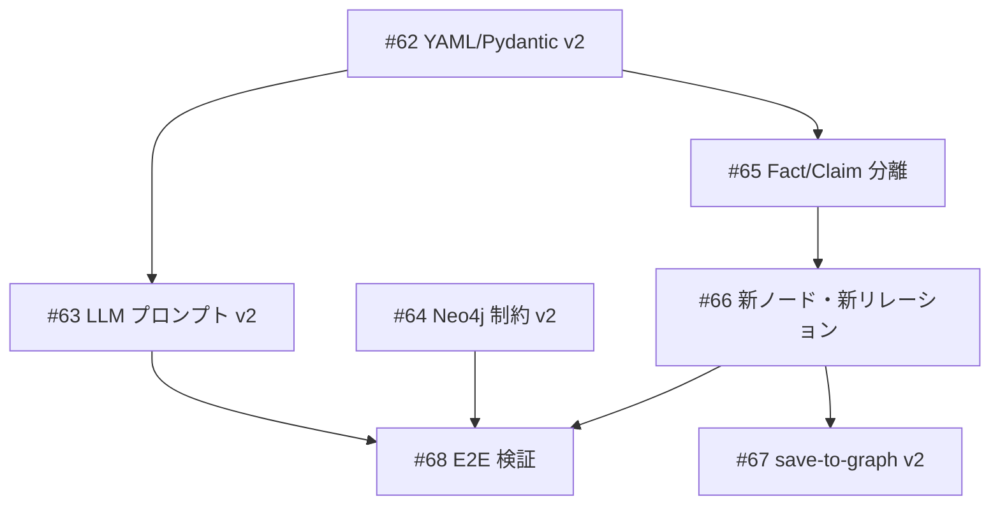

# KG スキーマ v2 実装

**作成日**: 2026-03-12
**ステータス**: 計画中
**タイプ**: from_plan_file
**GitHub Project**: [#76](https://github.com/users/YH-05/projects/76)

## 背景と目的

### 背景

KG スキーマ v2 設計議論（`docs/plan/KnowledgeGraph/2026-03-12_discussion-kg-schema-v2.md`）で決定した 11 項目の設計変更を実装する。現在のコードベースは v1 仕様のままであり、v2 SSoT（`data/config/knowledge-graph-schema.yaml`）との間に大きな乖離がある。

### 目的

- YAML スキーマ v2 に合わせてコードベースを統一する
- confidence プロパティの全削除（D11 決定）
- FinancialDataPoint / FiscalPeriod の新ノード対応
- save-to-graph スキルの v2 graph-queue フォーマット対応

### 成功基準

- [ ] `make check-all` が全パスすること
- [ ] graph-queue JSON が v2 フォーマットで出力されること（schema_version: "2.0"）
- [ ] save-to-graph スキルが v2 ノード・リレーションを投入できること

## リサーチ結果

### 既存パターン

- `emit_graph_queue.py` は 7 つのマッパー関数を持つ。map_pdf_extraction のみが confidence/facts/relations を使用
- `_mapped_result()` は全 7 マッパーから呼び出される共通ヘルパー。Optional keyword params 追加で後方互換性維持可能
- save-to-graph は現在 4 ノード（Topic/Entity/Source/Claim）のみ対応

### 参考実装

| ファイル | 説明 |
|---------|------|
| `scripts/emit_graph_queue.py` L237-273 | `_mapped_result()` ヘルパーの構造 |
| `scripts/emit_graph_queue.py` L530-662 | `map_pdf_extraction()` の現在の Fact/Claim 統合方式 |
| `.claude/skills/save-to-graph/SKILL.md` | 現在の投入フロー（4ノード対応） |

### 技術的考慮事項

- SCHEMA_VERSION を '2.0' に上げると save-to-graph v1 が壊れる → Wave 3 で対応
- FiscalPeriod の period_id で entity_ticker の取得方法が曖昧 → about_entities から推論
- LLM プロンプト v2 後の既存 processed データとの互換性 → 再抽出が必要

## 実装計画

### アーキテクチャ概要

```
YAML SSoT (v2) → Pydantic モデル → LLM プロンプト → emit_graph_queue → save-to-graph
```

### ファイルマップ

| 操作 | ファイルパス | 説明 |
|------|------------|------|
| 変更 | `data/config/knowledge-graph-schema.yaml` | confidence 2件削除 |
| 変更 | `src/pdf_pipeline/schemas/extraction.py` | Pydantic v2 更新 |
| 変更 | `src/pdf_pipeline/core/knowledge_extractor.py` | プロンプト v2 |
| 変更 | `src/pdf_pipeline/services/gemini_provider.py` | プロンプト v2 |
| 変更 | `scripts/emit_graph_queue.py` | Fact 分離、新ノード、新リレーション |
| 変更 | `data/config/neo4j-pdf-constraints.cypher` | 10制約+13インデックス |
| 変更 | `tests/pdf_pipeline/unit/test_extraction_schema.py` | v2 テスト |
| 変更 | `tests/pdf_pipeline/unit/test_knowledge_extractor.py` | v2 テスト |
| 変更 | `tests/pdf_pipeline/unit/test_emit_graph_queue_pdf.py` | v2 テスト |
| 変更 | `.claude/skills/save-to-graph/SKILL.md` | v2 ノード対応 |
| 変更 | `.claude/skills/save-to-graph/guide.md` | v2 Cypher テンプレート |

### リスク評価

| リスク | 影響度 | 対策 |
|--------|--------|------|
| SCHEMA_VERSION '2.0' で save-to-graph v1 が壊れる | 中 | Wave 3 で save-to-graph を先に更新 |
| FiscalPeriod period_id の entity_ticker 取得が曖昧 | 低 | about_entities から推論するロジックを実装 |
| 既存 processed データとの互換性 | 低 | 再抽出で対応（別スコープ） |

## タスク一覧

### Wave 1（並行開発可能）

- [ ] YAML/Pydantic: confidence 削除・enum 拡張・新フィールド・新モデル追加
  - Issue: [#62](https://github.com/YH-05/note-finance/issues/62)
  - ステータス: todo
  - 見積もり: M

- [ ] LLM プロンプト v2 更新（knowledge_extractor + gemini_provider）
  - Issue: [#63](https://github.com/YH-05/note-finance/issues/63)
  - ステータス: todo
  - 依存: #62
  - 見積もり: M

- [ ] neo4j-pdf-constraints.cypher v2 更新（10 制約 + 13 インデックス）
  - Issue: [#64](https://github.com/YH-05/note-finance/issues/64)
  - ステータス: todo
  - 見積もり: S

### Wave 2（Wave 1 完了後）

- [ ] emit_graph_queue: Fact/Claim 分離・confidence 削除
  - Issue: [#65](https://github.com/YH-05/note-finance/issues/65)
  - ステータス: todo
  - 依存: #62
  - 見積もり: M

- [ ] emit_graph_queue: 新ノード・新リレーション追加（Chunk/FinancialDataPoint/FiscalPeriod）
  - Issue: [#66](https://github.com/YH-05/note-finance/issues/66)
  - ステータス: todo
  - 依存: #65
  - 見積もり: L

### Wave 3（Wave 2 完了後）

- [ ] save-to-graph スキル: 新ノード 5 種・新リレーション 6 種対応
  - Issue: [#67](https://github.com/YH-05/note-finance/issues/67)
  - ステータス: todo
  - 依存: #66
  - 見積もり: L

- [ ] E2E 検証: サンプル PDF での graph-queue 生成確認
  - Issue: [#68](https://github.com/YH-05/note-finance/issues/68)
  - ステータス: todo
  - 依存: #64, #66
  - 見積もり: S

## 依存関係図



## スコープ外

- Pipeline 統合（Step 5/6）
- 既存 Neo4j データ v1→v2 マイグレーション
- Insight 生成ロジック
- Author/Topic 抽出パイプライン対応
- SUPPORTED_BY/CONTRADICTS 自動生成ロジック

---

**最終更新**: 2026-03-12
